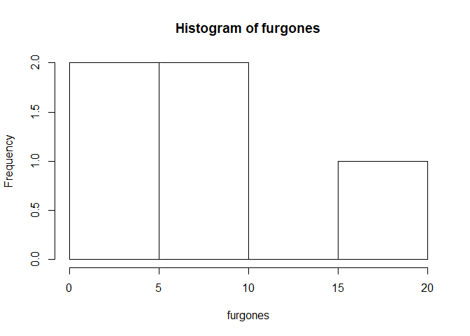
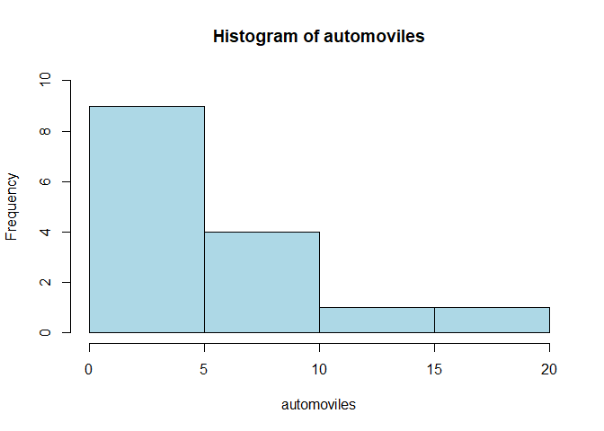
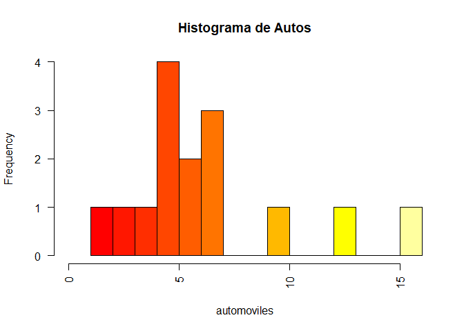

Ayudantia 1 Data Mining
================

## Operaciones Básicas en R

## Vectores y Listas

``` r
w<-c(2,34,7,21,14)
y<-c(1:8)
z<-11:18
w
```

    ## [1]  2 34  7 21 14

``` r
y
```

    ## [1] 1 2 3 4 5 6 7 8

``` r
z
```

    ## [1] 11 12 13 14 15 16 17 18

``` r
# Listas. Son combinaciones de vectores:
miLista<-list(antes=y,despues=z)
miLista
```

    ## $antes
    ## [1] 1 2 3 4 5 6 7 8
    ## 
    ## $despues
    ## [1] 11 12 13 14 15 16 17 18

``` r
miLista$antes
```

    ## [1] 1 2 3 4 5 6 7 8

``` r
# Mostrar por indices:
z
```

    ## [1] 11 12 13 14 15 16 17 18

``` r
z[4]
```

    ## [1] 14

``` r
z[c(1,3,4)]
```

    ## [1] 11 13 14

``` r
v<-c(2,4,6)
z[v]
```

    ## [1] 12 14 16

``` r
# Mostrar lo opuesto:
z[-c(1,4,7)]
```

    ## [1] 12 13 15 16 18

``` r
# Despliegue condicional:
z[z>13 & z<19] # da los valores entre 13 y 19
```

    ## [1] 14 15 16 17 18

``` r
# o bien condicional a la otra variable
# (siempre que ambas variables tengan la misma longitud):
z
```

    ## [1] 11 12 13 14 15 16 17 18

``` r
y
```

    ## [1] 1 2 3 4 5 6 7 8

``` r
z[y>4 & y<8]
```

    ## [1] 15 16 17

``` r
# lo siguiente solo determina el valor de verdad de cada caso
z>13 & z<19
```

    ## [1] FALSE FALSE FALSE  TRUE  TRUE  TRUE  TRUE  TRUE

## Vectores y Matrices

``` r
# Vectores
a <- c(1,2,5.3,6,-2,4) # vector numeric0 
b <- c("one","two","three") #  vector de caracteres
c <- c(TRUE,TRUE,TRUE,FALSE,TRUE,FALSE) # vector logico


length(a) # numero de elementos 
```

    ## [1] 6

``` r
str(a)    # estructura de un objecto
```

    ##  num [1:6] 1 2 5.3 6 -2 4

``` r
class(a)  # clase o tipo de un objecto
```

    ## [1] "numeric"

``` r
class(b)
```

    ## [1] "character"

``` r
class(c)
```

    ## [1] "logical"

``` r
z<-c(a,b)       # combina objetos en un vector
z
```

    ## [1] "1"     "2"     "5.3"   "6"     "-2"    "4"     "one"   "two"   "three"

``` r
class(z) 
```

    ## [1] "character"

``` r
# Matrices
y<-matrix(1:20, nrow=5,ncol=4)
y
```

    ##      [,1] [,2] [,3] [,4]
    ## [1,]    1    6   11   16
    ## [2,]    2    7   12   17
    ## [3,]    3    8   13   18
    ## [4,]    4    9   14   19
    ## [5,]    5   10   15   20

``` r
# otro ejemplo
valores <- c(14,26,24,68,23,14,56,32,11,9,78,44)
rnames <- c("F1", "F2","F3")
cnames <- c("C1", "C2","C3","C4")
mat <- matrix(valores, nrow=3, ncol=4, byrow=TRUE)
mat
```

    ##      [,1] [,2] [,3] [,4]
    ## [1,]   14   26   24   68
    ## [2,]   23   14   56   32
    ## [3,]   11    9   78   44

``` r
# seleccionar elementos individuales:
mat[2,3] 
```

    ## [1] 56

``` r
mat[,4] # 4th columna 
```

    ## [1] 68 32 44

``` r
mat[3,] # 3a fila
```

    ## [1] 11  9 78 44

``` r
mat[2:3,1:3] # filas 2,3 de columnas 1,2,3
```

    ##      [,1] [,2] [,3]
    ## [1,]   23   14   56
    ## [2,]   11    9   78

``` r
#agregar filas o columnas:

fila<-c(2,3,7,8)
columna<-c(11,22,33,44)

mat
```

    ##      [,1] [,2] [,3] [,4]
    ## [1,]   14   26   24   68
    ## [2,]   23   14   56   32
    ## [3,]   11    9   78   44

``` r
rbind(mat, fila) # combina objectos como columnas
```

    ##      [,1] [,2] [,3] [,4]
    ##        14   26   24   68
    ##        23   14   56   32
    ##        11    9   78   44
    ## fila    2    3    7    8

``` r
mat
```

    ##      [,1] [,2] [,3] [,4]
    ## [1,]   14   26   24   68
    ## [2,]   23   14   56   32
    ## [3,]   11    9   78   44

``` r
mat<-rbind(mat, fila) # combine objects as columns
mat
```

    ##      [,1] [,2] [,3] [,4]
    ##        14   26   24   68
    ##        23   14   56   32
    ##        11    9   78   44
    ## fila    2    3    7    8

``` r
mat<-cbind(mat, columna) # combina objectos como filas
mat
```

    ##                  columna
    ##      14 26 24 68      11
    ##      23 14 56 32      22
    ##      11  9 78 44      33
    ## fila  2  3  7  8      44

## Operaciones Basicas

``` r
antr<-read.table(header=TRUE,text='
Sujeto  Tipo  Sexo   Peso    Altura
1        A      F     46        155
2      A        M     78      166
3      B        F       56    160
4      C      M     80    180
5      G        M       67    172
6      C        F     81        177
7      A        M     72        168
8      B        F     74        170
9        A      F     57        160
10       B      M     49        157
')

antr
```

    ##    Sujeto Tipo Sexo Peso Altura
    ## 1       1    A    F   46    155
    ## 2       2    A    M   78    166
    ## 3       3    B    F   56    160
    ## 4       4    C    M   80    180
    ## 5       5    G    M   67    172
    ## 6       6    C    F   81    177
    ## 7       7    A    M   72    168
    ## 8       8    B    F   74    170
    ## 9       9    A    F   57    160
    ## 10     10    B    M   49    157

``` r
antr$Peso
```

    ##  [1] 46 78 56 80 67 81 72 74 57 49

``` r
attach(antr)
Peso
```

    ##  [1] 46 78 56 80 67 81 72 74 57 49

``` r
names(antr)
```

    ## [1] "Sujeto" "Tipo"   "Sexo"   "Peso"   "Altura"

``` r
str(antr)
```

    ## 'data.frame':    10 obs. of  5 variables:
    ##  $ Sujeto: int  1 2 3 4 5 6 7 8 9 10
    ##  $ Tipo  : Factor w/ 4 levels "A","B","C","G": 1 1 2 3 4 3 1 2 1 2
    ##  $ Sexo  : Factor w/ 2 levels "F","M": 1 2 1 2 2 1 2 1 1 2
    ##  $ Peso  : int  46 78 56 80 67 81 72 74 57 49
    ##  $ Altura: int  155 166 160 180 172 177 168 170 160 157

``` r
hist(Peso)
```

<!-- -->

``` r
plot(Peso,type="l",ylab="Peso")
```

<!-- -->

``` r
plot(Peso,Altura)
```

<!-- -->

``` r
pairs(antr)
```

<!-- -->

``` r
# Operaciones:
17/2 # division
```

    ## [1] 8.5

``` r
17%/%2 # division entera
```

    ## [1] 8

``` r
17%%2 # residuo
```

    ## [1] 1

``` r
# Se puede operar con vectores comno si fueran escalares:

v<-c(3,54,25,12,8)
w<-c(4,3,6,7,10)
v/w # obs.: deben tener el mismo largo
```

    ## [1]  0.750000 18.000000  4.166667  1.714286  0.800000

``` r
v%/%w
```

    ## [1]  0 18  4  1  0

``` r
v%%w
```

    ## [1] 3 0 1 5 8

``` r
log(v)
```

    ## [1] 1.098612 3.988984 3.218876 2.484907 2.079442

``` r
exp(-w)
```

    ## [1] 1.831564e-02 4.978707e-02 2.478752e-03 9.118820e-04 4.539993e-05

``` r
v^w
```

    ## [1]         81     157464  244140625   35831808 1073741824

## Medidas de Resumen

## DataFrame

``` r
Tabla<-read.table(header=TRUE,text='
Sujeto     Tipo  Rendimiento  Monto Actividades
23           alfa     109    4032     16
28       beta       45     3200      10
44       alfa       82     1290      8
56       gama     34     3425    10
75       alfa       19      678  20
')

# determinar el tipo de variable que contiene:
str(Tabla)
```

    ## 'data.frame':    5 obs. of  5 variables:
    ##  $ Sujeto     : int  23 28 44 56 75
    ##  $ Tipo       : Factor w/ 3 levels "alfa","beta",..: 1 2 1 3 1
    ##  $ Rendimiento: int  109 45 82 34 19
    ##  $ Monto      : int  4032 3200 1290 3425 678
    ##  $ Actividades: int  16 10 8 10 20

``` r
# editar la tabla:
tb<-edit(Tabla)
Tabla
```

    ##   Sujeto Tipo Rendimiento Monto Actividades
    ## 1     23 alfa         109  4032          16
    ## 2     28 beta          45  3200          10
    ## 3     44 alfa          82  1290           8
    ## 4     56 gama          34  3425          10
    ## 5     75 alfa          19   678          20

``` r
tb
```

    ##   Sujeto Tipo Rendimiento Monto Actividades
    ## 1     23 alfa         109  4032          16
    ## 2     28 beta          45  3200          10
    ## 3     44 alfa          82  1290           8
    ## 4     56 gama          34  3425          10
    ## 5     75 alfa          19   678          20

``` r
# Otra forma de crear un Data Frame:
dd<-data.frame()
fix(dd) # "arreglar" dd. Abre una hoja. Al cerrarla queda formado el DF 
dd
```

    ## data frame with 0 columns and 0 rows

``` r
# Eliminar columna (en este caso no numerica)
Tabla<-Tabla[,-2]
Tabla
```

    ##   Sujeto Rendimiento Monto Actividades
    ## 1     23         109  4032          16
    ## 2     28          45  3200          10
    ## 3     44          82  1290           8
    ## 4     56          34  3425          10
    ## 5     75          19   678          20

``` r
# Obtener el indice Rend*Monto/Actividad y agregar al data.frame e imprimir
attach(Tabla)
```

    ## The following object is masked from antr:
    ## 
    ##     Sujeto

``` r
Tabla$Indice<-Rendimiento*Monto/Actividades
Tabla
```

    ##   Sujeto Rendimiento Monto Actividades  Indice
    ## 1     23         109  4032          16 27468.0
    ## 2     28          45  3200          10 14400.0
    ## 3     44          82  1290           8 13222.5
    ## 4     56          34  3425          10 11645.0
    ## 5     75          19   678          20   644.1

``` r
# Formar una nueva tabla llamada Tabla1 con la siguiente estructura:
# Primera columna con numeros de 1 a 5, llamada "Numero". 
# Agregar las columnas "Rend", "Mont", "Activi" e "Ind". Imprimir.
Tabla1<-read.table(header=TRUE,text='
Numero
1
2
3
4
5 
')
Tabla1
```

    ##   Numero
    ## 1      1
    ## 2      2
    ## 3      3
    ## 4      4
    ## 5      5

``` r
attach(Tabla)
```

    ## The following objects are masked from Tabla (pos = 3):
    ## 
    ##     Actividades, Monto, Rendimiento, Sujeto
    ## 
    ## The following object is masked from antr:
    ## 
    ##     Sujeto

``` r
Tabla1$Rend<-Rendimiento
Tabla1$Mont<-Monto
Tabla1$Activ<-Actividades
Tabla1$Ind<-Tabla$Indice

# agregar otra columna:
Vector1<-c(3,5,12,8,4)
Tabla1$Nuevo<-Vector1
Tabla1
```

    ##   Numero Rend Mont Activ     Ind Nuevo
    ## 1      1  109 4032    16 27468.0     3
    ## 2      2   45 3200    10 14400.0     5
    ## 3      3   82 1290     8 13222.5    12
    ## 4      4   34 3425    10 11645.0     8
    ## 5      5   19  678    20   644.1     4

``` r
# Tratar de agregar un vector con distinto numero de elementos:
#Vector2<- c(7,32,6,7,19,7)
#Tabla1$Otro<-Vector2
# obs.: tambien se puede usar "cbind" (juntar columnas)

# Al final, agregar una fila con los promedios. 
# La columna con blancos, debera tener la palabra "Promedios" en la ultima fila. Imprimir.

Promedios<-c("Promedios",mean(Tabla1$Rend),mean(Tabla1$Mont),mean(Tabla1$Activ),mean(Tabla1$Ind),mean(Tabla1$Nuevo))
Tabla1<-rbind(Tabla1,Promedios)
Tabla1
```

    ##      Numero Rend Mont Activ      Ind Nuevo
    ## 1         1  109 4032    16    27468     3
    ## 2         2   45 3200    10    14400     5
    ## 3         3   82 1290     8  13222.5    12
    ## 4         4   34 3425    10    11645     8
    ## 5         5   19  678    20    644.1     4
    ## 6 Promedios 57.8 2525  12.8 13475.92   6.4

## Agrupar y Filtrar Datos

``` r
datos<-read.table(header=TRUE,text='
obs clase soporte tipo config intens sercha
1 a 2.5 v alta 23 14.9
2 a 3.2 s baja 42 21.8
3 b 4.1 s alta 59 16.1
4 c 2.1 v media 61 17.0
5 b 6.9 s media 18 11.2
6 d 3.1 g media 21 18.4
7 b 7.1 s alta 36 12.9
8 d 1.2 s baja 61 13.3
9 a 6.6 g alta 52 22.8
10 b 5.2 s media 36 19.2
11 c 6.2 g baja NA 20.0
12 b 3.7 v alta 42 18.9
') 
attach(datos) # permite trabajar con las variables de un data frame (DF) sin referencia la DF
# Borrar filas con valores nulos (NA)
datos <- na.omit(datos)
datos 
```

    ##    obs clase soporte tipo config intens sercha
    ## 1    1     a     2.5    v   alta     23   14.9
    ## 2    2     a     3.2    s   baja     42   21.8
    ## 3    3     b     4.1    s   alta     59   16.1
    ## 4    4     c     2.1    v  media     61   17.0
    ## 5    5     b     6.9    s  media     18   11.2
    ## 6    6     d     3.1    g  media     21   18.4
    ## 7    7     b     7.1    s   alta     36   12.9
    ## 8    8     d     1.2    s   baja     61   13.3
    ## 9    9     a     6.6    g   alta     52   22.8
    ## 10  10     b     5.2    s  media     36   19.2
    ## 12  12     b     3.7    v   alta     42   18.9

``` r
altas <- subset(datos, subset=config=="alta")
altas
```

    ##    obs clase soporte tipo config intens sercha
    ## 1    1     a     2.5    v   alta     23   14.9
    ## 3    3     b     4.1    s   alta     59   16.1
    ## 7    7     b     7.1    s   alta     36   12.9
    ## 9    9     a     6.6    g   alta     52   22.8
    ## 12  12     b     3.7    v   alta     42   18.9

``` r
#obs. Solo un criterio de seleccion. Si se requieren m?s criterios, instalar "dplyr"

#install.packages("dplyr") # Instalar paquete de manipulaci?n de dataframes "dplyr"
library(dplyr) # Habilitar la librer?a "dplyr"
```

    ## 
    ## Attaching package: 'dplyr'

    ## The following objects are masked from 'package:stats':
    ## 
    ##     filter, lag

    ## The following objects are masked from 'package:base':
    ## 
    ##     intersect, setdiff, setequal, union

``` r
# Filtrar de datos por filas: (usa dplyr)
filter(datos, config == "alta", clase== "b") # solo datos con las condiciones dadas
```

    ##   obs clase soporte tipo config intens sercha
    ## 1   3     b     4.1    s   alta     59   16.1
    ## 2   7     b     7.1    s   alta     36   12.9
    ## 3  12     b     3.7    v   alta     42   18.9

``` r
# Ordenar datos por filas en forma ascendente:
arrange(datos, clase, intens ) # primero por "clase" luego por "intens"
```

    ##    obs clase soporte tipo config intens sercha
    ## 1    1     a     2.5    v   alta     23   14.9
    ## 2    2     a     3.2    s   baja     42   21.8
    ## 3    9     a     6.6    g   alta     52   22.8
    ## 4    5     b     6.9    s  media     18   11.2
    ## 5    7     b     7.1    s   alta     36   12.9
    ## 6   10     b     5.2    s  media     36   19.2
    ## 7   12     b     3.7    v   alta     42   18.9
    ## 8    3     b     4.1    s   alta     59   16.1
    ## 9    4     c     2.1    v  media     61   17.0
    ## 10   6     d     3.1    g  media     21   18.4
    ## 11   8     d     1.2    s   baja     61   13.3

``` r
# descendente: 
arrange(datos, desc(clase), intens ) # descendente "clase" ascendente "intens" 
```

    ##    obs clase soporte tipo config intens sercha
    ## 1    6     d     3.1    g  media     21   18.4
    ## 2    8     d     1.2    s   baja     61   13.3
    ## 3    4     c     2.1    v  media     61   17.0
    ## 4    5     b     6.9    s  media     18   11.2
    ## 5    7     b     7.1    s   alta     36   12.9
    ## 6   10     b     5.2    s  media     36   19.2
    ## 7   12     b     3.7    v   alta     42   18.9
    ## 8    3     b     4.1    s   alta     59   16.1
    ## 9    1     a     2.5    v   alta     23   14.9
    ## 10   2     a     3.2    s   baja     42   21.8
    ## 11   9     a     6.6    g   alta     52   22.8

``` r
# seleccionar columnas y renombrar:
datos1<-select(datos, configuracion= config, intensidad = intens)
datos1
```

    ##    configuracion intensidad
    ## 1           alta         23
    ## 2           baja         42
    ## 3           alta         59
    ## 4          media         61
    ## 5          media         18
    ## 6          media         21
    ## 7           alta         36
    ## 8           baja         61
    ## 9           alta         52
    ## 10         media         36
    ## 12          alta         42

``` r
datos1<-rename(datos, con= config, int = intens) # renombrar columnas
datos1
```

    ##    obs clase soporte tipo   con int sercha
    ## 1    1     a     2.5    v  alta  23   14.9
    ## 2    2     a     3.2    s  baja  42   21.8
    ## 3    3     b     4.1    s  alta  59   16.1
    ## 4    4     c     2.1    v media  61   17.0
    ## 5    5     b     6.9    s media  18   11.2
    ## 6    6     d     3.1    g media  21   18.4
    ## 7    7     b     7.1    s  alta  36   12.9
    ## 8    8     d     1.2    s  baja  61   13.3
    ## 9    9     a     6.6    g  alta  52   22.8
    ## 10  10     b     5.2    s media  36   19.2
    ## 12  12     b     3.7    v  alta  42   18.9

``` r
# seleccionar un rango:
str(datos) # muestra las caracteristicas del DF
```

    ## 'data.frame':    11 obs. of  7 variables:
    ##  $ obs    : int  1 2 3 4 5 6 7 8 9 10 ...
    ##  $ clase  : Factor w/ 4 levels "a","b","c","d": 1 1 2 3 2 4 2 4 1 2 ...
    ##  $ soporte: num  2.5 3.2 4.1 2.1 6.9 3.1 7.1 1.2 6.6 5.2 ...
    ##  $ tipo   : Factor w/ 3 levels "g","s","v": 3 2 2 3 2 1 2 2 1 2 ...
    ##  $ config : Factor w/ 3 levels "alta","baja",..: 1 2 1 3 3 3 1 2 1 3 ...
    ##  $ intens : int  23 42 59 61 18 21 36 61 52 36 ...
    ##  $ sercha : num  14.9 21.8 16.1 17 11.2 18.4 12.9 13.3 22.8 19.2 ...
    ##  - attr(*, "na.action")= 'omit' Named int 11
    ##   ..- attr(*, "names")= chr "11"

``` r
select(datos, soporte:config) # desde "soporte" a "config"
```

    ##    soporte tipo config
    ## 1      2.5    v   alta
    ## 2      3.2    s   baja
    ## 3      4.1    s   alta
    ## 4      2.1    v  media
    ## 5      6.9    s  media
    ## 6      3.1    g  media
    ## 7      7.1    s   alta
    ## 8      1.2    s   baja
    ## 9      6.6    g   alta
    ## 10     5.2    s  media
    ## 12     3.7    v   alta

``` r
select(datos, -(soporte:config)) # excluir 
```

    ##    obs clase intens sercha
    ## 1    1     a     23   14.9
    ## 2    2     a     42   21.8
    ## 3    3     b     59   16.1
    ## 4    4     c     61   17.0
    ## 5    5     b     18   11.2
    ## 6    6     d     21   18.4
    ## 7    7     b     36   12.9
    ## 8    8     d     61   13.3
    ## 9    9     a     52   22.8
    ## 10  10     b     36   19.2
    ## 12  12     b     42   18.9

``` r
# Seleccionar y quedarse con las filas de valores no repetidos: 
distinct(datos, clase) # reporta solo la columna seleccionada con datos distintios 
```

    ##   clase
    ## 1     a
    ## 2     b
    ## 3     c
    ## 4     d

``` r
distinct(datos, clase, intens) # Solo con pares distintos
```

    ##    clase intens
    ## 1      a     23
    ## 2      a     42
    ## 3      b     59
    ## 4      c     61
    ## 5      b     18
    ## 6      d     21
    ## 7      b     36
    ## 8      d     61
    ## 9      a     52
    ## 10     b     42

``` r
# Agrega nuevas columnas a las ya existentes
mutate(datos, indice = intens - sercha) 
```

    ##    obs clase soporte tipo config intens sercha indice
    ## 1    1     a     2.5    v   alta     23   14.9    8.1
    ## 2    2     a     3.2    s   baja     42   21.8   20.2
    ## 3    3     b     4.1    s   alta     59   16.1   42.9
    ## 4    4     c     2.1    v  media     61   17.0   44.0
    ## 5    5     b     6.9    s  media     18   11.2    6.8
    ## 6    6     d     3.1    g  media     21   18.4    2.6
    ## 7    7     b     7.1    s   alta     36   12.9   23.1
    ## 8    8     d     1.2    s   baja     61   13.3   47.7
    ## 9    9     a     6.6    g   alta     52   22.8   29.2
    ## 10  10     b     5.2    s  media     36   19.2   16.8
    ## 11  12     b     3.7    v   alta     42   18.9   23.1

``` r
# Crear un nuevo dataframe solo con las columnas nuevas
transmute(datos,indice = intens - sercha, nuevoTipo = paste("el tipo es ", tipo)) 
```

    ##    indice     nuevoTipo
    ## 1     8.1 el tipo es  v
    ## 2    20.2 el tipo es  s
    ## 3    42.9 el tipo es  s
    ## 4    44.0 el tipo es  v
    ## 5     6.8 el tipo es  s
    ## 6     2.6 el tipo es  g
    ## 7    23.1 el tipo es  s
    ## 8    47.7 el tipo es  s
    ## 9    29.2 el tipo es  g
    ## 10   16.8 el tipo es  s
    ## 11   23.1 el tipo es  v

``` r
# Resumir informacion:
summarise(datos,delay = mean(soporte, na.rm = TRUE)) # media de la variable "soporte"; no considera los NA
```

    ##      delay
    ## 1 4.154545

``` r
#datos <- datos %>% mutate(valor = replace(valor, valor == "X", "Nueva"))
```

## Graficos

## Graficos Circulares

``` r
# Leer los datos de una tabla, con una columna adicional. Vehiculos por dia, de lunes a viernes.
vehiculos<-read.table(header=TRUE,text='
autos     camiones   furgones
1         2       4
3       5   4
6       4         6
4       5         6
9      12        16
')

attach(vehiculos)

# Crear un grafico circular para autos
pie(autos)
```

<!-- -->

``` r
# Agregar nombre, cambiar colores, define rotulos:

pie(autos, main="Autos", col=rainbow(length(autos)),
   labels=c("Lu","Ma","Mi","Ju","Vi"))
```

<!-- -->

``` r
# Cambiar colores, rotulos usando porcentajes, and crear una legenda:
# Definir algunos colores ideales para impresion en blanco y negro
colores <- c("white","grey70","grey90","grey50","black")
   
# Calcular el porcentaje de cada dia, redondeado a un decimal
rotulos <- round(autos/sum(autos) * 100, 1)

# Concadenar un simbolo '%' despues de cada valor
rotulos <- paste(rotulos, "%", sep="")

#dev.new() # abre una nueva ventana grafica para el sigueinte
# Crear un grafico circular con rotulos y colores definidos
pie(autos, main="Autos", col=colores, labels=rotulos,
   cex=0.8)

# Crear una leyenda arriba a la derecha  
legend(0.9,0.9,cex=0.8,c("Lu","Ma","Mi","Ju","Vi"),fill=colores)
```

<!-- -->

## Graficos de Barra

``` r
vehiculos<-read.table(header=TRUE,text='
autos    camiones   furgones
1           2   4
3        5  4
6        4  6
4        5  6
9       12  16
')
attach(vehiculos)
```

    ## The following objects are masked from vehiculos (pos = 3):
    ## 
    ##     autos, camiones, furgones

``` r
# EJEMPLO 1

barplot(autos)
```

<!-- -->

``` r
# Graficar vehiculos
# bordes y lineas diagnales en las barras.
barplot(autos, main="Autos", xlab="Dias",  
   ylab="Total", names.arg=c("Lu","Ma","Mi","Ju","Vi"), 
   border="blue", density=c(10,20,30,40,50))
```

<!-- -->

``` r
# EJEMPLO 2 COMBINACIONES DE COLORES 

# Graficar vehiculos con barras adyacentes usando diversas paletas de colores
barplot(as.matrix(vehiculos), main="Autos", ylab= "Total",
   beside=TRUE, col=rainbow(5))
```

<!-- -->

``` r
barplot(as.matrix(vehiculos), main="Autos", ylab= "Total",
   beside=TRUE, col=heat.colors(5))
```

<!-- -->

``` r
barplot(as.matrix(vehiculos), main="Autos", ylab= "Total",
   beside=TRUE, col=terrain.colors(5,1))
```

<!-- -->

``` r
barplot(as.matrix(vehiculos), main="Autos", ylab= "Total",
   beside=TRUE, col=terrain.colors(5,0.4))
```

<!-- -->

``` r
barplot(as.matrix(vehiculos), main="Autos", ylab= "Total",
   beside=TRUE, col=topo.colors(5))
```

<!-- -->

``` r
barplot(as.matrix(vehiculos), main="Autos", ylab= "Total",
   beside=TRUE, col=cm.colors(5))

# Poner leyenda en la esquina superior izquierda sin marco  
legend("topleft", c("Lu","Ma","Mi","Ju","Vi"),cex=0.8)   

legend("topleft", col=cm.colors(5),c("Lu","Ma","Mi","Ju","Vi"),cex=0.8,pch=15)   
```

<!-- -->

``` r
# EJEMPLO 3 grafico de barras apilado:  

# Expandir lado derecho del rectangulo para hacer espacio para la leyenda
par(xpd=T, mar=par()$mar+c(0,0,0,4))

# Graficar vehiculos (transponiendo la matriz) usando "heat colors",  
# poner 10% del espacio entre cada barra, y hacer rotulos  
# mas pequennos con eje y-axis horizxontal
barplot(t(vehiculos), main="Autos", ylab="Total", 
   col=heat.colors(3), space=0.1, cex.axis=0.8, las=1,
   names.arg=c("Lu","Ma","Mi","Ju","Vi"), cex=0.8) 
   
# Colocar la leyenda en (1,35) usando "heat colors"
legend(1, 35, names(vehiculos), cex=0.8, fill=heat.colors(3))
```

<!-- -->

``` r
# Restaurar default clipping rect
par(mar=c(5, 4, 4, 2) + 0.1) 
```

## Graficos de Linea

``` r
vehiculos<-read.table(header=TRUE,text='
autos  camiones  furgones
1           2       4
3           5       4
6           4       6
4           5       6
9          12      16
')

attach(vehiculos) # permite usar las variables por su nombre
```

    ## The following objects are masked from vehiculos (pos = 3):
    ## 
    ##     autos, camiones, furgones

    ## The following objects are masked from vehiculos (pos = 4):
    ## 
    ##     autos, camiones, furgones

``` r
# Graficar autos usando un eje y con rango de 0 a 12
plot(autos, type="o", col="blue",lwd=3, ylim=c(0,12))

# Graficar camiones con linea roja punteada con cuadrados en los puntos
lines(camiones, type="o",pch=21,bg="blue",lty=6,lwd=3,col="red")
lines(furgones,type="o",pch=21,bg="green",lty=4,lwd=2,col="orange")

# Crear un titulo en rojo, negrilla/italica
title(main="Autos", col.main="red", font.main=2)
```

<!-- -->

``` r
# Cambiar los rotulos de ejes para coincidir con los datos y agregar una leyenda. 
# Calcular los valores del eje y para que se adapte a cualquier cambio en los datos. 

# Calcular el rango de 0 a max de autos y camiones
rango <- range(0, autos, camiones)
rango
```

    ## [1]  0 12

``` r
# Graficar autos con eje y que ranguean entre 0 a maximo  valor de autos y camiones. 
# Quitar ejes y rotulos para poder controlarlos.
plot(autos, type="o", col="blue", ylim=rango, 
   axes=FALSE, ann=FALSE) # ann FALSE indica no poner rotulos.

# Cambiar ejes x a Lu-Vi
axis(1, at=1:5, lab=c("Lu","Ma","Mi","Ju","Vi"))

# Hacer linea vertical que muestre ticks cada 4 marcas. 
# 4*0:rango[2] es equivalente a c(0,4,8,12).
axis(2, las=1, at=4*0:rango[2]) # axis 2, eje vertical las??

# Crear caja alrededor del grafico
box()

# Graficar camiones con linea punteada roja and square points
lines(camiones, type="o", pch=22, lty=2, col="red")

# Crear titulo en rojo
title(main="Autos", col.main="red", font.main=4)

# Rotular ejes x e y con verde
title(xlab="Dias", col.lab=rgb(1,0.0,1))
title(ylab="Total", col.lab=rgb(0,0.8,0.5))

# Crear leyenda en (1, rango[2]) ligeramente mas peque?o 
# con los msimos colors de lineas y puntos usados por el grafico 

legend(1, rango[2], c("autos","camiones"), cex=0.8, 
   col=c("blue","red"), pch=21:22, lty=1:2)
```

<!-- -->

## Graficos de Puntos

``` r
# Ejemplo 1
vehiculos<-read.table(header=TRUE,text='
autos   camiones    furgones
1           2    4
3        5   4
6        4   6
4        5  6
9       12   16
')

# Grafico de puntos de la variable autos:
dotchart(vehiculos$autos)
```

<!-- -->

``` r
# Crear un grafico de puntos para todos los vehiculos
dotchart(t(vehiculos))
```

<!-- -->

``` r
# Un grafico de puntos mas colorido con rotulos mas pequennos:
dotchart(t(vehiculos), color=c("red","blue","darkgreen"),
   main="Grafico de puntos para Autos", cex=0.8)
```

<!-- -->

``` r
# EJEMPLO 2
attach(USArrests) # Casos por cada 100.000 habitantes en cada estado de USA, segun asaltos, asesinatos y violaciones.

USArrests
```

    ##                Murder Assault UrbanPop Rape
    ## Alabama          13.2     236       58 21.2
    ## Alaska           10.0     263       48 44.5
    ## Arizona           8.1     294       80 31.0
    ## Arkansas          8.8     190       50 19.5
    ## California        9.0     276       91 40.6
    ## Colorado          7.9     204       78 38.7
    ## Connecticut       3.3     110       77 11.1
    ## Delaware          5.9     238       72 15.8
    ## Florida          15.4     335       80 31.9
    ## Georgia          17.4     211       60 25.8
    ## Hawaii            5.3      46       83 20.2
    ## Idaho             2.6     120       54 14.2
    ## Illinois         10.4     249       83 24.0
    ## Indiana           7.2     113       65 21.0
    ## Iowa              2.2      56       57 11.3
    ## Kansas            6.0     115       66 18.0
    ## Kentucky          9.7     109       52 16.3
    ## Louisiana        15.4     249       66 22.2
    ## Maine             2.1      83       51  7.8
    ## Maryland         11.3     300       67 27.8
    ## Massachusetts     4.4     149       85 16.3
    ## Michigan         12.1     255       74 35.1
    ## Minnesota         2.7      72       66 14.9
    ## Mississippi      16.1     259       44 17.1
    ## Missouri          9.0     178       70 28.2
    ## Montana           6.0     109       53 16.4
    ## Nebraska          4.3     102       62 16.5
    ## Nevada           12.2     252       81 46.0
    ## New Hampshire     2.1      57       56  9.5
    ## New Jersey        7.4     159       89 18.8
    ## New Mexico       11.4     285       70 32.1
    ## New York         11.1     254       86 26.1
    ## North Carolina   13.0     337       45 16.1
    ## North Dakota      0.8      45       44  7.3
    ## Ohio              7.3     120       75 21.4
    ## Oklahoma          6.6     151       68 20.0
    ## Oregon            4.9     159       67 29.3
    ## Pennsylvania      6.3     106       72 14.9
    ## Rhode Island      3.4     174       87  8.3
    ## South Carolina   14.4     279       48 22.5
    ## South Dakota      3.8      86       45 12.8
    ## Tennessee        13.2     188       59 26.9
    ## Texas            12.7     201       80 25.5
    ## Utah              3.2     120       80 22.9
    ## Vermont           2.2      48       32 11.2
    ## Virginia          8.5     156       63 20.7
    ## Washington        4.0     145       73 26.2
    ## West Virginia     5.7      81       39  9.3
    ## Wisconsin         2.6      53       66 10.8
    ## Wyoming           6.8     161       60 15.6

``` r
dotchart(Murder)
```

<!-- -->

``` r
dotchart(Murder,labels=row.names(USArrests),cex=0.5)
```

<!-- -->

``` r
# cex=0.5 reduce los tipos a una escala de 0.5

# puntos ordenados por magnitud de la variable "Murder":
datos2<-USArrests[order(USArrests$Murder),] # ordena los datos segun la variable Murder
datos2
```

    ##                Murder Assault UrbanPop Rape
    ## North Dakota      0.8      45       44  7.3
    ## Maine             2.1      83       51  7.8
    ## New Hampshire     2.1      57       56  9.5
    ## Iowa              2.2      56       57 11.3
    ## Vermont           2.2      48       32 11.2
    ## Idaho             2.6     120       54 14.2
    ## Wisconsin         2.6      53       66 10.8
    ## Minnesota         2.7      72       66 14.9
    ## Utah              3.2     120       80 22.9
    ## Connecticut       3.3     110       77 11.1
    ## Rhode Island      3.4     174       87  8.3
    ## South Dakota      3.8      86       45 12.8
    ## Washington        4.0     145       73 26.2
    ## Nebraska          4.3     102       62 16.5
    ## Massachusetts     4.4     149       85 16.3
    ## Oregon            4.9     159       67 29.3
    ## Hawaii            5.3      46       83 20.2
    ## West Virginia     5.7      81       39  9.3
    ## Delaware          5.9     238       72 15.8
    ## Kansas            6.0     115       66 18.0
    ## Montana           6.0     109       53 16.4
    ## Pennsylvania      6.3     106       72 14.9
    ## Oklahoma          6.6     151       68 20.0
    ## Wyoming           6.8     161       60 15.6
    ## Indiana           7.2     113       65 21.0
    ## Ohio              7.3     120       75 21.4
    ## New Jersey        7.4     159       89 18.8
    ## Colorado          7.9     204       78 38.7
    ## Arizona           8.1     294       80 31.0
    ## Virginia          8.5     156       63 20.7
    ## Arkansas          8.8     190       50 19.5
    ## California        9.0     276       91 40.6
    ## Missouri          9.0     178       70 28.2
    ## Kentucky          9.7     109       52 16.3
    ## Alaska           10.0     263       48 44.5
    ## Illinois         10.4     249       83 24.0
    ## New York         11.1     254       86 26.1
    ## Maryland         11.3     300       67 27.8
    ## New Mexico       11.4     285       70 32.1
    ## Michigan         12.1     255       74 35.1
    ## Nevada           12.2     252       81 46.0
    ## Texas            12.7     201       80 25.5
    ## North Carolina   13.0     337       45 16.1
    ## Alabama          13.2     236       58 21.2
    ## Tennessee        13.2     188       59 26.9
    ## South Carolina   14.4     279       48 22.5
    ## Florida          15.4     335       80 31.9
    ## Louisiana        15.4     249       66 22.2
    ## Mississippi      16.1     259       44 17.1
    ## Georgia          17.4     211       60 25.8

``` r
dotchart(datos2$Murder,labels=row.names(datos2),cex=0.4,main="Arrestos por homicidio segun estado",xlab="Arrestos por cada 100.000 hab")
```

<!-- -->

``` r
# agregar colores:
colors() # muestra los colores disponibles
```

    ##   [1] "white"                "aliceblue"            "antiquewhite"        
    ##   [4] "antiquewhite1"        "antiquewhite2"        "antiquewhite3"       
    ##   [7] "antiquewhite4"        "aquamarine"           "aquamarine1"         
    ##  [10] "aquamarine2"          "aquamarine3"          "aquamarine4"         
    ##  [13] "azure"                "azure1"               "azure2"              
    ##  [16] "azure3"               "azure4"               "beige"               
    ##  [19] "bisque"               "bisque1"              "bisque2"             
    ##  [22] "bisque3"              "bisque4"              "black"               
    ##  [25] "blanchedalmond"       "blue"                 "blue1"               
    ##  [28] "blue2"                "blue3"                "blue4"               
    ##  [31] "blueviolet"           "brown"                "brown1"              
    ##  [34] "brown2"               "brown3"               "brown4"              
    ##  [37] "burlywood"            "burlywood1"           "burlywood2"          
    ##  [40] "burlywood3"           "burlywood4"           "cadetblue"           
    ##  [43] "cadetblue1"           "cadetblue2"           "cadetblue3"          
    ##  [46] "cadetblue4"           "chartreuse"           "chartreuse1"         
    ##  [49] "chartreuse2"          "chartreuse3"          "chartreuse4"         
    ##  [52] "chocolate"            "chocolate1"           "chocolate2"          
    ##  [55] "chocolate3"           "chocolate4"           "coral"               
    ##  [58] "coral1"               "coral2"               "coral3"              
    ##  [61] "coral4"               "cornflowerblue"       "cornsilk"            
    ##  [64] "cornsilk1"            "cornsilk2"            "cornsilk3"           
    ##  [67] "cornsilk4"            "cyan"                 "cyan1"               
    ##  [70] "cyan2"                "cyan3"                "cyan4"               
    ##  [73] "darkblue"             "darkcyan"             "darkgoldenrod"       
    ##  [76] "darkgoldenrod1"       "darkgoldenrod2"       "darkgoldenrod3"      
    ##  [79] "darkgoldenrod4"       "darkgray"             "darkgreen"           
    ##  [82] "darkgrey"             "darkkhaki"            "darkmagenta"         
    ##  [85] "darkolivegreen"       "darkolivegreen1"      "darkolivegreen2"     
    ##  [88] "darkolivegreen3"      "darkolivegreen4"      "darkorange"          
    ##  [91] "darkorange1"          "darkorange2"          "darkorange3"         
    ##  [94] "darkorange4"          "darkorchid"           "darkorchid1"         
    ##  [97] "darkorchid2"          "darkorchid3"          "darkorchid4"         
    ## [100] "darkred"              "darksalmon"           "darkseagreen"        
    ## [103] "darkseagreen1"        "darkseagreen2"        "darkseagreen3"       
    ## [106] "darkseagreen4"        "darkslateblue"        "darkslategray"       
    ## [109] "darkslategray1"       "darkslategray2"       "darkslategray3"      
    ## [112] "darkslategray4"       "darkslategrey"        "darkturquoise"       
    ## [115] "darkviolet"           "deeppink"             "deeppink1"           
    ## [118] "deeppink2"            "deeppink3"            "deeppink4"           
    ## [121] "deepskyblue"          "deepskyblue1"         "deepskyblue2"        
    ## [124] "deepskyblue3"         "deepskyblue4"         "dimgray"             
    ## [127] "dimgrey"              "dodgerblue"           "dodgerblue1"         
    ## [130] "dodgerblue2"          "dodgerblue3"          "dodgerblue4"         
    ## [133] "firebrick"            "firebrick1"           "firebrick2"          
    ## [136] "firebrick3"           "firebrick4"           "floralwhite"         
    ## [139] "forestgreen"          "gainsboro"            "ghostwhite"          
    ## [142] "gold"                 "gold1"                "gold2"               
    ## [145] "gold3"                "gold4"                "goldenrod"           
    ## [148] "goldenrod1"           "goldenrod2"           "goldenrod3"          
    ## [151] "goldenrod4"           "gray"                 "gray0"               
    ## [154] "gray1"                "gray2"                "gray3"               
    ## [157] "gray4"                "gray5"                "gray6"               
    ## [160] "gray7"                "gray8"                "gray9"               
    ## [163] "gray10"               "gray11"               "gray12"              
    ## [166] "gray13"               "gray14"               "gray15"              
    ## [169] "gray16"               "gray17"               "gray18"              
    ## [172] "gray19"               "gray20"               "gray21"              
    ## [175] "gray22"               "gray23"               "gray24"              
    ## [178] "gray25"               "gray26"               "gray27"              
    ## [181] "gray28"               "gray29"               "gray30"              
    ## [184] "gray31"               "gray32"               "gray33"              
    ## [187] "gray34"               "gray35"               "gray36"              
    ## [190] "gray37"               "gray38"               "gray39"              
    ## [193] "gray40"               "gray41"               "gray42"              
    ## [196] "gray43"               "gray44"               "gray45"              
    ## [199] "gray46"               "gray47"               "gray48"              
    ## [202] "gray49"               "gray50"               "gray51"              
    ## [205] "gray52"               "gray53"               "gray54"              
    ## [208] "gray55"               "gray56"               "gray57"              
    ## [211] "gray58"               "gray59"               "gray60"              
    ## [214] "gray61"               "gray62"               "gray63"              
    ## [217] "gray64"               "gray65"               "gray66"              
    ## [220] "gray67"               "gray68"               "gray69"              
    ## [223] "gray70"               "gray71"               "gray72"              
    ## [226] "gray73"               "gray74"               "gray75"              
    ## [229] "gray76"               "gray77"               "gray78"              
    ## [232] "gray79"               "gray80"               "gray81"              
    ## [235] "gray82"               "gray83"               "gray84"              
    ## [238] "gray85"               "gray86"               "gray87"              
    ## [241] "gray88"               "gray89"               "gray90"              
    ## [244] "gray91"               "gray92"               "gray93"              
    ## [247] "gray94"               "gray95"               "gray96"              
    ## [250] "gray97"               "gray98"               "gray99"              
    ## [253] "gray100"              "green"                "green1"              
    ## [256] "green2"               "green3"               "green4"              
    ## [259] "greenyellow"          "grey"                 "grey0"               
    ## [262] "grey1"                "grey2"                "grey3"               
    ## [265] "grey4"                "grey5"                "grey6"               
    ## [268] "grey7"                "grey8"                "grey9"               
    ## [271] "grey10"               "grey11"               "grey12"              
    ## [274] "grey13"               "grey14"               "grey15"              
    ## [277] "grey16"               "grey17"               "grey18"              
    ## [280] "grey19"               "grey20"               "grey21"              
    ## [283] "grey22"               "grey23"               "grey24"              
    ## [286] "grey25"               "grey26"               "grey27"              
    ## [289] "grey28"               "grey29"               "grey30"              
    ## [292] "grey31"               "grey32"               "grey33"              
    ## [295] "grey34"               "grey35"               "grey36"              
    ## [298] "grey37"               "grey38"               "grey39"              
    ## [301] "grey40"               "grey41"               "grey42"              
    ## [304] "grey43"               "grey44"               "grey45"              
    ## [307] "grey46"               "grey47"               "grey48"              
    ## [310] "grey49"               "grey50"               "grey51"              
    ## [313] "grey52"               "grey53"               "grey54"              
    ## [316] "grey55"               "grey56"               "grey57"              
    ## [319] "grey58"               "grey59"               "grey60"              
    ## [322] "grey61"               "grey62"               "grey63"              
    ## [325] "grey64"               "grey65"               "grey66"              
    ## [328] "grey67"               "grey68"               "grey69"              
    ## [331] "grey70"               "grey71"               "grey72"              
    ## [334] "grey73"               "grey74"               "grey75"              
    ## [337] "grey76"               "grey77"               "grey78"              
    ## [340] "grey79"               "grey80"               "grey81"              
    ## [343] "grey82"               "grey83"               "grey84"              
    ## [346] "grey85"               "grey86"               "grey87"              
    ## [349] "grey88"               "grey89"               "grey90"              
    ## [352] "grey91"               "grey92"               "grey93"              
    ## [355] "grey94"               "grey95"               "grey96"              
    ## [358] "grey97"               "grey98"               "grey99"              
    ## [361] "grey100"              "honeydew"             "honeydew1"           
    ## [364] "honeydew2"            "honeydew3"            "honeydew4"           
    ## [367] "hotpink"              "hotpink1"             "hotpink2"            
    ## [370] "hotpink3"             "hotpink4"             "indianred"           
    ## [373] "indianred1"           "indianred2"           "indianred3"          
    ## [376] "indianred4"           "ivory"                "ivory1"              
    ## [379] "ivory2"               "ivory3"               "ivory4"              
    ## [382] "khaki"                "khaki1"               "khaki2"              
    ## [385] "khaki3"               "khaki4"               "lavender"            
    ## [388] "lavenderblush"        "lavenderblush1"       "lavenderblush2"      
    ## [391] "lavenderblush3"       "lavenderblush4"       "lawngreen"           
    ## [394] "lemonchiffon"         "lemonchiffon1"        "lemonchiffon2"       
    ## [397] "lemonchiffon3"        "lemonchiffon4"        "lightblue"           
    ## [400] "lightblue1"           "lightblue2"           "lightblue3"          
    ## [403] "lightblue4"           "lightcoral"           "lightcyan"           
    ## [406] "lightcyan1"           "lightcyan2"           "lightcyan3"          
    ## [409] "lightcyan4"           "lightgoldenrod"       "lightgoldenrod1"     
    ## [412] "lightgoldenrod2"      "lightgoldenrod3"      "lightgoldenrod4"     
    ## [415] "lightgoldenrodyellow" "lightgray"            "lightgreen"          
    ## [418] "lightgrey"            "lightpink"            "lightpink1"          
    ## [421] "lightpink2"           "lightpink3"           "lightpink4"          
    ## [424] "lightsalmon"          "lightsalmon1"         "lightsalmon2"        
    ## [427] "lightsalmon3"         "lightsalmon4"         "lightseagreen"       
    ## [430] "lightskyblue"         "lightskyblue1"        "lightskyblue2"       
    ## [433] "lightskyblue3"        "lightskyblue4"        "lightslateblue"      
    ## [436] "lightslategray"       "lightslategrey"       "lightsteelblue"      
    ## [439] "lightsteelblue1"      "lightsteelblue2"      "lightsteelblue3"     
    ## [442] "lightsteelblue4"      "lightyellow"          "lightyellow1"        
    ## [445] "lightyellow2"         "lightyellow3"         "lightyellow4"        
    ## [448] "limegreen"            "linen"                "magenta"             
    ## [451] "magenta1"             "magenta2"             "magenta3"            
    ## [454] "magenta4"             "maroon"               "maroon1"             
    ## [457] "maroon2"              "maroon3"              "maroon4"             
    ## [460] "mediumaquamarine"     "mediumblue"           "mediumorchid"        
    ## [463] "mediumorchid1"        "mediumorchid2"        "mediumorchid3"       
    ## [466] "mediumorchid4"        "mediumpurple"         "mediumpurple1"       
    ## [469] "mediumpurple2"        "mediumpurple3"        "mediumpurple4"       
    ## [472] "mediumseagreen"       "mediumslateblue"      "mediumspringgreen"   
    ## [475] "mediumturquoise"      "mediumvioletred"      "midnightblue"        
    ## [478] "mintcream"            "mistyrose"            "mistyrose1"          
    ## [481] "mistyrose2"           "mistyrose3"           "mistyrose4"          
    ## [484] "moccasin"             "navajowhite"          "navajowhite1"        
    ## [487] "navajowhite2"         "navajowhite3"         "navajowhite4"        
    ## [490] "navy"                 "navyblue"             "oldlace"             
    ## [493] "olivedrab"            "olivedrab1"           "olivedrab2"          
    ## [496] "olivedrab3"           "olivedrab4"           "orange"              
    ## [499] "orange1"              "orange2"              "orange3"             
    ## [502] "orange4"              "orangered"            "orangered1"          
    ## [505] "orangered2"           "orangered3"           "orangered4"          
    ## [508] "orchid"               "orchid1"              "orchid2"             
    ## [511] "orchid3"              "orchid4"              "palegoldenrod"       
    ## [514] "palegreen"            "palegreen1"           "palegreen2"          
    ## [517] "palegreen3"           "palegreen4"           "paleturquoise"       
    ## [520] "paleturquoise1"       "paleturquoise2"       "paleturquoise3"      
    ## [523] "paleturquoise4"       "palevioletred"        "palevioletred1"      
    ## [526] "palevioletred2"       "palevioletred3"       "palevioletred4"      
    ## [529] "papayawhip"           "peachpuff"            "peachpuff1"          
    ## [532] "peachpuff2"           "peachpuff3"           "peachpuff4"          
    ## [535] "peru"                 "pink"                 "pink1"               
    ## [538] "pink2"                "pink3"                "pink4"               
    ## [541] "plum"                 "plum1"                "plum2"               
    ## [544] "plum3"                "plum4"                "powderblue"          
    ## [547] "purple"               "purple1"              "purple2"             
    ## [550] "purple3"              "purple4"              "red"                 
    ## [553] "red1"                 "red2"                 "red3"                
    ## [556] "red4"                 "rosybrown"            "rosybrown1"          
    ## [559] "rosybrown2"           "rosybrown3"           "rosybrown4"          
    ## [562] "royalblue"            "royalblue1"           "royalblue2"          
    ## [565] "royalblue3"           "royalblue4"           "saddlebrown"         
    ## [568] "salmon"               "salmon1"              "salmon2"             
    ## [571] "salmon3"              "salmon4"              "sandybrown"          
    ## [574] "seagreen"             "seagreen1"            "seagreen2"           
    ## [577] "seagreen3"            "seagreen4"            "seashell"            
    ## [580] "seashell1"            "seashell2"            "seashell3"           
    ## [583] "seashell4"            "sienna"               "sienna1"             
    ## [586] "sienna2"              "sienna3"              "sienna4"             
    ## [589] "skyblue"              "skyblue1"             "skyblue2"            
    ## [592] "skyblue3"             "skyblue4"             "slateblue"           
    ## [595] "slateblue1"           "slateblue2"           "slateblue3"          
    ## [598] "slateblue4"           "slategray"            "slategray1"          
    ## [601] "slategray2"           "slategray3"           "slategray4"          
    ## [604] "slategrey"            "snow"                 "snow1"               
    ## [607] "snow2"                "snow3"                "snow4"               
    ## [610] "springgreen"          "springgreen1"         "springgreen2"        
    ## [613] "springgreen3"         "springgreen4"         "steelblue"           
    ## [616] "steelblue1"           "steelblue2"           "steelblue3"          
    ## [619] "steelblue4"           "tan"                  "tan1"                
    ## [622] "tan2"                 "tan3"                 "tan4"                
    ## [625] "thistle"              "thistle1"             "thistle2"            
    ## [628] "thistle3"             "thistle4"             "tomato"              
    ## [631] "tomato1"              "tomato2"              "tomato3"             
    ## [634] "tomato4"              "turquoise"            "turquoise1"          
    ## [637] "turquoise2"           "turquoise3"           "turquoise4"          
    ## [640] "violet"               "violetred"            "violetred1"          
    ## [643] "violetred2"           "violetred3"           "violetred4"          
    ## [646] "wheat"                "wheat1"               "wheat2"              
    ## [649] "wheat3"               "wheat4"               "whitesmoke"          
    ## [652] "yellow"               "yellow1"              "yellow2"             
    ## [655] "yellow3"              "yellow4"              "yellowgreen"

``` r
dotchart(datos2$Murder,labels=row.names(datos2),cex=0.6,main="Arrestos por homicidio segun estado",
pch=16, col=c("darkblue","dodgerblue"),lcolor="gray90",xlab="Arrestos por cada 100.000 hab",cex.main=2,cex.lab=1.5)
```

<!-- -->

## Histogramas

``` r
# EJEMPLO 1
vehiculos<-read.table(header=TRUE,text='
autos   camiones    furgones
1           2   4
3        5  4
6        4   6
4        5  6
9       12  16
')

# -------------------------

attach(vehiculos)
```

    ## The following objects are masked from vehiculos (pos = 4):
    ## 
    ##     autos, camiones, furgones

    ## The following objects are masked from vehiculos (pos = 5):
    ## 
    ##     autos, camiones, furgones

    ## The following objects are masked from vehiculos (pos = 6):
    ## 
    ##     autos, camiones, furgones

``` r
# Crear un histograma para furgones
hist(furgones)
```

<!-- -->

``` r
# ----------------------------

# Concatenar los tres vectores
automoviles <- c(autos,camiones,furgones)

# Crear un histograma para automoviles en azul claro con el eje y rangeando ente 0-10
hist(automoviles, col="lightblue", ylim=c(0,10))
```

<!-- -->

``` r
# -----------------------------

# Ahora cambiar los cortes de modo que ninguno de los valores esten agrupados juntos y cambiar las posiciones de los ejes.

# buscar el mayor valor de y usado en los automoviles
max_num <- max(automoviles)
max_num
```

    ## [1] 16

``` r
# Crear un histograma para autos con "heat colors", hacer que el eje x ranguee entre
# 0-max_num, desabilitar cerrado por la derecha de los intervalos, fijar encabezado
# y poner los rotulos del eje y horizontales.
hist(automoviles, col=heat.colors(max_num), breaks=max_num, 
   xlim=c(0,max_num), right=FALSE, main="Histograma de Autos", las=2)
```

<!-- -->
