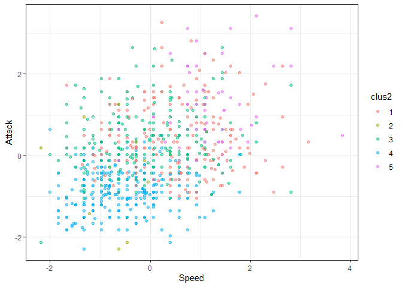
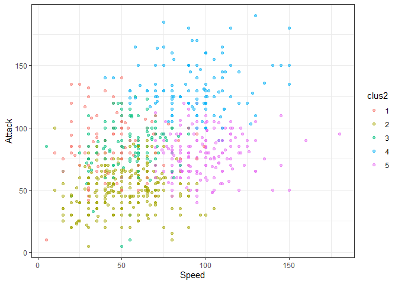

Ayudantia 5 Clusters
================

# Actividad Ayudantia 5

Realizar análisis de clustering (K-means, incluye preprocesamiento de la
data) e índices de evaluación para el archivo “sandwiches.csv” tomando
las columnas de nota y precio. Hacer análisis para diferentes K y/o
medidas de distancia para que vean cómo se comporta el clustering (En
caso de tener algún problema con ese csv, pueden utilizar el csv de
Pokémon también para la actividad)

# Algoritmo de clustering base:

## K-Medias

Para el análisis de clusters vamos a analizar la data de “pokemon.csv”
que contiene la información de los pokemones de 7 de sus generaciones,
echaremos un vistazo a las variables presentes.

``` r
library(tidyverse)
```

    ## -- Attaching packages --------------------------------------- tidyverse 1.3.0 --

    ## v ggplot2 3.3.3     v purrr   0.3.4
    ## v tibble  3.1.1     v dplyr   1.0.5
    ## v tidyr   1.1.3     v stringr 1.4.0
    ## v readr   1.3.1     v forcats 0.5.0

    ## -- Conflicts ------------------------------------------ tidyverse_conflicts() --
    ## x dplyr::filter() masks stats::filter()
    ## x dplyr::lag()    masks stats::lag()

``` r
setwd("D:/Users/Italo/Documents/Italo Felipe/UAI/Semestre 11/Ayudantia Mineria de Datos/material ayudantia/Ayudantia5")
data_pok  <- read.csv("pokemon.csv", sep=",")

head(data_pok)
```

    ##   X.                  Name Type.1 Type.2 Total HP Attack Defense Sp..Atk
    ## 1  1             Bulbasaur  Grass Poison   318 45     49      49      65
    ## 2  2               Ivysaur  Grass Poison   405 60     62      63      80
    ## 3  3              Venusaur  Grass Poison   525 80     82      83     100
    ## 4  3 VenusaurMega Venusaur  Grass Poison   625 80    100     123     122
    ## 5  4            Charmander   Fire          309 39     52      43      60
    ## 6  5            Charmeleon   Fire          405 58     64      58      80
    ##   Sp..Def Speed Generation Legendary
    ## 1      65    45          1     False
    ## 2      80    60          1     False
    ## 3     100    80          1     False
    ## 4     120    80          1     False
    ## 5      50    65          1     False
    ## 6      65    80          1     False

``` r
summary(data_pok)
```

    ##        X.                             Name         Type.1         Type.2   
    ##  Min.   :  1.0   Abomasnow              :  1   Water  :112           :386  
    ##  1st Qu.:184.8   AbomasnowMega Abomasnow:  1   Normal : 98   Flying  : 97  
    ##  Median :364.5   Abra                   :  1   Grass  : 70   Ground  : 35  
    ##  Mean   :362.8   Absol                  :  1   Bug    : 69   Poison  : 34  
    ##  3rd Qu.:539.2   AbsolMega Absol        :  1   Psychic: 57   Psychic : 33  
    ##  Max.   :721.0   Accelgor               :  1   Fire   : 52   Fighting: 26  
    ##                  (Other)                :794   (Other):342   (Other) :189  
    ##      Total             HP             Attack       Defense      
    ##  Min.   :180.0   Min.   :  1.00   Min.   :  5   Min.   :  5.00  
    ##  1st Qu.:330.0   1st Qu.: 50.00   1st Qu.: 55   1st Qu.: 50.00  
    ##  Median :450.0   Median : 65.00   Median : 75   Median : 70.00  
    ##  Mean   :435.1   Mean   : 69.26   Mean   : 79   Mean   : 73.84  
    ##  3rd Qu.:515.0   3rd Qu.: 80.00   3rd Qu.:100   3rd Qu.: 90.00  
    ##  Max.   :780.0   Max.   :255.00   Max.   :190   Max.   :230.00  
    ##                                                                 
    ##     Sp..Atk          Sp..Def          Speed          Generation    Legendary  
    ##  Min.   : 10.00   Min.   : 20.0   Min.   :  5.00   Min.   :1.000   False:735  
    ##  1st Qu.: 49.75   1st Qu.: 50.0   1st Qu.: 45.00   1st Qu.:2.000   True : 65  
    ##  Median : 65.00   Median : 70.0   Median : 65.00   Median :3.000              
    ##  Mean   : 72.82   Mean   : 71.9   Mean   : 68.28   Mean   :3.324              
    ##  3rd Qu.: 95.00   3rd Qu.: 90.0   3rd Qu.: 90.00   3rd Qu.:5.000              
    ##  Max.   :194.00   Max.   :230.0   Max.   :180.00   Max.   :6.000              
    ## 

Para clusterizar vamos a seleccionar las variables de Hp, Ataque,
Defensa, Speed, Generacion y Legendary. Para analizar el comportamiento
vamos a excluir Special Attack y Special Defense.

Antes de clusterizar debemos preparar la data\_pok:

  - Eliminando datos faltantes.

  - Pasar Legendary a numérico.

  - Escalar la data\_pok

<!-- end list -->

``` r
#Como no tenemos datos nulos obviamos este paso

levels(data_pok$Legendary) <- c(0,1)
data_pok$Legendary <- as.numeric(data_pok$Legendary)

data_pok$Type.1 <- as.numeric(data_pok$Type.1)

numdata_pok <- data_pok[, colnames(data_pok) %in% c("Type.1","HP", "Attack", "Defense", "Speed", "Generation", "Legendary")]

escal_data_pok = scale(numdata_pok) %>% as_tibble()

escal_data_pok %>% summary()
```

    ##      Type.1               HP              Attack           Defense       
    ##  Min.   :-1.69658   Min.   :-2.6732   Min.   :-2.2800   Min.   :-2.2077  
    ##  1st Qu.:-0.80058   1st Qu.:-0.7542   1st Qu.:-0.7395   1st Qu.:-0.7646  
    ##  Median : 0.09542   Median :-0.1668   Median :-0.1233   Median :-0.1232  
    ##  Mean   : 0.00000   Mean   : 0.0000   Mean   : 0.0000   Mean   : 0.0000  
    ##  3rd Qu.: 0.81222   3rd Qu.: 0.4207   3rd Qu.: 0.6470   3rd Qu.: 0.5181  
    ##  Max.   : 1.34982   Max.   : 7.2741   Max.   : 3.4198   Max.   : 5.0077  
    ##      Speed           Generation        Legendary      
    ##  Min.   :-2.1774   Min.   :-1.3988   Min.   :-0.2972  
    ##  1st Qu.:-0.8010   1st Qu.:-0.7968   1st Qu.:-0.2972  
    ##  Median :-0.1128   Median :-0.1949   Median :-0.2972  
    ##  Mean   : 0.0000   Mean   : 0.0000   Mean   : 0.0000  
    ##  3rd Qu.: 0.7475   3rd Qu.: 1.0090   3rd Qu.:-0.2972  
    ##  Max.   : 3.8445   Max.   : 1.6109   Max.   : 3.3606

Ya tenemos escalada la data\_pok, vamos a aplicar el algoritmo de
kmedias, que viene implementado en R base. Para probar, vamos a aplicar
kmedias con k = 10

## Analisis Cluster K = 10

``` r
modelo_kmeans <- kmeans(escal_data_pok, centers = 10)
modelo_kmeans2 <- kmeans(numdata_pok, centers = 10)

# creo la variable cluster en la tabla escal_data_pokda
escal_data_pok$clus <- modelo_kmeans$cluster %>% as.factor()
numdata_pok$clus <- modelo_kmeans2$cluster %>% as.factor()

ggplot(escal_data_pok, aes(Speed, Attack, color=clus)) +
  geom_point(alpha=0.5, show.legend = T) +
  theme_bw()
```

<!-- -->

``` r
ggplot(numdata_pok, aes(Speed, Attack, color=clus)) +
  geom_point(alpha=0.5, show.legend = T) +
  theme_bw()
```

<!-- -->

``` r
info_clus <- modelo_kmeans$centers
info_clus2 <- modelo_kmeans2$centers

info_clus
```

    ##         Type.1          HP     Attack    Defense       Speed Generation
    ## 1   0.68720093  2.09462030 -0.3561407 -0.3059366 -0.73298034 -0.2648719
    ## 2  -0.03415139  0.91952285  1.1607742  0.8279711  1.09795579  0.2681535
    ## 3  -1.19710398 -0.33009877 -0.4523504 -0.2603651 -0.05421014  0.8553176
    ## 4   0.64356535 -0.75421968 -0.7733866 -0.6953304 -0.42132440 -0.8322287
    ## 5  -0.43009522  0.53638080  1.0540668  0.2940252  0.55069298  0.8872638
    ## 6   0.56685800 -0.04146324  0.3165899  1.8487279 -0.96193969 -0.1856180
    ## 7   0.56424031 -0.55366051 -0.6881206 -0.5151674 -0.48052791  1.0454861
    ## 8   0.85185500  0.33592714  0.4049306  0.1552165  0.74815473 -0.4726979
    ## 9  -1.17526722 -1.00557136 -0.9517765 -0.8870294 -0.77034501 -0.7202096
    ## 10 -1.04129270  0.01616985  0.5729290  0.0577001  0.61241696 -1.0304097
    ##     Legendary
    ## 1  -0.2971949
    ## 2   3.3605889
    ## 3  -0.2971949
    ## 4  -0.2971949
    ## 5  -0.2971949
    ## 6  -0.2971949
    ## 7  -0.2971949
    ## 8  -0.2971949
    ## 9  -0.2971949
    ## 10 -0.2971949

``` r
info_clus2
```

    ##       Type.1        HP    Attack   Defense     Speed Generation Legendary
    ## 1  10.186916  50.14019  52.51402  45.57944  78.42991   3.149533  1.000000
    ## 2  10.070175  48.19298  43.02632  45.47368  40.08772   3.245614  1.000000
    ## 3  10.026316  66.71930  73.02632  61.45614  51.33333   3.482456  1.000000
    ## 4  11.404494  80.23596  83.74157 103.59551  71.87640   3.404494  1.112360
    ## 5  11.258621  51.17241  66.31034  97.15517  36.27586   3.120690  1.017241
    ## 6  14.344828  64.48276  86.93103 161.58621  42.58621   3.448276  1.137931
    ## 7   9.550847  71.58475  87.24576  68.68644 108.97458   3.237288  1.127119
    ## 8  14.304348 143.69565  70.00000  56.26087  47.43478   3.173913  1.000000
    ## 9  10.000000  83.90909 117.18182  74.71429  66.53247   3.571429  1.025974
    ## 10  9.619718  95.07042 135.26761 103.01408  98.57746   3.394366  1.464789

## Evolución suma de cuadrados intra-cluster en la medida que aumentamos el numero de k

``` r
SSinterior <- numeric(30)

for(k in 1:30){
  modelo <- kmeans(escal_data_pok, centers = k)
  SSinterior[k] <- modelo$tot.withinss
}

plot(SSinterior)
```

<!-- -->

## Metodo del Codo 2

``` r
#Calculando K para Data normalizada
k.max <- 30
wss1 <- sapply(1:k.max, 
              function(k){kmeans(escal_data_pok, k, nstart=50,iter.max = 8)$tot.withinss})
```

    ## Warning: did not converge in 8 iterations
    
    ## Warning: did not converge in 8 iterations

``` r
wss2 <- sapply(1:k.max, 
              function(k){kmeans(numdata_pok, k, nstart=50,iter.max = 8)$tot.withinss})
```

    ## Warning: did not converge in 8 iterations
    
    ## Warning: did not converge in 8 iterations
    
    ## Warning: did not converge in 8 iterations
    
    ## Warning: did not converge in 8 iterations
    
    ## Warning: did not converge in 8 iterations
    
    ## Warning: did not converge in 8 iterations
    
    ## Warning: did not converge in 8 iterations
    
    ## Warning: did not converge in 8 iterations
    
    ## Warning: did not converge in 8 iterations
    
    ## Warning: did not converge in 8 iterations
    
    ## Warning: did not converge in 8 iterations
    
    ## Warning: did not converge in 8 iterations
    
    ## Warning: did not converge in 8 iterations
    
    ## Warning: did not converge in 8 iterations
    
    ## Warning: did not converge in 8 iterations
    
    ## Warning: did not converge in 8 iterations
    
    ## Warning: did not converge in 8 iterations
    
    ## Warning: did not converge in 8 iterations
    
    ## Warning: did not converge in 8 iterations
    
    ## Warning: did not converge in 8 iterations
    
    ## Warning: did not converge in 8 iterations
    
    ## Warning: did not converge in 8 iterations
    
    ## Warning: did not converge in 8 iterations
    
    ## Warning: did not converge in 8 iterations
    
    ## Warning: did not converge in 8 iterations
    
    ## Warning: did not converge in 8 iterations
    
    ## Warning: did not converge in 8 iterations
    
    ## Warning: did not converge in 8 iterations
    
    ## Warning: did not converge in 8 iterations
    
    ## Warning: did not converge in 8 iterations
    
    ## Warning: did not converge in 8 iterations
    
    ## Warning: did not converge in 8 iterations
    
    ## Warning: did not converge in 8 iterations
    
    ## Warning: did not converge in 8 iterations

``` r
#wss1
plot(1:k.max, wss1,
     type="b", pch = 19, frame = FALSE, 
     xlab="Numeros de clusters K",
     ylab="Total within-clusters sum of squares")
```

<!-- -->

``` r
plot(1:k.max, wss2,
     type="b", pch = 19, frame = FALSE, 
     xlab="Numeros de clusters K",
     ylab="Total within-clusters sum of squares")
```

<!-- -->

# Evaluacion

Existen diversos metodos de evaluacion de calidad de los clusters
resultantes.

## Inspeccion visual

``` r
escal_data_pok$clus <- as.numeric(escal_data_pok$clus)
numdata_pok$clus <- as.numeric(numdata_pok$clus)

# uso distancia euclidiana
tempDist <- dist(escal_data_pok) %>% as.matrix()

#reordeno filas y columnas en base al cluster obtenido
index <- sort(modelo_kmeans$cluster, index.return=TRUE)
tempDist <- tempDist[index$ix,index$ix]
rownames(tempDist) <- c(1:nrow(escal_data_pok))
colnames(tempDist) <- c(1:nrow(escal_data_pok))

image(tempDist)
```

<!-- -->

## Estadistico de Hopkins.

``` r
library(factoextra)
```

    ## Welcome! Want to learn more? See two factoextra-related books at https://goo.gl/ve3WBa

``` r
#Calcula el hopkins statistic 
res <- get_clust_tendency(escal_data_pok, n = 30, graph = FALSE)
res2 <- get_clust_tendency(numdata_pok, n = 30, graph = FALSE)

print(res)
```

    ## $hopkins_stat
    ## [1] 0.8237485
    ## 
    ## $plot
    ## NULL

``` r
print(res2)
```

    ## $hopkins_stat
    ## [1] 0.8027837
    ## 
    ## $plot
    ## NULL

## Indice de correlación

``` r
#Correlation
#construyo matriz de correlacion ideal (cada entidad correlaciona 1 con su cluster)
tempMatrix <- matrix(0, nrow = nrow(numdata_pok), ncol = nrow(numdata_pok))
tempMatrix[which(index$x==1), which(index$x==1)]  <- 1
tempMatrix[which(index$x==2), which(index$x==2)]  <- 1
tempMatrix[which(index$x==3), which(index$x==3)]  <- 1
tempMatrix[which(index$x==4), which(index$x==4)]  <- 1
tempMatrix[which(index$x==5), which(index$x==5)]  <- 1
tempMatrix[which(index$x==6), which(index$x==6)]  <- 1
tempMatrix[which(index$x==7), which(index$x==7)]  <- 1
tempMatrix[which(index$x==8), which(index$x==8)]  <- 1
tempMatrix[which(index$x==9), which(index$x==9)]  <- 1
tempMatrix[which(index$x==10), which(index$x==10)] <- 1

#construyo matriz de disimilitud
tempDist2 <- 1/(1+tempDist)

#Calcula correlacion 
cor <- cor(tempMatrix[upper.tri(tempMatrix)],tempDist2[upper.tri(tempDist2)])

print(cor)
```

    ## [1] 0.6965268

## Indice de cohesión y el de separación.

``` r
library(flexclust) # usaremos la distancia implementada en flexclus (dist2) que maneja mejor objetos de diferente tamaño
```

    ## Loading required package: grid

    ## Loading required package: lattice

    ## Loading required package: modeltools

    ## Loading required package: stats4

``` r
#escal_data_pok <- apply(escal_data_pok,2,as.numeric)
 
#Cohesion
withinCluster <- numeric(10)
for (i in 1:10){
  tempdata_pok <- escal_data_pok[which(modelo_kmeans$cluster == i),]
  withinCluster[i] <- sum(dist2(tempdata_pok,colMeans(tempdata_pok))^2)
}
cohesion = sum(withinCluster)
#es equivalente a model$tot.withinss en k-means
print(c(cohesion, modelo_kmeans$tot.withinss))
```

    ## [1] 2201.338 2201.338

``` r
#Separation
meandata_pok <- colMeans(escal_data_pok)
SSB <- numeric(10)
for (i in 1:10){
  tempdata_pok <- escal_data_pok[which(modelo_kmeans$cluster==i),]
  SSB[i] <- nrow(tempdata_pok)*sum((meandata_pok-colMeans(tempdata_pok))^2)
}
separation = sum(SSB)

print(separation)
```

    ## [1] 8851.742

## Coeficiente de silueta

``` r
library(cluster)

coefSil <- silhouette(modelo_kmeans$cluster,dist(escal_data_pok))
summary(coefSil)
```

    ## Silhouette of 800 units in 10 clusters from silhouette.default(x = modelo_kmeans$cluster, dist = dist(escal_data_pok)) :
    ##  Cluster sizes and average silhouette widths:
    ##        43        65        94       119        89        65        99       104 
    ## 0.3832247 0.4437532 0.3830292 0.4175929 0.3205739 0.2055988 0.4218214 0.3247871 
    ##        55        67 
    ## 0.4132641 0.2998245 
    ## Individual silhouette widths:
    ##     Min.  1st Qu.   Median     Mean  3rd Qu.     Max. 
    ## -0.02596  0.29289  0.37656  0.36409  0.44449  0.59265

``` r
#visualizamos el codigo de silueta de cada cluster
fviz_silhouette(coefSil) + coord_flip()
```

    ##    cluster size ave.sil.width
    ## 1        1   43          0.38
    ## 2        2   65          0.44
    ## 3        3   94          0.38
    ## 4        4  119          0.42
    ## 5        5   89          0.32
    ## 6        6   65          0.21
    ## 7        7   99          0.42
    ## 8        8  104          0.32
    ## 9        9   55          0.41
    ## 10      10   67          0.30

<!-- -->

## Utilizamos el coeficiente de silueta para encontrar el mejor valor de K

``` r
coefSil=numeric(30)
for (k in 2:30){
  modelo <- kmeans(escal_data_pok, centers = k)
  temp <- silhouette(modelo$cluster,dist(escal_data_pok))
  coefSil[k] <- mean(temp[,3])
}
tempDF=data.frame(CS=coefSil,K=c(1:30))

ggplot(tempDF, aes(x=K, y=CS)) + 
  geom_line() +
  scale_x_continuous(breaks=c(1:30))
```

<!-- -->

# 2do Análisis Cluster

``` r
numdata_pok2 <- data_pok[, colnames(data_pok) %in% c("Type.1","HP", "Attack", "Defense", "Speed", "Generation", "Legendary")]
escal_data_pok2 = scale(numdata_pok2) %>% as_tibble()

modelo_kmean <- kmeans(escal_data_pok2, centers = 5)
modelo_kmean2 <- kmeans(numdata_pok2, centers = 5)

# creo la variable cluster en la tabla escal_data_pokda
escal_data_pok2$clus2 <- modelo_kmean$cluster %>% as.factor()
numdata_pok2$clus2 <- modelo_kmean2$cluster %>% as.factor()

ggplot(escal_data_pok2, aes(Speed, Attack, color=clus2)) +
  geom_point(alpha=0.5, show.legend = T) +
  theme_bw()
```

<!-- -->

``` r
ggplot(numdata_pok2, aes(Speed, Attack, color=clus2)) +
  geom_point(alpha=0.5, show.legend = T) +
  theme_bw()
```

<!-- -->

``` r
info_clusters <- modelo_kmean$centers
info_clusters2 <- modelo_kmean2$centers

info_clusters
```

    ##        Type.1          HP     Attack    Defense       Speed  Generation
    ## 1 -1.00421263  0.09390432  0.4305185  0.0672437  0.51009183  0.23073673
    ## 2  0.68902418  3.50224825 -0.1983756 -0.7545657 -0.53216614 -0.60871356
    ## 3  0.74774219  0.32201011  0.3427349  0.6587598 -0.05475849 -0.08909808
    ## 4  0.04013890 -0.74949797 -0.8490519 -0.7535565 -0.53462189 -0.11376592
    ## 5 -0.03415139  0.91952285  1.1607742  0.8279711  1.09795579  0.26815346
    ##    Legendary
    ## 1 -0.2971949
    ## 2 -0.2971949
    ## 3 -0.2971949
    ## 4 -0.2971949
    ## 5  3.3605889

``` r
info_clusters2
```

    ##      Type.1       HP    Attack   Defense    Speed Generation Legendary
    ## 1 12.179245 65.30189  85.07547 123.10377 46.98113   3.358491  1.075472
    ## 2 10.182156 49.50558  50.94052  50.18216 51.51301   3.289963  1.000000
    ## 3 11.814516 96.25000  83.46774  70.83871 54.13710   3.370968  1.016129
    ## 4  9.577236 88.95935 130.73171  92.21951 93.59350   3.471545  1.365854
    ## 5  9.556180 69.05056  78.93258  69.65730 98.65169   3.219101  1.056180

# Evaluacion

## Inspeccion visual

``` r
escal_data_pok2$clus <- as.numeric(escal_data_pok2$clus2)
numdata_pok2$clus <- as.numeric(numdata_pok2$clus2)

# uso distancia euclidiana
tempDist_2 <- dist(escal_data_pok2) %>% as.matrix()

#reordeno filas y columnas en base al cluster obtenido
index <- sort(modelo_kmean$cluster, index.return=TRUE)
tempDist_2 <- tempDist_2[index$ix,index$ix]
rownames(tempDist_2) <- c(1:nrow(data_pok))
colnames(tempDist_2) <- c(1:nrow(data_pok))

image(tempDist_2)
```

<!-- -->

## Estadistico de Hopkins.

``` r
library(factoextra)

escal_data_pok2$clus2 <- NULL
numdata_pok2$clus2 <- NULL

#Calcula el hopkins statistic 
res_1 <- get_clust_tendency(escal_data_pok2, n = 30, graph = FALSE)
res_2 <- get_clust_tendency(numdata_pok2, n = 30, graph = FALSE)

print(res_1)
```

    ## $hopkins_stat
    ## [1] 0.8068474
    ## 
    ## $plot
    ## NULL

``` r
print(res_2)
```

    ## $hopkins_stat
    ## [1] 0.8025411
    ## 
    ## $plot
    ## NULL

## Indice de correlación

``` r
#Correlation
#construyo matriz de correlacion ideal (cada entidad correlaciona 1 con su cluster)
tempMatrix2 <- matrix(0, nrow = nrow(escal_data_pok2), ncol = nrow(escal_data_pok2))
tempMatrix2[which(index$x==1), which(index$x==1)]  <- 1
tempMatrix2[which(index$x==2), which(index$x==2)]  <- 1
tempMatrix2[which(index$x==3), which(index$x==3)]  <- 1
tempMatrix2[which(index$x==4), which(index$x==4)]  <- 1
tempMatrix2[which(index$x==5), which(index$x==5)]  <- 1

#construyo matriz de disimilitud
tempDist_22 <- 1/(1+tempDist_2)

#Calcula correlacion 
cor2 <- cor(tempMatrix2[upper.tri(tempMatrix2)],tempDist_2[upper.tri(tempDist_2)])

print(cor2)
```

    ## [1] -0.6544947

## Indice de cohesión y el de separación.

``` r
library(flexclust) # usaremos la distancia implementada en flexclus (dist2) que maneja mejor objetos de diferente tamaño
escal_data_pok2 <- apply(escal_data_pok2,2,as.numeric)
 
#Cohesion
withinCluster <- numeric(4)
for (i in 1:4){
  tempdata_pok2 <- escal_data_pok2[which(modelo_kmean$cluster == i),]
  withinCluster[i] <- sum(dist2(tempdata_pok2,colMeans(tempdata_pok2))^2)
}
cohesion2 = sum(withinCluster)
#es equivalente a model$tot.withinss en k-means
print(c(cohesion2, modelo_kmean$tot.withinss))
```

    ## [1] 2794.102 3099.315

``` r
#Separation
meandata_pok2 <- colMeans(escal_data_pok2)
SSB <- numeric(4)
for (i in 1:4){
  tempdata_pok2 <- escal_data_pok2[which(modelo_kmean$cluster==i),]
  SSB[i] <- nrow(tempdata_pok2)*sum((meandata_pok2-colMeans(tempdata_pok2))^2)
}
separation2 = sum(SSB)

print(separation2)
```

    ## [1] 2579.397

## Coeficiente de silueta

``` r
library(cluster)

coefSil2 <- silhouette(modelo_kmean$cluster,dist(escal_data_pok2))
summary(coefSil2)
```

    ## Silhouette of 800 units in 5 clusters from silhouette.default(x = modelo_kmean$cluster, dist = dist(escal_data_pok2)) :
    ##  Cluster sizes and average silhouette widths:
    ##       198        16       239       282        65 
    ## 0.3323904 0.2674069 0.2055785 0.3121655 0.4570724 
    ## Individual silhouette widths:
    ##    Min. 1st Qu.  Median    Mean 3rd Qu.    Max. 
    ## 0.00958 0.22597 0.29910 0.29621 0.37568 0.56785

``` r
#visualizamos el codigo de silueta de cada cluster
fviz_silhouette(coefSil2) + coord_flip()
```

    ##   cluster size ave.sil.width
    ## 1       1  198          0.33
    ## 2       2   16          0.27
    ## 3       3  239          0.21
    ## 4       4  282          0.31
    ## 5       5   65          0.46

<!-- -->
