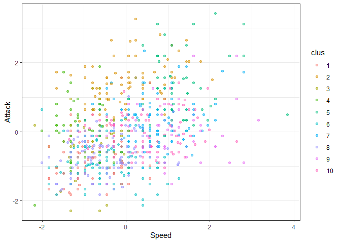
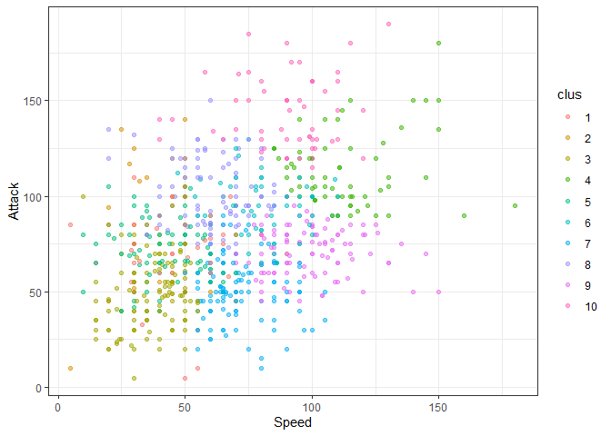
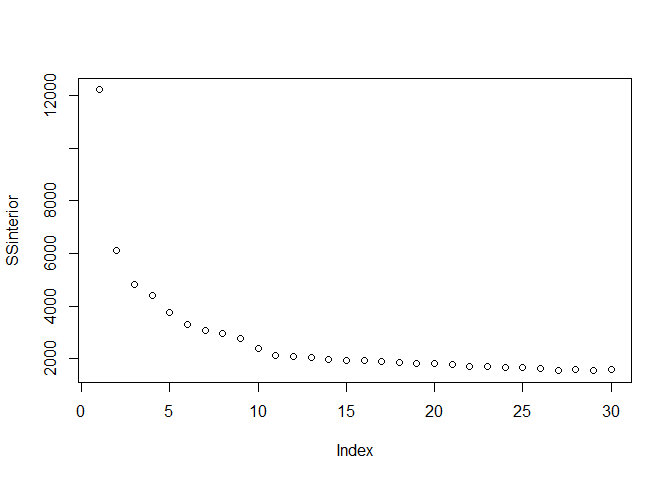
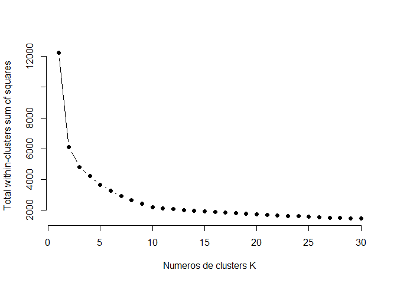
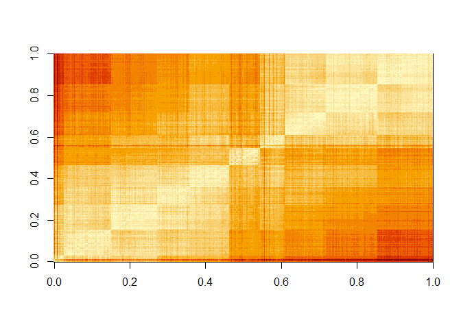
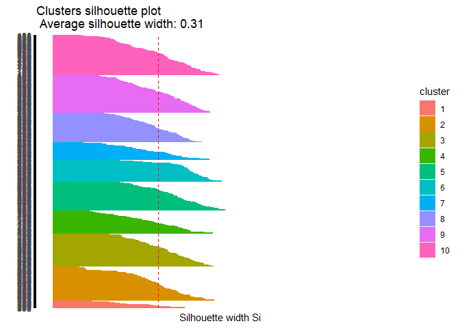
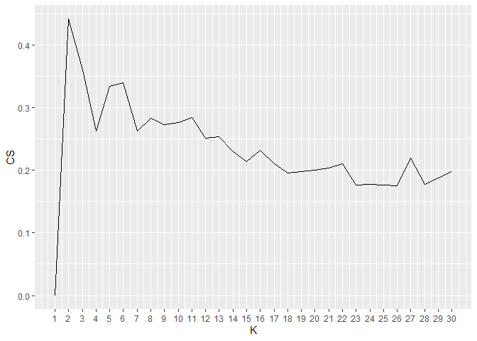
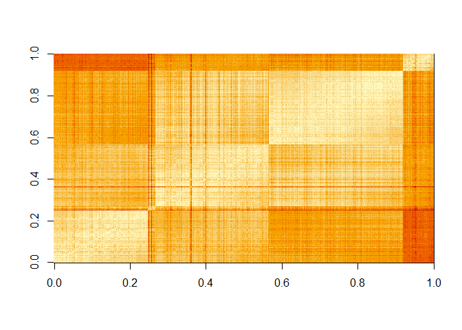

Ayudantia 5 Clusters
================

# Algoritmo de Clustering base:

## K-Medias

Para el analisis de clusters vamos a analizar data\_pok de ventas de
videojuegos, echaremos un vistazo a las variables presentes.

``` r
library(tidyverse)

setwd("D:/Users/Italo/Documents/Italo Felipe/UAI/Semestre 11/Ayudantia Mineria de Datos/material ayudantia/Ayudantia5")
data_pok  <- read.csv("pokemon.csv", sep=",")

head(data_pok)
```

    ##   X.                  Name Type.1 Type.2 Total HP Attack Defense Sp..Atk
    ## 1  1             Bulbasaur  Grass Poison   318 45     49      49      65
    ## 2  2               Ivysaur  Grass Poison   405 60     62      63      80
    ## 3  3              Venusaur  Grass Poison   525 80     82      83     100
    ## 4  3 VenusaurMega Venusaur  Grass Poison   625 80    100     123     122
    ## 5  4            Charmander   Fire          309 39     52      43      60
    ## 6  5            Charmeleon   Fire          405 58     64      58      80
    ##   Sp..Def Speed Generation Legendary
    ## 1      65    45          1     False
    ## 2      80    60          1     False
    ## 3     100    80          1     False
    ## 4     120    80          1     False
    ## 5      50    65          1     False
    ## 6      65    80          1     False

``` r
summary(data_pok)
```

    ##        X.                             Name         Type.1         Type.2   
    ##  Min.   :  1.0   Abomasnow              :  1   Water  :112           :386  
    ##  1st Qu.:184.8   AbomasnowMega Abomasnow:  1   Normal : 98   Flying  : 97  
    ##  Median :364.5   Abra                   :  1   Grass  : 70   Ground  : 35  
    ##  Mean   :362.8   Absol                  :  1   Bug    : 69   Poison  : 34  
    ##  3rd Qu.:539.2   AbsolMega Absol        :  1   Psychic: 57   Psychic : 33  
    ##  Max.   :721.0   Accelgor               :  1   Fire   : 52   Fighting: 26  
    ##                  (Other)                :794   (Other):342   (Other) :189  
    ##      Total             HP             Attack       Defense      
    ##  Min.   :180.0   Min.   :  1.00   Min.   :  5   Min.   :  5.00  
    ##  1st Qu.:330.0   1st Qu.: 50.00   1st Qu.: 55   1st Qu.: 50.00  
    ##  Median :450.0   Median : 65.00   Median : 75   Median : 70.00  
    ##  Mean   :435.1   Mean   : 69.26   Mean   : 79   Mean   : 73.84  
    ##  3rd Qu.:515.0   3rd Qu.: 80.00   3rd Qu.:100   3rd Qu.: 90.00  
    ##  Max.   :780.0   Max.   :255.00   Max.   :190   Max.   :230.00  
    ##                                                                 
    ##     Sp..Atk          Sp..Def          Speed          Generation    Legendary  
    ##  Min.   : 10.00   Min.   : 20.0   Min.   :  5.00   Min.   :1.000   False:735  
    ##  1st Qu.: 49.75   1st Qu.: 50.0   1st Qu.: 45.00   1st Qu.:2.000   True : 65  
    ##  Median : 65.00   Median : 70.0   Median : 65.00   Median :3.000              
    ##  Mean   : 72.82   Mean   : 71.9   Mean   : 68.28   Mean   :3.324              
    ##  3rd Qu.: 95.00   3rd Qu.: 90.0   3rd Qu.: 90.00   3rd Qu.:5.000              
    ##  Max.   :194.00   Max.   :230.0   Max.   :180.00   Max.   :6.000              
    ## 

Para clusterizar vamos a seleccionar las variables de Hp, Ataque,
Defensa, Speed, Generacion y Legendary. Para analizar el comportamiento
vamos a excluir special attack y special defense.

Antes de clusterizar debemos preparar la data\_pok:

  - Eliminando datos faltantes.

  - Pasar Legendary a numerico.

  - Escalar la data\_pok

<!-- end list -->

``` r
#Como no tenemos datos nulos obviamos este paso

levels(data_pok$Legendary) <- c(0,1)
data_pok$Legendary <- as.numeric(data_pok$Legendary)

data_pok$Type.1 <- as.numeric(data_pok$Type.1)

numdata_pok <- data_pok[, colnames(data_pok) %in% c("Type.1","HP", "Attack", "Defense", "Speed", "Generation", "Legendary")]

escal_data_pok = scale(numdata_pok) %>% as_tibble()

escal_data_pok %>% summary()
```

    ##      Type.1               HP              Attack           Defense       
    ##  Min.   :-1.69658   Min.   :-2.6732   Min.   :-2.2800   Min.   :-2.2077  
    ##  1st Qu.:-0.80058   1st Qu.:-0.7542   1st Qu.:-0.7395   1st Qu.:-0.7646  
    ##  Median : 0.09542   Median :-0.1668   Median :-0.1233   Median :-0.1232  
    ##  Mean   : 0.00000   Mean   : 0.0000   Mean   : 0.0000   Mean   : 0.0000  
    ##  3rd Qu.: 0.81222   3rd Qu.: 0.4207   3rd Qu.: 0.6470   3rd Qu.: 0.5181  
    ##  Max.   : 1.34982   Max.   : 7.2741   Max.   : 3.4198   Max.   : 5.0077  
    ##      Speed           Generation        Legendary      
    ##  Min.   :-2.1774   Min.   :-1.3988   Min.   :-0.2972  
    ##  1st Qu.:-0.8010   1st Qu.:-0.7968   1st Qu.:-0.2972  
    ##  Median :-0.1128   Median :-0.1949   Median :-0.2972  
    ##  Mean   : 0.0000   Mean   : 0.0000   Mean   : 0.0000  
    ##  3rd Qu.: 0.7475   3rd Qu.: 1.0090   3rd Qu.:-0.2972  
    ##  Max.   : 3.8445   Max.   : 1.6109   Max.   : 3.3606

Ya tenemos escalada la data\_pok, vamos a aplicar el algoritmo de
kmedias, que viene implementado en R base. Para probar, vamos a aplicar
kmedias con k = 10

``` r
modelo_kmeans <- kmeans(escal_data_pok, centers = 10)
modelo_kmeans2 <- kmeans(numdata_pok, centers = 10)

# creo la variable cluster en la tabla escal_data_pokda
escal_data_pok$clus <- modelo_kmeans$cluster %>% as.factor()
numdata_pok$clus <- modelo_kmeans2$cluster %>% as.factor()

ggplot(escal_data_pok, aes(Speed, Attack, color=clus)) +
  geom_point(alpha=0.5, show.legend = T) +
  theme_bw()
```

<!-- -->

``` r
ggplot(numdata_pok, aes(Speed, Attack, color=clus)) +
  geom_point(alpha=0.5, show.legend = T) +
  theme_bw()
```

<!-- -->

``` r
info_clus <- modelo_kmeans$centers
info_clus2 <- modelo_kmeans2$centers

info_clus
```

    ##         Type.1         HP      Attack     Defense      Speed Generation
    ## 1  -0.03415139  0.9195228  1.16077421  0.82797114  1.0979558  0.2681535
    ## 2  -1.30432746 -0.7925118 -0.70249847 -0.78917268 -0.4297456 -0.3754611
    ## 3   0.90996970  0.2467961  0.63249289  1.64393220 -0.5695099 -0.4137665
    ## 4   0.18875738  0.2758341  0.24322933 -0.02768558  0.7987510  1.0152750
    ## 5  -0.98271397  0.4816443  1.43740832  0.32100177  0.5032313  0.2985162
    ## 6  -1.06593013 -0.1675362 -0.09246745  0.97634842 -0.6719608  0.3954873
    ## 7   0.27979331 -0.5602903 -0.69473681 -0.51636651 -0.6851958  1.0958233
    ## 8   0.71665086  2.0419787 -0.35606110 -0.28783918 -0.6893575 -0.2751375
    ## 9   0.08763272  0.1273609  0.30269976 -0.08766830  1.0362462 -1.0454485
    ## 10  0.67747689 -0.7536125 -0.77338455 -0.65321825 -0.4696962 -0.7594906
    ##     Legendary
    ## 1   3.3605889
    ## 2  -0.2971949
    ## 3  -0.2971949
    ## 4  -0.2971949
    ## 5  -0.2971949
    ## 6  -0.2971949
    ## 7  -0.2971949
    ## 8  -0.2971949
    ## 9  -0.2971949
    ## 10 -0.2971949

``` r
info_clus2
```

    ##       Type.1        HP    Attack   Defense     Speed Generation Legendary
    ## 1  14.125000  62.79167  81.62500 168.20833  44.29167   3.375000  1.166667
    ## 2  10.486957  47.55652  50.21739  45.41739  73.99130   3.052174  1.000000
    ## 3  10.764045  86.52809  98.95506  94.19101  88.53933   3.280899  1.235955
    ## 4   9.456140  93.14035 147.01754  93.80702 102.14035   3.438596  1.456140
    ## 5  11.328125  82.60938 108.81250 104.26562  49.15625   3.500000  1.015625
    ## 6   9.612613  70.92793  82.73874  67.51351 108.45045   3.324324  1.099099
    ## 7  10.141667  51.36667  45.85833  47.51667  37.92500   3.375000  1.000000
    ## 8  13.162791 123.30233  68.58140  65.44186  48.00000   3.186047  1.000000
    ## 9   9.606061  67.43434  87.01010  60.73737  59.40404   3.434343  1.010101
    ## 10 10.333333  52.80769  64.94872  94.71795  47.02564   3.384615  1.012821

Vamos a ver como evoluciona la suma de cuadrados intra-cluster en la
medida que aumentamos el numero de k

``` r
SSinterior <- numeric(30)

for(k in 1:30){
  modelo <- kmeans(escal_data_pok, centers = k)
  SSinterior[k] <- modelo$tot.withinss
}

plot(SSinterior)
```

<!-- -->

``` r
#Calculando K para Data normalizada
k.max <- 30
wss1 <- sapply(1:k.max, 
              function(k){kmeans(escal_data_pok, k, nstart=50,iter.max = 8)$tot.withinss})
wss2 <- sapply(1:k.max, 
              function(k){kmeans(numdata_pok, k, nstart=50,iter.max = 8)$tot.withinss})
```

    ## Warning: did not converge in 8 iterations
    
    ## Warning: did not converge in 8 iterations
    
    ## Warning: did not converge in 8 iterations
    
    ## Warning: did not converge in 8 iterations
    
    ## Warning: did not converge in 8 iterations
    
    ## Warning: did not converge in 8 iterations
    
    ## Warning: did not converge in 8 iterations
    
    ## Warning: did not converge in 8 iterations
    
    ## Warning: did not converge in 8 iterations
    
    ## Warning: did not converge in 8 iterations
    
    ## Warning: did not converge in 8 iterations
    
    ## Warning: did not converge in 8 iterations
    
    ## Warning: did not converge in 8 iterations
    
    ## Warning: did not converge in 8 iterations
    
    ## Warning: did not converge in 8 iterations
    
    ## Warning: did not converge in 8 iterations
    
    ## Warning: did not converge in 8 iterations
    
    ## Warning: did not converge in 8 iterations
    
    ## Warning: did not converge in 8 iterations
    
    ## Warning: did not converge in 8 iterations
    
    ## Warning: did not converge in 8 iterations
    
    ## Warning: did not converge in 8 iterations
    
    ## Warning: did not converge in 8 iterations
    
    ## Warning: did not converge in 8 iterations
    
    ## Warning: did not converge in 8 iterations
    
    ## Warning: did not converge in 8 iterations
    
    ## Warning: did not converge in 8 iterations
    
    ## Warning: did not converge in 8 iterations
    
    ## Warning: did not converge in 8 iterations
    
    ## Warning: did not converge in 8 iterations
    
    ## Warning: did not converge in 8 iterations

``` r
#wss1
plot(1:k.max, wss1,
     type="b", pch = 19, frame = FALSE, 
     xlab="Numeros de clusters K",
     ylab="Total within-clusters sum of squares")
```

<!-- -->

``` r
plot(1:k.max, wss2,
     type="b", pch = 19, frame = FALSE, 
     xlab="Numeros de clusters K",
     ylab="Total within-clusters sum of squares")
```

<!-- --> \#\#
Evaluacion

Existen diversos metodos de evaluacion de calidad de los clusters
resultantes.

Inspeccion visual

``` r
escal_data_pok$clus <- as.numeric(escal_data_pok$clus)
numdata_pok$clus <- as.numeric(numdata_pok$clus)

# uso distancia euclidiana
tempDist <- dist(escal_data_pok) %>% as.matrix()

#reordeno filas y columnas en base al cluster obtenido
index <- sort(modelo_kmeans$cluster, index.return=TRUE)
tempDist <- tempDist[index$ix,index$ix]
rownames(tempDist) <- c(1:nrow(escal_data_pok))
colnames(tempDist) <- c(1:nrow(escal_data_pok))

image(tempDist)
```

<!-- -->

Estadistico de Hopkins.

``` r
library(factoextra)
```

    ## Welcome! Want to learn more? See two factoextra-related books at https://goo.gl/ve3WBa

``` r
#Calcula el hopkins statistic 
res <- get_clust_tendency(escal_data_pok, n = 30, graph = FALSE)
res2 <- get_clust_tendency(numdata_pok, n = 30, graph = FALSE)

print(res)
```

    ## $hopkins_stat
    ## [1] 0.8198401
    ## 
    ## $plot
    ## NULL

``` r
print(res2)
```

    ## $hopkins_stat
    ## [1] 0.8016206
    ## 
    ## $plot
    ## NULL

Indice de correlación

``` r
#Correlation
#construyo matriz de correlacion ideal (cada entidad correlaciona 1 con su cluster)
tempMatrix <- matrix(0, nrow = nrow(numdata_pok), ncol = nrow(numdata_pok))
tempMatrix[which(index$x==1), which(index$x==1)]  <- 1
tempMatrix[which(index$x==2), which(index$x==2)]  <- 1
tempMatrix[which(index$x==3), which(index$x==3)]  <- 1
tempMatrix[which(index$x==4), which(index$x==4)]  <- 1
tempMatrix[which(index$x==5), which(index$x==5)]  <- 1
tempMatrix[which(index$x==6), which(index$x==6)]  <- 1
tempMatrix[which(index$x==7), which(index$x==7)]  <- 1
tempMatrix[which(index$x==8), which(index$x==8)]  <- 1
tempMatrix[which(index$x==9), which(index$x==9)]  <- 1
tempMatrix[which(index$x==10), which(index$x==10)] <- 1

#construyo matriz de disimilitud
tempDist2 <- 1/(1+tempDist)

#Calcula correlacion 
cor <- cor(tempMatrix[upper.tri(tempMatrix)],tempDist2[upper.tri(tempDist2)])

print(cor)
```

    ## [1] 0.6873689

Indice de cohesión y el de separación.

``` r
library(flexclust) # usaremos la distancia implementada en flexclus (dist2) que maneja mejor objetos de diferente tamaño
```

    ## Loading required package: grid

    ## Loading required package: lattice

    ## Loading required package: modeltools

    ## Loading required package: stats4

``` r
#escal_data_pok <- apply(escal_data_pok,2,as.numeric)
 
#Cohesion
withinCluster <- numeric(10)
for (i in 1:10){
  tempdata_pok <- escal_data_pok[which(modelo_kmeans$cluster == i),]
  withinCluster[i] <- sum(dist2(tempdata_pok,colMeans(tempdata_pok))^2)
}
cohesion = sum(withinCluster)
#es equivalente a model$tot.withinss en k-means
print(c(cohesion, modelo_kmeans$tot.withinss))
```

    ## [1] 2227.494 2227.494

``` r
#Separation
meandata_pok <- colMeans(escal_data_pok)
SSB <- numeric(10)
for (i in 1:10){
  tempdata_pok <- escal_data_pok[which(modelo_kmeans$cluster==i),]
  SSB[i] <- nrow(tempdata_pok)*sum((meandata_pok-colMeans(tempdata_pok))^2)
}
separation = sum(SSB)

print(separation)
```

    ## [1] 10617.38

Y finalmente aplicamos el coeficiente de silueta

``` r
library(cluster)

coefSil <- silhouette(modelo_kmeans$cluster,dist(escal_data_pok))
summary(coefSil)
```

    ## Silhouette of 800 units in 10 clusters from silhouette.default(x = modelo_kmeans$cluster, dist = dist(escal_data_pok)) :
    ##  Cluster sizes and average silhouette widths:
    ##        65        90        66        96        61        52       104        45 
    ## 0.4541425 0.4841248 0.2791842 0.2933638 0.2096751 0.2315727 0.4082401 0.2139112 
    ##        92       129 
    ## 0.3157585 0.3584931 
    ## Individual silhouette widths:
    ##     Min.  1st Qu.   Median     Mean  3rd Qu.     Max. 
    ## -0.04439  0.24406  0.34688  0.33986  0.44496  0.60019

``` r
#visualizamos el codigo de silueta de cada cluster
fviz_silhouette(coefSil) + coord_flip()
```

    ##    cluster size ave.sil.width
    ## 1        1   65          0.45
    ## 2        2   90          0.48
    ## 3        3   66          0.28
    ## 4        4   96          0.29
    ## 5        5   61          0.21
    ## 6        6   52          0.23
    ## 7        7  104          0.41
    ## 8        8   45          0.21
    ## 9        9   92          0.32
    ## 10      10  129          0.36

<!-- -->

# Utilizamos el coeficiente de silueta para encontrar el mejor valor de K

``` r
coefSil=numeric(30)
for (k in 2:30){
  modelo <- kmeans(escal_data_pok, centers = k)
  temp <- silhouette(modelo$cluster,dist(escal_data_pok))
  coefSil[k] <- mean(temp[,3])
}
tempDF=data.frame(CS=coefSil,K=c(1:30))

ggplot(tempDF, aes(x=K, y=CS)) + 
  geom_line() +
  scale_x_continuous(breaks=c(1:30))
```

<!-- -->

``` r
numdata_pok2 <- data_pok[, colnames(data_pok) %in% c("Type.1","HP", "Attack", "Defense", "Sp..Atk", "Sp..Def", "Speed", "Generation", "Legendary")]
escal_data_pok2 = scale(numdata_pok2) %>% as_tibble()

modelo_kmean <- kmeans(escal_data_pok2, centers = 4)
modelo_kmean2 <- kmeans(numdata_pok2, centers = 4)

# creo la variable cluster en la tabla escal_data_pokda
escal_data_pok2$clus2 <- modelo_kmean$cluster %>% as.factor()
numdata_pok2$clus2 <- modelo_kmean2$cluster %>% as.factor()

ggplot(escal_data_pok2, aes(Speed, Attack, color=clus2)) +
  geom_point(alpha=0.5, show.legend = T) +
  theme_bw()
```

<!-- -->

``` r
ggplot(numdata_pok2, aes(Speed, Attack, color=clus2)) +
  geom_point(alpha=0.5, show.legend = T) +
  theme_bw()
```

<!-- -->

``` r
info_clusters <- modelo_kmean$centers
info_clusters2 <- modelo_kmean2$centers

info_clusters
```

    ##        Type.1         HP     Attack    Defense    Sp..Atk     Sp..Def
    ## 1 -0.03415139  0.9195228  1.1607742  0.8279711  1.5085927  1.22304303
    ## 2  0.70470419  3.5249298 -0.3779702 -0.8607917 -0.2308314 -0.01326558
    ## 3  0.01572837  0.3114216  0.4261484  0.4399093  0.3163665  0.40635061
    ## 4 -0.04371317 -0.7063019 -0.7116390 -0.6405769 -0.6575910 -0.71712749
    ##        Speed  Generation  Legendary
    ## 1  1.0979558  0.26815346  3.3605889
    ## 2 -0.6404174 -0.63630256 -0.2971949
    ## 3  0.2960808  0.03104294 -0.2971949
    ## 4 -0.5345507 -0.06030556 -0.2971949

``` r
info_clusters2
```

    ##      Type.1       HP    Attack   Defense   Sp..Atk  Sp..Def     Speed
    ## 1  9.719298 89.20175 121.09649  92.73684 120.45614 97.67544 100.44737
    ## 2 11.130435 71.30435  92.91304 121.42609  63.89565 88.23478  52.36522
    ## 3 10.493056 79.18056  81.31944  69.19097  82.01042 77.53125  80.10417
    ## 4 10.473498 50.29682  54.03180  51.62898  47.90459 49.15548  49.74912
    ##   Generation Legendary
    ## 1   3.385965  1.508772
    ## 2   3.513043  1.060870
    ## 3   3.246528  1.000000
    ## 4   3.300353  1.000000

## Evaluacion

Inspeccion visual

``` r
# uso distancia euclidiana
tempDist_2 <- dist(escal_data_pok2) %>% as.matrix()

#reordeno filas y columnas en base al cluster obtenido
index <- sort(modelo_kmean$cluster, index.return=TRUE)
tempDist_2 <- tempDist_2[index$ix,index$ix]
rownames(tempDist_2) <- c(1:nrow(data_pok))
colnames(tempDist_2) <- c(1:nrow(data_pok))

image(tempDist_2)
```

<!-- -->

Indice de correlación

``` r
#Correlation
#construyo matriz de correlacion ideal (cada entidad correlaciona 1 con su cluster)
tempMatrix2 <- matrix(0, nrow = nrow(escal_data_pok2), ncol = nrow(escal_data_pok2))
tempMatrix2[which(index$x==1), which(index$x==1)]  <- 1
tempMatrix2[which(index$x==2), which(index$x==2)]  <- 1
tempMatrix2[which(index$x==3), which(index$x==3)]  <- 1
tempMatrix2[which(index$x==4), which(index$x==4)]  <- 1

#construyo matriz de disimilitud
tempDist_22 <- 1/(1+tempDist_2)

#Calcula correlacion 
cor2 <- cor(tempMatrix2[upper.tri(tempMatrix2)],tempDist_2[upper.tri(tempDist_2)])

print(cor2)
```

    ## [1] -0.5244858

Indice de cohesión y el de separación.

``` r
library(flexclust) # usaremos la distancia implementada en flexclus (dist2) que maneja mejor objetos de diferente tamaño
escal_data_pok2 <- apply(escal_data_pok2,2,as.numeric)
 
#Cohesion
withinCluster <- numeric(4)
for (i in 1:4){
  tempdata_pok2 <- escal_data_pok2[which(modelo_kmean$cluster == i),]
  withinCluster[i] <- sum(dist2(tempdata_pok2,colMeans(tempdata_pok2))^2)
}
cohesion2 = sum(withinCluster)
#es equivalente a model$tot.withinss en k-means
print(c(cohesion2, modelo_kmean$tot.withinss))
```

    ## [1] 4456.786 4456.786

``` r
#Separation
meandata_pok2 <- colMeans(escal_data_pok2)
SSB <- numeric(4)
for (i in 1:4){
  tempdata_pok2 <- escal_data_pok2[which(modelo_kmean$cluster==i),]
  SSB[i] <- nrow(tempdata_pok2)*sum((meandata_pok2-colMeans(tempdata_pok2))^2)
}
separation2 = sum(SSB)

print(separation2)
```

    ## [1] 3296.969

Coeficiente de silueta

``` r
library(cluster)

coefSil2 <- silhouette(modelo_kmean$cluster,dist(escal_data_pok2))
summary(coefSil2)
```

    ## Silhouette of 800 units in 4 clusters from silhouette.default(x = modelo_kmean$cluster, dist = dist(escal_data_pok2)) :
    ##  Cluster sizes and average silhouette widths:
    ##        65        15       389       331 
    ## 0.4010622 0.2650684 0.1650899 0.3040967 
    ## Individual silhouette widths:
    ##     Min.  1st Qu.   Median     Mean  3rd Qu.     Max. 
    ## -0.03048  0.16168  0.24129  0.24365  0.33659  0.49083

``` r
#visualizamos el codigo de silueta de cada cluster
fviz_silhouette(coefSil2) + coord_flip()
```

    ##   cluster size ave.sil.width
    ## 1       1   65          0.40
    ## 2       2   15          0.27
    ## 3       3  389          0.17
    ## 4       4  331          0.30

<!-- -->
