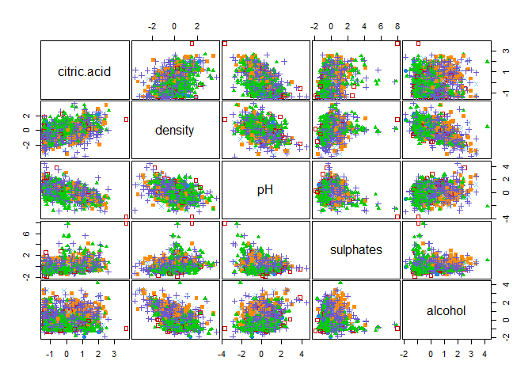

Ayudantia 8: Clustering Probabilistico
================

Actividad Ayudantia 8: Entrega 28/05

Para esta actividad tendran que utilizar el csv que esta subido de
spotify o realizar ustedes un sample de la data del proyecto 2 de al
menos 8000 observaciones.

Para dicho dataset tendran que realizar los tres modelos de clustering
vistos en la ayudantia y tendran que ejecutar 3 iteraciones del analisis
mencionando que modificaron en cada iteracion en la busqueda de mejorar
los clusters que se forman.

# Ayudantia 8

Para esta ayudantia utilizaremos un dataset que contiene la calidad de
diversos vinos que se evaluaron

## Importar Librerias

``` r
library(tidyverse)
library(cluster)
library(factoextra)
library(mclust)
```

Para un primer intento tomaremos todas las variables del dataset, ver
que cluster obtenemos y como se comportan los indicadores de cada modelo

## Cargar Datos

``` r
setwd("D:/Users/Italo/Documents/Italo Felipe/UAI/Semestre 11/Ayudantia Mineria de Datos/material ayudantia/Ayudantia8")

wine <- read.csv("winequality-red.csv",sep = ",")
```

## Comprobar Datos NA y Cambiar Tipo Data

``` r
wine %>% 
  summarise_all(funs(sum(is.na(.))))
```

    ## Warning: `funs()` was deprecated in dplyr 0.8.0.
    ## Please use a list of either functions or lambdas: 
    ## 
    ##   # Simple named list: 
    ##   list(mean = mean, median = median)
    ## 
    ##   # Auto named with `tibble::lst()`: 
    ##   tibble::lst(mean, median)
    ## 
    ##   # Using lambdas
    ##   list(~ mean(., trim = .2), ~ median(., na.rm = TRUE))

    ##   fixed.acidity volatile.acidity citric.acid residual.sugar chlorides
    ## 1             0                0           0              0         0
    ##   free.sulfur.dioxide total.sulfur.dioxide density pH sulphates alcohol quality
    ## 1                   0                    0       0  0         0       0       0

``` r
str(wine)
```

    ## 'data.frame':    1599 obs. of  12 variables:
    ##  $ fixed.acidity       : num  7.4 7.8 7.8 11.2 7.4 7.4 7.9 7.3 7.8 7.5 ...
    ##  $ volatile.acidity    : num  0.7 0.88 0.76 0.28 0.7 0.66 0.6 0.65 0.58 0.5 ...
    ##  $ citric.acid         : num  0 0 0.04 0.56 0 0 0.06 0 0.02 0.36 ...
    ##  $ residual.sugar      : num  1.9 2.6 2.3 1.9 1.9 1.8 1.6 1.2 2 6.1 ...
    ##  $ chlorides           : num  0.076 0.098 0.092 0.075 0.076 0.075 0.069 0.065 0.073 0.071 ...
    ##  $ free.sulfur.dioxide : num  11 25 15 17 11 13 15 15 9 17 ...
    ##  $ total.sulfur.dioxide: num  34 67 54 60 34 40 59 21 18 102 ...
    ##  $ density             : num  0.998 0.997 0.997 0.998 0.998 ...
    ##  $ pH                  : num  3.51 3.2 3.26 3.16 3.51 3.51 3.3 3.39 3.36 3.35 ...
    ##  $ sulphates           : num  0.56 0.68 0.65 0.58 0.56 0.56 0.46 0.47 0.57 0.8 ...
    ##  $ alcohol             : num  9.4 9.8 9.8 9.8 9.4 9.4 9.4 10 9.5 10.5 ...
    ##  $ quality             : int  5 5 5 6 5 5 5 7 7 5 ...

``` r
class <- wine$quality

X <- wine[,1:11]
head(X)
```

    ##   fixed.acidity volatile.acidity citric.acid residual.sugar chlorides
    ## 1           7.4             0.70        0.00            1.9     0.076
    ## 2           7.8             0.88        0.00            2.6     0.098
    ## 3           7.8             0.76        0.04            2.3     0.092
    ## 4          11.2             0.28        0.56            1.9     0.075
    ## 5           7.4             0.70        0.00            1.9     0.076
    ## 6           7.4             0.66        0.00            1.8     0.075
    ##   free.sulfur.dioxide total.sulfur.dioxide density   pH sulphates alcohol
    ## 1                  11                   34  0.9978 3.51      0.56     9.4
    ## 2                  25                   67  0.9968 3.20      0.68     9.8
    ## 3                  15                   54  0.9970 3.26      0.65     9.8
    ## 4                  17                   60  0.9980 3.16      0.58     9.8
    ## 5                  11                   34  0.9978 3.51      0.56     9.4
    ## 6                  13                   40  0.9978 3.51      0.56     9.4

## Escalar Data

``` r
data_sca <- sapply(X, scale) %>% as_tibble()

clPairs(data_sca,class)
```

<!-- -->

# DBSCAN

Primer metodo, clustering basado en densidad

``` r
library(dbscan)

set.seed(369)

model = dbscan(data_sca, eps = 1, minPts = 6)

model
```

    ## DBSCAN clustering for 1599 objects.
    ## Parameters: eps = 1, minPts = 6
    ## The clustering contains 15 cluster(s) and 1244 noise points.
    ## 
    ##    0    1    2    3    4    5    6    7    8    9   10   11   12   13   14   15 
    ## 1244  200    6   27    6   15    6    6   14   20   19    7    6    6    6   11 
    ## 
    ## Available fields: cluster, eps, minPts

El modelo genera 15 clusters, basado en los parametros que le entregamos
a la funcion dbscan.

Veamos que pasa al ir modificando esos valores

# Plot

``` r
ggplot(data_sca, aes(alcohol, pH, color = factor(model$cluster), size = alcohol)) + 
  geom_point(alpha = 0.3) 
```

<!-- -->

Se puede ver que hay diversos puntos que no quedan asignados a ningun
cluster dados los valores escogidos para la distancia minima.

Otros algoritmos como el c-means permiten asignarle un cluster a todos
los puntos

# Fuzzy C Means

``` r
library(e1071)

set.seed(369)

modelo_c_means <- cmeans(data_sca,  7, m=2) 

modelo_c_means$membership %>% head()
```

    ##               1         2         3         4         5         6         7
    ## [1,] 0.05551529 0.1558980 0.1530975 0.1747171 0.1515337 0.1551843 0.1540540
    ## [2,] 0.06494899 0.1555268 0.1543908 0.1613799 0.1537209 0.1552448 0.1547878
    ## [3,] 0.04379253 0.1583033 0.1556920 0.1737750 0.1541985 0.1576456 0.1565930
    ## [4,] 0.33800161 0.1109999 0.1127521 0.1008980 0.1137638 0.1114394 0.1121452
    ## [5,] 0.05551529 0.1558980 0.1530975 0.1747171 0.1515337 0.1551843 0.1540540
    ## [6,] 0.05233540 0.1564188 0.1535428 0.1755570 0.1519334 0.1556866 0.1545259

El algoritmo cmeans asigna como cluster al que tenga mayor probabilidad

``` r
#Plot
ggplot(data_sca, aes(alcohol, pH, color = factor(modelo_c_means$cluster), size = alcohol)) + 
  geom_point(alpha = 0.3) 
```

<!-- -->

Para los modelos de clustering difuso podemos calcular el Coeficiente de
partición difusa (FPC)

``` r
# FCP

matriz <- modelo_c_means$membership%*%t(modelo_c_means$membership) # producto matricial

(FPC <- sum(matriz*diag(nrow(matriz)))/nrow(matriz))
```

    ## [1] 0.1537765

El valor del FPC es bajo, lo que significa que los grupos tienen alta
variabilidad, y se puede confirmar en la figura ya que no se ven grupos
definidos.

# GMM

GMM permiten obtener clusters difusos utilizando modelos probabilisticos

``` r
library(mclust)

set.seed(369)

model_gmm = Mclust(data_sca)

model_gmm 
```

    ## 'Mclust' model object: (VVE,9) 
    ## 
    ## Available components: 
    ##  [1] "call"           "data"           "modelName"      "n"             
    ##  [5] "d"              "G"              "BIC"            "loglik"        
    ##  [9] "df"             "bic"            "icl"            "hypvol"        
    ## [13] "parameters"     "z"              "classification" "uncertainty"

``` r
summary(model_gmm, parameters = TRUE)
```

    ## ---------------------------------------------------- 
    ## Gaussian finite mixture model fitted by EM algorithm 
    ## ---------------------------------------------------- 
    ## 
    ## Mclust VVE (ellipsoidal, equal orientation) model with 9 components: 
    ## 
    ##  log-likelihood    n  df       BIC       ICL
    ##        -16244.4 1599 261 -34414.23 -34915.85
    ## 
    ## Clustering table:
    ##   1   2   3   4   5   6   7   8   9 
    ## 131 215  93 119 276  73 266 169 257 
    ## 
    ## Mixing probabilities:
    ##          1          2          3          4          5          6          7 
    ## 0.08117479 0.13270288 0.06401578 0.07804015 0.17886591 0.04791363 0.15712146 
    ##          8          9 
    ## 0.10767479 0.15249061 
    ## 
    ## Means:
    ##                             [,1]        [,2]       [,3]        [,4]        [,5]
    ## fixed.acidity        -0.61427402 -0.25453041  1.3477082 -0.23106618  0.09093965
    ## volatile.acidity      0.68091970  0.23195423 -0.6970457  0.59416339 -0.24073034
    ## citric.acid          -1.03425682 -0.22441701  1.3678457  0.19597448  0.29878982
    ## residual.sugar        0.23703644 -0.19767332  0.8403958  1.80796213 -0.13931650
    ## chlorides            -0.03437322 -0.11136783  0.1434160  0.11825708 -0.08581053
    ## free.sulfur.dioxide  -0.35296759  0.49144945 -0.7832396  1.14715172 -0.05073509
    ## total.sulfur.dioxide -0.62467164  1.18778016 -0.7145382  1.39808506 -0.04790403
    ## density              -0.35358873  0.07597768  0.7782514  0.29607181  0.23422603
    ## pH                    0.66010209 -0.02564328 -0.6884004 -0.02777476 -0.08724116
    ## sulphates            -0.49409421 -0.55710918  0.3254934 -0.11004131 -0.13708389
    ## alcohol               0.40683997 -0.74940173  0.9747804 -0.19991464 -0.10711217
    ##                             [,6]        [,7]       [,8]       [,9]
    ## fixed.acidity         0.15440870  0.94446813 -0.6245750 -0.5863390
    ## volatile.acidity     -0.06330419 -0.92868326  0.5036935  0.3277013
    ## citric.acid           0.58524134  0.94549626 -0.7501746 -0.9075210
    ## residual.sugar       -0.34903372 -0.30708681 -0.3424933 -0.4008872
    ## chlorides             2.99859288 -0.31492682 -0.4213488 -0.2250309
    ## free.sulfur.dioxide  -0.22624091 -0.53475371  0.7667837 -0.3578979
    ## total.sulfur.dioxide  0.22484148 -0.67610870  0.1406703 -0.5337990
    ## density               0.25107323  0.01346732 -0.8259713 -0.1404049
    ## pH                   -1.06712301 -0.67291400  0.8362918  0.5145970
    ## sulphates             2.18944322  0.31192751  0.1709207 -0.3017234
    ## alcohol              -0.67987613  0.49056566  0.7350181 -0.5565235
    ## 
    ## Variances:
    ## [,,1]
    ##                      fixed.acidity volatile.acidity citric.acid residual.sugar
    ## fixed.acidity           0.53562242       0.10083442  0.21115279   -0.035105612
    ## volatile.acidity        0.10083442       0.53204485 -0.14191719   -0.021508479
    ## citric.acid             0.21115279      -0.14191719  0.26905248   -0.016645286
    ## residual.sugar         -0.03510561      -0.02150848 -0.01664529    0.556174458
    ## chlorides               0.05556303       0.04393579  0.03844282    0.011469739
    ## free.sulfur.dioxide     0.01188999      -0.12386087  0.05386893   -0.002763365
    ## total.sulfur.dioxide    0.05781259      -0.08159822  0.05075646    0.001980175
    ## density                 0.50907692       0.15144922  0.17377726    0.088748326
    ## pH                     -0.31792178      -0.04235465 -0.11379480   -0.062527808
    ## sulphates               0.07218996      -0.10113825  0.09389074   -0.004412618
    ## alcohol                -0.23114928      -0.10649563 -0.03075384   -0.013165184
    ##                         chlorides free.sulfur.dioxide total.sulfur.dioxide
    ## fixed.acidity         0.055563032         0.011889987          0.057812594
    ## volatile.acidity      0.043935787        -0.123860870         -0.081598221
    ## citric.acid           0.038442822         0.053868929          0.050756456
    ## residual.sugar        0.011469739        -0.002763365          0.001980175
    ## chlorides             0.233634649         0.010719733          0.010232136
    ## free.sulfur.dioxide   0.010719733         0.451034934          0.270442505
    ## total.sulfur.dioxide  0.010232136         0.270442505          0.194196928
    ## density               0.091586334         0.002724745          0.066512564
    ## pH                   -0.046290649        -0.021243838         -0.021515976
    ## sulphates             0.008916144         0.028717169          0.034736481
    ## alcohol              -0.070036539         0.013524829         -0.010795295
    ##                           density          pH    sulphates     alcohol
    ## fixed.acidity         0.509076917 -0.31792178  0.072189962 -0.23114928
    ## volatile.acidity      0.151449223 -0.04235465 -0.101138247 -0.10649563
    ## citric.acid           0.173777256 -0.11379480  0.093890743 -0.03075384
    ## residual.sugar        0.088748326 -0.06252781 -0.004412618 -0.01316518
    ## chlorides             0.091586334 -0.04629065  0.008916144 -0.07003654
    ## free.sulfur.dioxide   0.002724745 -0.02124384  0.028717169  0.01352483
    ## total.sulfur.dioxide  0.066512564 -0.02151598  0.034736481 -0.01079529
    ## density               0.763259422 -0.21743287  0.124504331 -0.43246960
    ## pH                   -0.217432873  0.53100273  0.024331557  0.24910452
    ## sulphates             0.124504331  0.02433156  0.232200268 -0.01173806
    ## alcohol              -0.432469596  0.24910452 -0.011738056  0.57523556
    ## [,,2]
    ##                      fixed.acidity volatile.acidity citric.acid residual.sugar
    ## fixed.acidity           0.21180568     -0.030265227  0.07593777    0.013372258
    ## volatile.acidity       -0.03026523      0.516657352 -0.18102319    0.007297991
    ## citric.acid             0.07593777     -0.181023189  0.27065723    0.017311673
    ## residual.sugar          0.01337226      0.007297991  0.01731167    0.074327542
    ## chlorides               0.02217003      0.021411637 -0.02163280    0.002101982
    ## free.sulfur.dioxide     0.02848969     -0.175659170  0.04400237    0.006807479
    ## total.sulfur.dioxide   -0.03163632     -0.089796568  0.08019940    0.003797444
    ## density                 0.15162427      0.046966328  0.03329517    0.033389474
    ## pH                     -0.11491357      0.025962283 -0.04205299    0.016115397
    ## sulphates               0.02838536     -0.127381266  0.08598719    0.015082305
    ## alcohol                -0.02277463     -0.103077239  0.02876084    0.008682813
    ##                         chlorides free.sulfur.dioxide total.sulfur.dioxide
    ## fixed.acidity         0.022170027         0.028489689         -0.031636316
    ## volatile.acidity      0.021411637        -0.175659170         -0.089796568
    ## citric.acid          -0.021632800         0.044002366          0.080199404
    ## residual.sugar        0.002101982         0.006807479          0.003797444
    ## chlorides             0.051063158         0.013107866          0.008936505
    ## free.sulfur.dioxide   0.013107866         0.614729121          0.059676908
    ## total.sulfur.dioxide  0.008936505         0.059676908          0.569534962
    ## density               0.041566984         0.003419226          0.005176663
    ## pH                   -0.002918367        -0.002373430         -0.015651137
    ## sulphates            -0.002844665         0.037205988          0.036079093
    ## alcohol              -0.021380102         0.021865302          0.004225471
    ##                           density           pH    sulphates      alcohol
    ## fixed.acidity         0.151624266 -0.114913575  0.028385363 -0.022774630
    ## volatile.acidity      0.046966328  0.025962283 -0.127381266 -0.103077239
    ## citric.acid           0.033295175 -0.042052989  0.085987189  0.028760844
    ## residual.sugar        0.033389474  0.016115397  0.015082305  0.008682813
    ## chlorides             0.041566984 -0.002918367 -0.002844665 -0.021380102
    ## free.sulfur.dioxide   0.003419226 -0.002373430  0.037205988  0.021865302
    ## total.sulfur.dioxide  0.005176663 -0.015651137  0.036079093  0.004225471
    ## density               0.328170189  0.069446008  0.081754234 -0.114136235
    ## pH                    0.069446008  0.410394230  0.074919565  0.070386330
    ## sulphates             0.081754234  0.074919565  0.216998744  0.032632930
    ## alcohol              -0.114136235  0.070386330  0.032632930  0.264208725
    ## [,,3]
    ##                      fixed.acidity volatile.acidity  citric.acid residual.sugar
    ## fixed.acidity           0.94181695      0.327298346  0.269738128   -0.034888715
    ## volatile.acidity        0.32729835      0.517055372  0.119600017    0.008169107
    ## citric.acid             0.26973813      0.119600017  0.369325547   -0.024454241
    ## residual.sugar         -0.03488871      0.008169107 -0.024454241    1.027618362
    ## chlorides               0.10401575      0.030706928  0.041453918    0.018652079
    ## free.sulfur.dioxide     0.05172499     -0.007237709  0.066001853    0.000286065
    ## total.sulfur.dioxide    0.12010300      0.004920683  0.040306024    0.005494367
    ## density                 0.68386841      0.200798509  0.232127831    0.114177229
    ## pH                     -0.41881725     -0.115827413 -0.136811631   -0.118408793
    ## sulphates               0.05402465      0.041124143  0.007743578   -0.025371860
    ## alcohol                -0.15023762      0.192723028 -0.050281412    0.044485666
    ##                         chlorides free.sulfur.dioxide total.sulfur.dioxide
    ## fixed.acidity         0.104015748         0.051724991          0.120103004
    ## volatile.acidity      0.030706928        -0.007237709          0.004920683
    ## citric.acid           0.041453918         0.066001853          0.040306024
    ## residual.sugar        0.018652079         0.000286065          0.005494367
    ## chlorides             0.297271009        -0.001850146          0.011432610
    ## free.sulfur.dioxide  -0.001850146         0.206568523          0.103003028
    ## total.sulfur.dioxide  0.011432610         0.103003028          0.123199206
    ## density               0.135523611         0.018601239          0.097546891
    ## pH                   -0.071106207        -0.020143571         -0.029510297
    ## sulphates             0.017453322         0.032213791          0.027516583
    ## alcohol              -0.081621352         0.064535596          0.023437641
    ##                          density          pH    sulphates     alcohol
    ## fixed.acidity         0.68386841 -0.41881725  0.054024648 -0.15023762
    ## volatile.acidity      0.20079851 -0.11582741  0.041124143  0.19272303
    ## citric.acid           0.23212783 -0.13681163  0.007743578 -0.05028141
    ## residual.sugar        0.11417723 -0.11840879 -0.025371860  0.04448567
    ## chlorides             0.13552361 -0.07110621  0.017453322 -0.08162135
    ## free.sulfur.dioxide   0.01860124 -0.02014357  0.032213791  0.06453560
    ## total.sulfur.dioxide  0.09754689 -0.02951030  0.027516583  0.02343764
    ## density               1.11040043 -0.39072806  0.118114823 -0.57204079
    ## pH                   -0.39072806  0.69135506 -0.031327758  0.30237071
    ## sulphates             0.11811482 -0.03132776  0.373561271 -0.08913954
    ## alcohol              -0.57204079  0.30237071 -0.089139538  1.23731669
    ## [,,4]
    ##                      fixed.acidity volatile.acidity citric.acid residual.sugar
    ## fixed.acidity           1.28974785       0.06825449  0.52370114    -0.87346324
    ## volatile.acidity        0.06825449       1.96005153 -0.65111692    -0.46838476
    ## citric.acid             0.52370114      -0.65111692  1.03317748    -0.40615658
    ## residual.sugar         -0.87346324      -0.46838476 -0.40615658     5.36128540
    ## chlorides               0.09187952       0.11277421  0.01779691     0.05716457
    ## free.sulfur.dioxide     0.06455197      -0.54670130  0.15231592    -0.08641684
    ## total.sulfur.dioxide    0.01100178      -0.31462083  0.23389621    -0.08110105
    ## density                 0.97024297       0.27895649  0.28672737     0.36262632
    ## pH                     -0.57406003       0.06099201 -0.19782547    -0.52227731
    ## sulphates               0.21351143      -0.45197424  0.37299417    -0.17147366
    ## alcohol                -0.40600819      -0.49383168  0.03138188    -0.17028199
    ##                         chlorides free.sulfur.dioxide total.sulfur.dioxide
    ## fixed.acidity         0.091879521         0.064551971           0.01100178
    ## volatile.acidity      0.112774210        -0.546701300          -0.31462083
    ## citric.acid           0.017796908         0.152315918           0.23389621
    ## residual.sugar        0.057164569        -0.086416836          -0.08110105
    ## chlorides             0.569921317         0.048488328           0.03111894
    ## free.sulfur.dioxide   0.048488328         2.105223391           0.61944166
    ## total.sulfur.dioxide  0.031118938         0.619441661           1.52945524
    ## density               0.196931331        -0.002713901           0.09271506
    ## pH                   -0.071535526        -0.027887614          -0.05298657
    ## sulphates             0.001592454         0.104616136           0.12084891
    ## alcohol              -0.144198796         0.030965931          -0.02758649
    ##                           density          pH    sulphates     alcohol
    ## fixed.acidity         0.970242966 -0.57406003  0.213511426 -0.40600819
    ## volatile.acidity      0.278956492  0.06099201 -0.451974242 -0.49383168
    ## citric.acid           0.286727368 -0.19782547  0.372994170  0.03138188
    ## residual.sugar        0.362626316 -0.52227731 -0.171473665 -0.17028199
    ## chlorides             0.196931331 -0.07153553  0.001592454 -0.14419880
    ## free.sulfur.dioxide  -0.002713901 -0.02788761  0.104616136  0.03096593
    ## total.sulfur.dioxide  0.092715064 -0.05298657  0.120848907 -0.02758649
    ## density               1.729997017 -0.15384206  0.337592835 -0.82798418
    ## pH                   -0.153842063  1.64419745  0.214886020  0.50978681
    ## sulphates             0.337592835  0.21488602  0.815098704  0.09003468
    ## alcohol              -0.827984177  0.50978681  0.090034676  1.18261711
    ## [,,5]
    ##                      fixed.acidity volatile.acidity citric.acid residual.sugar
    ## fixed.acidity           0.59404939       0.07396979  0.21549928   0.0637522319
    ## volatile.acidity        0.07396979       0.81011387 -0.20558633   0.0379375553
    ## citric.acid             0.21549928      -0.20558633  0.44686033   0.0440663368
    ## residual.sugar          0.06375223       0.03793756  0.04406634   0.1081492435
    ## chlorides               0.08005920       0.03972881 -0.01032861   0.0074035160
    ## free.sulfur.dioxide     0.02157951      -0.22969208  0.11472686   0.0131359776
    ## total.sulfur.dioxide    0.06423899      -0.15806545  0.08371197   0.0148756859
    ## density                 0.52299600       0.14373959  0.16150660   0.0757484323
    ## pH                     -0.33672513      -0.04018302 -0.10535365   0.0001824946
    ## sulphates               0.04153393      -0.11526187  0.08551671   0.0212617812
    ## alcohol                -0.16089806      -0.10718424 -0.01032385   0.0221996499
    ##                          chlorides free.sulfur.dioxide total.sulfur.dioxide
    ## fixed.acidity         0.0800591976         0.021579510           0.06423899
    ## volatile.acidity      0.0397288150        -0.229692082          -0.15806545
    ## citric.acid          -0.0103286096         0.114726859           0.08371197
    ## residual.sugar        0.0074035160         0.013135978           0.01487569
    ## chlorides             0.1159434818         0.013020134           0.02047005
    ## free.sulfur.dioxide   0.0130201339         0.674794590           0.35907145
    ## total.sulfur.dioxide  0.0204700529         0.359071450           0.33696480
    ## density               0.1167255078        -0.003536406           0.07108540
    ## pH                   -0.0403589202        -0.030358334          -0.02137220
    ## sulphates            -0.0005911588         0.072866222           0.05875766
    ## alcohol              -0.0672891977         0.042766034           0.01740201
    ##                           density            pH     sulphates     alcohol
    ## fixed.acidity         0.522996000 -0.3367251286  0.0415339253 -0.16089806
    ## volatile.acidity      0.143739595 -0.0401830193 -0.1152618734 -0.10718424
    ## citric.acid           0.161506599 -0.1053536534  0.0855167095 -0.01032385
    ## residual.sugar        0.075748432  0.0001824946  0.0212617812  0.02219965
    ## chlorides             0.116725508 -0.0403589202 -0.0005911588 -0.06728920
    ## free.sulfur.dioxide  -0.003536406 -0.0303583343  0.0728662220  0.04276603
    ## total.sulfur.dioxide  0.071085402 -0.0213722029  0.0587576642  0.01740201
    ## density               0.843704221 -0.1376921328  0.1173318187 -0.42036385
    ## pH                   -0.137692133  0.6986856016  0.0004465350  0.23771046
    ## sulphates             0.117331819  0.0004465350  0.4982963642  0.00151824
    ## alcohol              -0.420363853  0.2377104608  0.0015182399  0.73604031
    ## [,,6]
    ##                      fixed.acidity volatile.acidity citric.acid residual.sugar
    ## fixed.acidity           0.68531112     -0.180542254  0.15960799    0.061232097
    ## volatile.acidity       -0.18054225      1.309081733 -0.57053200    0.003920744
    ## citric.acid             0.15960799     -0.570532000  0.91254370    0.034960327
    ## residual.sugar          0.06123210      0.003920744  0.03496033    0.097060905
    ## chlorides              -0.84364920      0.147591563  1.29245546   -0.072665934
    ## free.sulfur.dioxide     0.02533066     -0.351061710  0.07216903    0.012644447
    ## total.sulfur.dioxide    0.05686353     -0.263133560  0.09258313    0.012890482
    ## density                 0.61680021     -0.051713729  0.11758083    0.065906035
    ## pH                     -0.10402571     -0.277140697  0.12364578   -0.004538915
    ## sulphates              -0.41409685      0.482967664 -0.44110587   -0.011430789
    ## alcohol                -0.14647120     -0.256892949  0.07540318    0.006939985
    ##                        chlorides free.sulfur.dioxide total.sulfur.dioxide
    ## fixed.acidity        -0.84364920          0.02533066          0.056863529
    ## volatile.acidity      0.14759156         -0.35106171         -0.263133560
    ## citric.acid           1.29245546          0.07216903          0.092583129
    ## residual.sugar       -0.07266593          0.01264445          0.012890482
    ## chlorides             7.84499376         -0.14915623         -0.327245668
    ## free.sulfur.dioxide  -0.14915623          1.15986658          0.421578114
    ## total.sulfur.dioxide -0.32724567          0.42157811          0.772949581
    ## density              -0.67147026         -0.02312719          0.065109402
    ## pH                   -0.02747135         -0.08781897         -0.046304146
    ## sulphates             0.08479622          0.23243296          0.022986385
    ## alcohol               0.07822783          0.03914288          0.007650461
    ##                          density           pH   sulphates      alcohol
    ## fixed.acidity         0.61680021 -0.104025712 -0.41409685 -0.146471199
    ## volatile.acidity     -0.05171373 -0.277140697  0.48296766 -0.256892949
    ## citric.acid           0.11758083  0.123645781 -0.44110587  0.075403181
    ## residual.sugar        0.06590604 -0.004538915 -0.01143079  0.006939985
    ## chlorides            -0.67147026 -0.027471354  0.08479622  0.078227828
    ## free.sulfur.dioxide  -0.02312719 -0.087818972  0.23243296  0.039142883
    ## total.sulfur.dioxide  0.06510940 -0.046304146  0.02298638  0.007650461
    ## density               0.82255248 -0.019523536 -0.46606271 -0.351792977
    ## pH                   -0.01952354  0.754529703 -1.01306509  0.195733975
    ## sulphates            -0.46606271 -1.013065088  3.30509374  0.038570846
    ## alcohol              -0.35179298  0.195733975  0.03857085  0.589139775
    ## [,,7]
    ##                      fixed.acidity volatile.acidity  citric.acid residual.sugar
    ## fixed.acidity           0.86863298       0.21896536  0.328617893    0.101503632
    ## volatile.acidity        0.21896536       0.45203219 -0.043312210    0.048333894
    ## citric.acid             0.32861789      -0.04331221  0.274807111    0.042731228
    ## residual.sugar          0.10150363       0.04833389  0.042731228    0.081135363
    ## chlorides               0.13800158       0.05381356  0.040510753    0.015528727
    ## free.sulfur.dioxide     0.00866130       0.01691809 -0.007728896    0.007612779
    ## total.sulfur.dioxide    0.08867421       0.01771340  0.025542242    0.015657106
    ## density                 0.89617629       0.24426374  0.332928270    0.106590396
    ## pH                     -0.52868251      -0.15875377 -0.171079770   -0.036774288
    ## sulphates               0.05549280       0.04728961  0.005103550    0.016414065
    ## alcohol                -0.45449107      -0.08418147 -0.122724314   -0.006193053
    ##                         chlorides free.sulfur.dioxide total.sulfur.dioxide
    ## fixed.acidity         0.138001575         0.008661300          0.088674207
    ## volatile.acidity      0.053813560         0.016918085          0.017713398
    ## citric.acid           0.040510753        -0.007728896          0.025542242
    ## residual.sugar        0.015528727         0.007612779          0.015657106
    ## chlorides             0.093608081         0.017606039          0.025402962
    ## free.sulfur.dioxide   0.017606039         0.317537757          0.184050920
    ## total.sulfur.dioxide  0.025402962         0.184050920          0.141121225
    ## density               0.181412719         0.014880292          0.110166810
    ## pH                   -0.088352548        -0.028246113         -0.044352741
    ## sulphates             0.007961712         0.003961902          0.006160216
    ## alcohol              -0.123522219        -0.010530659         -0.049790872
    ##                          density          pH    sulphates      alcohol
    ## fixed.acidity         0.89617629 -0.52868251  0.055492802 -0.454491069
    ## volatile.acidity      0.24426374 -0.15875377  0.047289607 -0.084181469
    ## citric.acid           0.33292827 -0.17107977  0.005103550 -0.122724314
    ## residual.sugar        0.10659040 -0.03677429  0.016414065 -0.006193053
    ## chlorides             0.18141272 -0.08835255  0.007961712 -0.123522219
    ## free.sulfur.dioxide   0.01488029 -0.02824611  0.003961902 -0.010530659
    ## total.sulfur.dioxide  0.11016681 -0.04435274  0.006160216 -0.049790872
    ## density               1.24291537 -0.49781218  0.117243822 -0.757845105
    ## pH                   -0.49781218  0.69327731 -0.129003536  0.433224230
    ## sulphates             0.11724382 -0.12900354  0.536555977 -0.074364012
    ## alcohol              -0.75784511  0.43322423 -0.074364012  0.912913109
    ## [,,8]
    ##                      fixed.acidity volatile.acidity   citric.acid
    ## fixed.acidity           0.81096046       0.05014678  0.3550299757
    ## volatile.acidity        0.05014678       1.33417169 -0.5040317227
    ## citric.acid             0.35502998      -0.50403172  0.5695671253
    ## residual.sugar          0.09192094       0.02751486  0.0538594598
    ## chlorides               0.11718167       0.07856115  0.0002997865
    ## free.sulfur.dioxide     0.06497947      -0.55868280  0.2260182506
    ## total.sulfur.dioxide    0.06599308      -0.34860315  0.2195309651
    ## density                 0.79383871       0.22136040  0.2770512759
    ## pH                     -0.48859191      -0.06531319 -0.1835805591
    ## sulphates               0.11267569      -0.30923371  0.2090680718
    ## alcohol                -0.34250657      -0.30763953  0.0150419963
    ##                      residual.sugar     chlorides free.sulfur.dioxide
    ## fixed.acidity           0.091920942  0.1171816745         0.064979474
    ## volatile.acidity        0.027514863  0.0785611549        -0.558682799
    ## citric.acid             0.053859460  0.0002997865         0.226018251
    ## residual.sugar          0.081802131  0.0124076675         0.018809114
    ## chlorides               0.012407667  0.0852109671         0.024514731
    ## free.sulfur.dioxide     0.018809114  0.0245147314         1.279408935
    ## total.sulfur.dioxide    0.019614924  0.0251716674         0.547333761
    ## density                 0.101027090  0.1662393755        -0.001235955
    ## pH                     -0.021235948 -0.0719867019        -0.057118432
    ## sulphates               0.027937383 -0.0054622736         0.156398719
    ## alcohol                 0.003373426 -0.1172973063         0.089604134
    ##                      total.sulfur.dioxide      density          pH    sulphates
    ## fixed.acidity                  0.06599308  0.793838709 -0.48859191  0.112675693
    ## volatile.acidity              -0.34860315  0.221360399 -0.06531319 -0.309233714
    ## citric.acid                    0.21953097  0.277051276 -0.18358056  0.209068072
    ## residual.sugar                 0.01961492  0.101027090 -0.02123595  0.027937383
    ## chlorides                      0.02517167  0.166239376 -0.07198670 -0.005462274
    ## free.sulfur.dioxide            0.54733376 -0.001235955 -0.05711843  0.156398719
    ## total.sulfur.dioxide           0.77882834  0.072633943 -0.07515088  0.119742626
    ## density                        0.07263394  1.147102164 -0.36733792  0.146774631
    ## pH                            -0.07515088 -0.367337920  0.74392214 -0.060002603
    ## sulphates                      0.11974263  0.146774631 -0.06000260  0.566303651
    ## alcohol                        0.02077112 -0.660373028  0.37108205  0.029226670
    ##                           alcohol
    ## fixed.acidity        -0.342506572
    ## volatile.acidity     -0.307639535
    ## citric.acid           0.015041996
    ## residual.sugar        0.003373426
    ## chlorides            -0.117297306
    ## free.sulfur.dioxide   0.089604134
    ## total.sulfur.dioxide  0.020771121
    ## density              -0.660373028
    ## pH                    0.371082047
    ## sulphates             0.029226670
    ## alcohol               0.902510164
    ## [,,9]
    ##                      fixed.acidity volatile.acidity citric.acid residual.sugar
    ## fixed.acidity          0.185547947      0.004076472  0.06917094    0.015619507
    ## volatile.acidity       0.004076472      0.365449963 -0.10465384    0.017301632
    ## citric.acid            0.069170940     -0.104653841  0.19370856    0.015725636
    ## residual.sugar         0.015619507      0.017301632  0.01572564    0.051252858
    ## chlorides              0.020801162      0.015033655 -0.01282426    0.003397631
    ## free.sulfur.dioxide    0.006757577     -0.112517089  0.05652002    0.006535569
    ## total.sulfur.dioxide   0.019009485     -0.077416641  0.03550802    0.008636038
    ## density                0.127388949      0.060818378  0.03126534    0.043890253
    ## pH                    -0.123979631      0.039228282 -0.03750276    0.038470286
    ## sulphates             -0.004058733     -0.040486733  0.03055629    0.021098341
    ## alcohol               -0.011138266     -0.036667438  0.01565125    0.015659373
    ##                         chlorides free.sulfur.dioxide total.sulfur.dioxide
    ## fixed.acidity         0.020801162        0.0067575774          0.019009485
    ## volatile.acidity      0.015033655       -0.1125170894         -0.077416641
    ## citric.acid          -0.012824264        0.0565200187          0.035508023
    ## residual.sugar        0.003397631        0.0065355693          0.008636038
    ## chlorides             0.039187156        0.0054227819          0.009321113
    ## free.sulfur.dioxide   0.005422782        0.3028473952          0.169877734
    ## total.sulfur.dioxide  0.009321113        0.1698777342          0.145403894
    ## density               0.044944761        0.0003026663          0.039831761
    ## pH                    0.009450455       -0.0031475797          0.027869141
    ## sulphates             0.003737519        0.0399693443          0.039529878
    ## alcohol              -0.016643818        0.0226364696          0.017291866
    ##                            density           pH    sulphates     alcohol
    ## fixed.acidity         0.1273889493 -0.123979631 -0.004058733 -0.01113827
    ## volatile.acidity      0.0608183783  0.039228282 -0.040486733 -0.03666744
    ## citric.acid           0.0312653373 -0.037502758  0.030556293  0.01565125
    ## residual.sugar        0.0438902528  0.038470286  0.021098341  0.01565937
    ## chlorides             0.0449447608  0.009450455  0.003737519 -0.01664382
    ## free.sulfur.dioxide   0.0003026663 -0.003147580  0.039969344  0.02263647
    ## total.sulfur.dioxide  0.0398317609  0.027869141  0.039529878  0.01729187
    ## density               0.3700373279  0.202209199  0.113545746 -0.10232558
    ## pH                    0.2022091989  0.607719438  0.138366755  0.06935567
    ## sulphates             0.1135457459  0.138366755  0.274309519  0.01539827
    ## alcohol              -0.1023255756  0.069355669  0.015398267  0.25943582

El modelo genero clusters los que se pueden visualizar igual que los
ejemplos anteriores

``` r
# Plot
ggplot(data_sca) + 
  aes(x=alcohol, y=pH, color=factor(model_gmm$classification)) + 
  geom_point(alpha=1)
```

<!-- -->

``` r
fviz_cluster(model_gmm, data_sca, stand = FALSE, frame = FALSE,geom = "point")
```

    ## Warning: argument frame is deprecated; please use ellipse instead.

<!-- -->

El modelo aplicó todas las formas posibles de la matriz de covarianzas,
y permite visualizar como evoluciona el BIC a medida que aumentamos el
numero de clusters. Esta visualizacion permite ver que la mayoria de los
modelos deja de mejorar sobre clusters

# BIC

``` r
plot(model_gmm, what = "BIC")
```

<!-- -->

# Segundo Intento: Seleccionar algunas columnas del df

``` r
wine1 <- wine[colnames(wine) %in% c("citric.acid","density", "pH", "sulphates", "alcohol","quality")]
```

## Comprobar Datos NA y Cambiar Tipo Data

``` r
class1 <- wine1$quality

X1 <- wine1[,1:5]
head(X1)
```

    ##   citric.acid density   pH sulphates alcohol
    ## 1        0.00  0.9978 3.51      0.56     9.4
    ## 2        0.00  0.9968 3.20      0.68     9.8
    ## 3        0.04  0.9970 3.26      0.65     9.8
    ## 4        0.56  0.9980 3.16      0.58     9.8
    ## 5        0.00  0.9978 3.51      0.56     9.4
    ## 6        0.00  0.9978 3.51      0.56     9.4

## Escalar Data

``` r
data_sca1 <- sapply(X1, scale) %>% as_tibble()

clPairs(data_sca1,class1)
```

<!-- -->

# DBSCAN

Primer metodo, clustering basado en densidad

``` r
library(dbscan)

set.seed(369)

model1 = dbscan(data_sca1, eps = 0.5, minPts = 6)

model1
```

    ## DBSCAN clustering for 1599 objects.
    ## Parameters: eps = 0.5, minPts = 6
    ## The clustering contains 9 cluster(s) and 1048 noise points.
    ## 
    ##    0    1    2    3    4    5    6    7    8    9 
    ## 1048  491    8    7    7    6    9   11    6    6 
    ## 
    ## Available fields: cluster, eps, minPts

El modelo genera 7 clusters, basado en los parametros que le entregamos
a la funcion dbscan.

Veamos que pasa al ir modificando esos valores

# Plot

``` r
ggplot(data_sca, aes(alcohol, pH, color = factor(model1$cluster), size = alcohol)) + 
  geom_point(alpha = 0.3) 
```

<!-- -->

Se puede ver que hay diversos puntos que no quedan asignados a ningun
cluster dados los valores escogidos para la distancia minima.

Otros algoritmos como el c-means permiten asignarle un cluster a todos
los puntos

# Fuzzy C Means

``` r
library(e1071)

set.seed(369)

modelo_c_means1 <- cmeans(data_sca1,  4,m=1.5) 

modelo_c_means1$membership %>% head()
```

    ##               1          2          3           4
    ## [1,] 0.03509445 0.72581811 0.03127252 0.207814915
    ## [2,] 0.05139212 0.82196898 0.04367425 0.082964651
    ## [3,] 0.01568706 0.93789938 0.01316646 0.033247098
    ## [4,] 0.91160548 0.04712076 0.03427502 0.006998745
    ## [5,] 0.03509445 0.72581811 0.03127252 0.207814915
    ## [6,] 0.03509445 0.72581811 0.03127252 0.207814915

El algoritmo cmeans asigna como cluster al que tenga mayor probabilidad

``` r
#Plot
ggplot(data_sca1, aes(alcohol, pH, color = factor(modelo_c_means1$cluster), size = alcohol)) + 
  geom_point(alpha = 0.3) 
```

<!-- -->

Para los modelos de clustering difuso podemos calcular el Coeficiente de
partición difusa (FPC)

``` r
# FCP

matriz <- modelo_c_means1$membership%*%t(modelo_c_means1$membership) # producto matricial

(FPC <- sum(matriz*diag(nrow(matriz)))/nrow(matriz))
```

    ## [1] 0.6434276

El valor del FPC es bajo, lo que significa que los grupos tienen alta
variabilidad, y se puede confirmar en la figura ya que no se ven grupos
definidos.

# GMM

GMM permiten obtener clusters difusos pero utilizando modelos
probabilisticos

``` r
library(mclust)

set.seed(369)

model_gmm1 = Mclust(data_sca1)

model_gmm1 
```

    ## 'Mclust' model object: (VVE,8) 
    ## 
    ## Available components: 
    ##  [1] "call"           "data"           "modelName"      "n"             
    ##  [5] "d"              "G"              "BIC"            "loglik"        
    ##  [9] "df"             "bic"            "icl"            "hypvol"        
    ## [13] "parameters"     "z"              "classification" "uncertainty"

``` r
summary(model_gmm1, parameters = TRUE)
```

    ## ---------------------------------------------------- 
    ## Gaussian finite mixture model fitted by EM algorithm 
    ## ---------------------------------------------------- 
    ## 
    ## Mclust VVE (ellipsoidal, equal orientation) model with 8 components: 
    ## 
    ##  log-likelihood    n df      BIC       ICL
    ##       -9226.311 1599 97 -19168.2 -19896.63
    ## 
    ## Clustering table:
    ##   1   2   3   4   5   6   7   8 
    ## 250 310 267  54  68 293 237 120 
    ## 
    ## Mixing probabilities:
    ##          1          2          3          4          5          6          7 
    ## 0.14266635 0.19332864 0.17500003 0.02881572 0.04491632 0.18667631 0.14065654 
    ##          8 
    ## 0.08794009 
    ## 
    ## Means:
    ##                   [,1]       [,2]       [,3]       [,4]       [,5]        [,6]
    ## citric.acid -1.1540627 -0.5071098  1.3171953 -1.3452007  0.5577020  0.54012336
    ## density     -0.1866776 -0.2021853  1.0182799 -0.7176674  0.2541287 -0.42539383
    ## pH           0.7136479  0.1310066 -0.8157525  0.4901083 -1.1137354 -0.06126223
    ## sulphates   -0.2755478 -0.5881715  0.3721133 -0.4177849  2.4792363  0.32034831
    ## alcohol     -0.1369883 -0.7032966  0.2579831  0.4236640 -0.8315366  0.72038716
    ##                   [,7]       [,8]
    ## citric.acid  0.1124952 -0.8046712
    ## density      0.6835104 -1.3639044
    ## pH          -0.2862645  1.1737433
    ## sulphates   -0.3989213 -0.1717989
    ## alcohol     -0.7602264  1.2276190
    ## 
    ## Variances:
    ## [,,1]
    ##             citric.acid       density            pH    sulphates     alcohol
    ## citric.acid  0.05359516 -0.0360540474 -0.0794792304  0.014898701  0.04305234
    ## density     -0.03605405  0.5101659895  0.0001016788  0.017102508 -0.25402773
    ## pH          -0.07947923  0.0001016788  0.4784815898 -0.001583028  0.05718799
    ## sulphates    0.01489870  0.0171025079 -0.0015830278  0.493303962  0.01894800
    ## alcohol      0.04305234 -0.2540277346  0.0571879939  0.018947996  0.55606973
    ## [,,2]
    ##             citric.acid     density          pH   sulphates     alcohol
    ## citric.acid  0.27574467 -0.02010774 -0.05851115 -0.03295216 -0.01765065
    ## density     -0.02010774  0.13956272  0.11394344  0.03972833 -0.03976645
    ## pH          -0.05851115  0.11394344  0.59801414  0.15729763  0.03619880
    ## sulphates   -0.03295216  0.03972833  0.15729763  0.15987420  0.01360001
    ## alcohol     -0.01765065 -0.03976645  0.03619880  0.01360001  0.12497690
    ## [,,3]
    ##              citric.acid       density          pH    sulphates     alcohol
    ## citric.acid  0.295462769 -0.0525878786 -0.07066497 0.0090107523  0.07145034
    ## density     -0.052587879  1.0317626378 -0.05615813 0.0009408695 -0.46325861
    ## pH          -0.070664971 -0.0561581291  0.70054251 0.0172055396  0.09189421
    ## sulphates    0.009010752  0.0009408695  0.01720554 0.6612901405  0.01113715
    ## alcohol      0.071450336 -0.4632586124  0.09189421 0.0111371495  1.12760580
    ## [,,4]
    ##              citric.acid     density           pH   sulphates      alcohol
    ## citric.acid  0.008965662 -0.01452132 -0.015661892 0.001219535  0.016232845
    ## density     -0.014521324  0.17373809 -0.011026257 0.002259220 -0.132481656
    ## pH          -0.015661892 -0.01102626  0.101837432 0.007301057  0.026606003
    ## sulphates    0.001219535  0.00225922  0.007301057 0.082084906  0.004474018
    ## alcohol      0.016232845 -0.13248166  0.026606003 0.004474018  0.200460786
    ## [,,5]
    ##             citric.acid    density          pH  sulphates     alcohol
    ## citric.acid  0.82174038 0.01956598 -0.04828211  0.3167314 -0.03913698
    ## density      0.01956598 0.16864302  0.03479088  0.1373079  0.03390679
    ## pH          -0.04828211 0.03479088  0.85551995 -1.1113144 -0.06400852
    ## sulphates    0.31673144 0.13730787 -1.11131440  3.9335331  0.21372865
    ## alcohol     -0.03913698 0.03390679 -0.06400852  0.2137287  0.16104422
    ## [,,6]
    ##             citric.acid      density            pH    sulphates     alcohol
    ## citric.acid  0.19450857 -0.048259295 -0.0491609277 0.0103945584  0.03923642
    ## density     -0.04825930  0.578683233 -0.0087755164 0.0231583327 -0.44177852
    ## pH          -0.04916093 -0.008775516  0.4824193671 0.0006550841  0.09038893
    ## sulphates    0.01039456  0.023158333  0.0006550841 0.4769233222  0.02893926
    ## alcohol      0.03923642 -0.441778519  0.0903889292 0.0289392568  0.66335708
    ## [,,7]
    ##              citric.acid      density           pH    sulphates      alcohol
    ## citric.acid  0.415443458 -0.003598493 -0.008825159 -0.025668552 -0.025255355
    ## density     -0.003598493  0.175115988  0.072030708  0.021523082  0.024904587
    ## pH          -0.008825159  0.072030708  0.471876770  0.099273611  0.010440818
    ## sulphates   -0.025668552  0.021523082  0.099273611  0.190031402  0.004918008
    ## alcohol     -0.025255355  0.024904587  0.010440818  0.004918008  0.157323948
    ## [,,8]
    ##             citric.acid     density         pH   sulphates     alcohol
    ## citric.acid  0.28615979 -0.11403060 -0.1876428 -0.03859197  0.06218325
    ## density     -0.11403060  0.98304265  0.1258394  0.08121137 -0.80416742
    ## pH          -0.18764278  0.12583940  1.3493317  0.27011744  0.20652695
    ## sulphates   -0.03859197  0.08121137  0.2701174  0.60058272  0.05268205
    ## alcohol      0.06218325 -0.80416742  0.2065270  0.05268205  1.10810112

El modelo genero clusters los que se pueden visualizar igual que los
ejemplos anteriores

``` r
# Plot
ggplot(data_sca1) + 
  aes(x=alcohol, y=pH, color=factor(model_gmm1$classification)) + 
  geom_point(alpha=1)
```

<!-- -->

``` r
fviz_cluster(model_gmm1, data_sca1, stand = FALSE, frame = FALSE,geom = "point")
```

    ## Warning: argument frame is deprecated; please use ellipse instead.

<!-- -->

El modelo aplicó todas las formas posibles de la matriz de covarianzas,
y permite visualizar como evoluciona el BIC a medida que aumentamos el
numero de clusters. Esta visualizacion permite ver que la mayoria de los
modelos deja de mejorar sobre clusters

# BIC

``` r
plot(model_gmm1, what = "BIC")
```

<!-- -->
