Ayudantia 9: Regresion Lineal y Regresion Logistica
================

## Actividad Ayudantia 9:

Para la actividad de esta ayudantía tendrá que utilizar dos datasets, el
primer dataset que utilizar para la regresión lineal será la data de los
autos usados del fabricante toyota. El segundo dataset para la regresión
logística será el dataset de los vinos que hemos utilizado antes, donde
se busca clasificar según la calidad del vino. (Entrega límite:
6/06/2021 23:59)

## Cargar Librerias

``` r
library(tidyverse)
library(GGally)
library(regclass)
library(pROC)
library(rsample)
```

## Cargar Datos

``` r
setwd("D:/Users/Italo/Documents/Italo Felipe/UAI/Semestre 11/Ayudantia Mineria de Datos/material ayudantia/Ayudantia9")

audi <- read.csv("audi.csv")
airbnb <- read.csv("airbnb.csv")
```

En esta ayudantia veremos los dos modelos de regresion que suelen ser
los mas conocidos o que se tiene la costumbre de utilizar en modelos
supervisados, para ello se utilizaran dos datasets en esta ayudantia.

## Regresion Lineal

El primero que veremos será un dataset de los autos usados del
fabricante Audi (link en bloc de notas), y lo utilizaremos para realizar
un analisis

# Simple (Precio Auto)

``` r
summary(audi)
```

    ##      model           year          price           transmission 
    ##   A3    :1929   Min.   :1997   Min.   :  1490   Automatic:2708  
    ##   Q3    :1417   1st Qu.:2016   1st Qu.: 15131   Manual   :4369  
    ##   A4    :1381   Median :2017   Median : 20200   Semi-Auto:3591  
    ##   A1    :1347   Mean   :2017   Mean   : 22897                   
    ##   A5    : 882   3rd Qu.:2019   3rd Qu.: 27990                   
    ##   Q5    : 877   Max.   :2020   Max.   :145000                   
    ##  (Other):2835                                                   
    ##     mileage         fuelType         tax           mpg           engineSize   
    ##  Min.   :     1   Diesel:5577   Min.   :  0   Min.   : 18.90   Min.   :0.000  
    ##  1st Qu.:  5969   Hybrid:  28   1st Qu.:125   1st Qu.: 40.90   1st Qu.:1.500  
    ##  Median : 19000   Petrol:5063   Median :145   Median : 49.60   Median :2.000  
    ##  Mean   : 24827                 Mean   :126   Mean   : 50.77   Mean   :1.931  
    ##  3rd Qu.: 36465                 3rd Qu.:145   3rd Qu.: 58.90   3rd Qu.:2.000  
    ##  Max.   :323000                 Max.   :580   Max.   :188.30   Max.   :6.300  
    ## 

``` r
audi %>% head()
```

    ##   model year price transmission mileage fuelType tax  mpg engineSize
    ## 1    A1 2017 12500       Manual   15735   Petrol 150 55.4        1.4
    ## 2    A6 2016 16500    Automatic   36203   Diesel  20 64.2        2.0
    ## 3    A1 2016 11000       Manual   29946   Petrol  30 55.4        1.4
    ## 4    A4 2017 16800    Automatic   25952   Diesel 145 67.3        2.0
    ## 5    A3 2019 17300       Manual    1998   Petrol 145 49.6        1.0
    ## 6    A1 2016 13900    Automatic   32260   Petrol  30 58.9        1.4

Este dataset contiene informacion sobre el modelo del auto, año, precio,
transmision, kilometraje, mpg (millas por galon), tipo de combustible,
impuesto de circulacion, y tamaño del motor. (La data ya esta limpiada
en cuanto a datos duplicados y columnas relevantes).

En este analisis lo que buscaremos es predecir el precio al que
podriamos vender mi auto en caso de tener un Audi en UK.

Para esto transformamos las variables del modelo, transmision y tipo de
combustible, a factores para trabajar con dichos valores como
“etiquetas”

``` r
audi$model <- as.factor(audi$model)
audi$transmission <- as.factor(audi$transmission)
audi$fuelType <- as.factor(audi$fuelType)

summary(audi)
```

    ##      model           year          price           transmission 
    ##   A3    :1929   Min.   :1997   Min.   :  1490   Automatic:2708  
    ##   Q3    :1417   1st Qu.:2016   1st Qu.: 15131   Manual   :4369  
    ##   A4    :1381   Median :2017   Median : 20200   Semi-Auto:3591  
    ##   A1    :1347   Mean   :2017   Mean   : 22897                   
    ##   A5    : 882   3rd Qu.:2019   3rd Qu.: 27990                   
    ##   Q5    : 877   Max.   :2020   Max.   :145000                   
    ##  (Other):2835                                                   
    ##     mileage         fuelType         tax           mpg           engineSize   
    ##  Min.   :     1   Diesel:5577   Min.   :  0   Min.   : 18.90   Min.   :0.000  
    ##  1st Qu.:  5969   Hybrid:  28   1st Qu.:125   1st Qu.: 40.90   1st Qu.:1.500  
    ##  Median : 19000   Petrol:5063   Median :145   Median : 49.60   Median :2.000  
    ##  Mean   : 24827                 Mean   :126   Mean   : 50.77   Mean   :1.931  
    ##  3rd Qu.: 36465                 3rd Qu.:145   3rd Qu.: 58.90   3rd Qu.:2.000  
    ##  Max.   :323000                 Max.   :580   Max.   :188.30   Max.   :6.300  
    ## 

Podemos ver que un valor en el tamaño del motor de 0 no tiene mucho
sentido por lo que revisaremos cuantas observaciones presentan este este
valor, y en caso de haber datos con valor 0 los eliminamos de nuestro
dataset Corroboramos la existencia de valores na y nulos para ver si es
necesario hacer esa limpieza.

``` r
audi %>% filter(engineSize == 0) %>% nrow()
```

    ## [1] 57

``` r
audi <- audi %>%  filter(engineSize != 0)

summary(audi)
```

    ##      model           year          price           transmission 
    ##   A3    :1922   Min.   :1997   Min.   :  1490   Automatic:2669  
    ##   Q3    :1390   1st Qu.:2016   1st Qu.: 15000   Manual   :4351  
    ##   A4    :1380   Median :2017   Median : 20000   Semi-Auto:3591  
    ##   A1    :1346   Mean   :2017   Mean   : 22855                   
    ##   A5    : 879   3rd Qu.:2019   3rd Qu.: 27990                   
    ##   Q5    : 872   Max.   :2020   Max.   :145000                   
    ##  (Other):2822                                                   
    ##     mileage         fuelType         tax             mpg          engineSize   
    ##  Min.   :     1   Diesel:5561   Min.   :  0.0   Min.   : 18.9   Min.   :1.000  
    ##  1st Qu.:  6000   Hybrid:  28   1st Qu.:125.0   1st Qu.: 40.9   1st Qu.:1.500  
    ##  Median : 19118   Petrol:5022   Median :145.0   Median : 49.6   Median :2.000  
    ##  Mean   : 24913                 Mean   :125.9   Mean   : 50.8   Mean   :1.941  
    ##  3rd Qu.: 36547                 3rd Qu.:145.0   3rd Qu.: 58.9   3rd Qu.:2.000  
    ##  Max.   :323000                 Max.   :580.0   Max.   :188.3   Max.   :6.300  
    ## 

``` r
sum(is.na(audi))
```

    ## [1] 0

``` r
sum(is.null(audi))
```

    ## [1] 0

Una vez ya listo nuestro datos, realizamos una visualizacion de nuestro
datos numericos, para ver la correlacion que pueda existir entre las
variables y la distribucion de los datos.

``` r
audi %>% select(year, mileage, tax, mpg, engineSize, price) %>% 
  ggpairs(lower = list(continuous = wrap("points", alpha = 0.3, size = 0.5)))
```

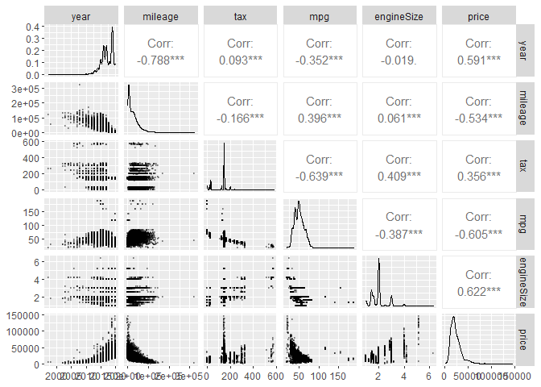<!-- -->

Revisamos como se distribuyen los datos que pasamos a factor en relacion
al precio, para esto utilizamos los boxplot lo que tambien nos ayudara a
ver si existen valores atipicos que puedan alterar nuestro modelo

``` r
audi %>% 
  ggplot(aes(transmission, price)) +
  geom_boxplot()
```

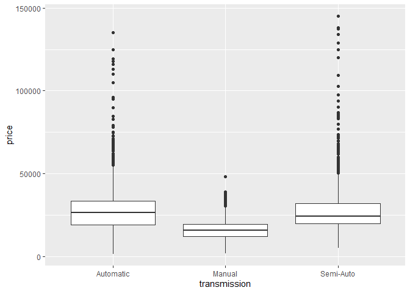<!-- -->

``` r
audi %>% 
  ggplot(aes(fuelType, price)) +
  geom_boxplot()
```

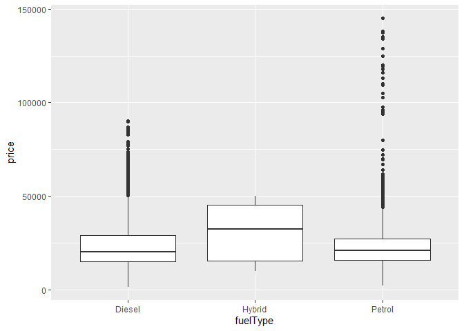<!-- -->

``` r
audi %>% mutate(model = reorder(model, price)) %>%
  ggplot(aes(price, model)) +
  geom_boxplot()
```

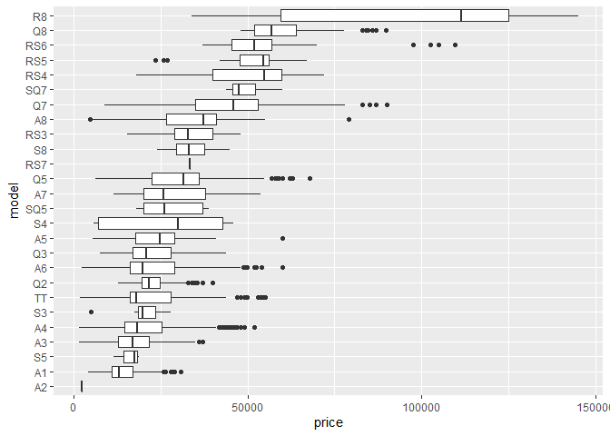<!-- -->

Graficamos las cuatro variables con mayores valores (no consideramos los
tax) para ver como se distributen con el precio

``` r
audi %>% ggplot(aes(mileage, price)) +
  geom_point(alpha = .1) +
  stat_smooth(method = "gam", formula = y ~ s(x, k=3))
```

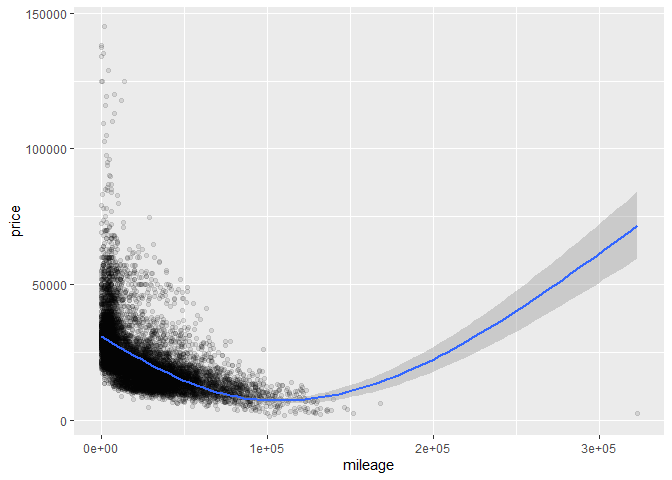<!-- -->

``` r
audi %>% ggplot(aes(year, price)) +
  geom_point(alpha = .1) +
  stat_smooth(method = "gam", formula = y ~ s(x, k=3))
```

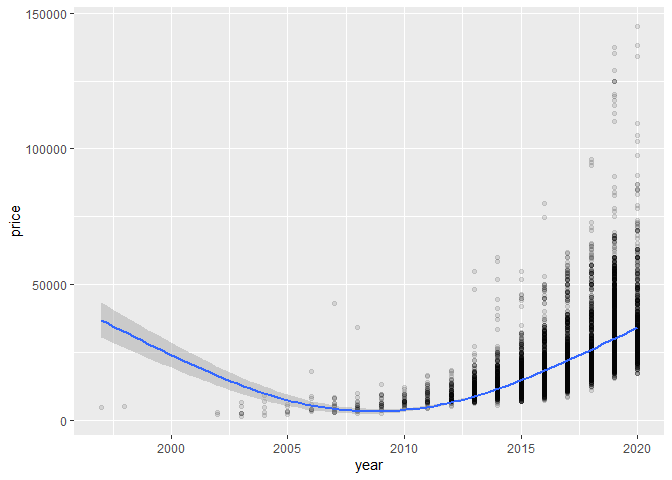<!-- -->

``` r
audi %>% ggplot(aes(mpg, price)) +
  geom_point(alpha = .1) +
  stat_smooth(method = "gam", formula = y ~ s(x, k=3))
```

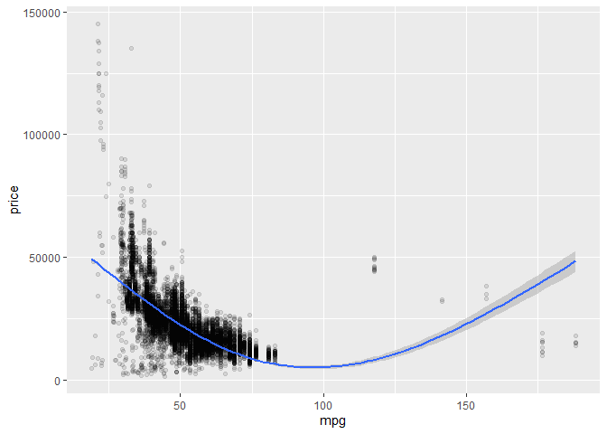<!-- -->

``` r
audi %>% ggplot(aes(engineSize, price)) +
  geom_point(alpha = .1) +
  stat_smooth(method = "gam", formula = y ~ s(x, k=3))
```

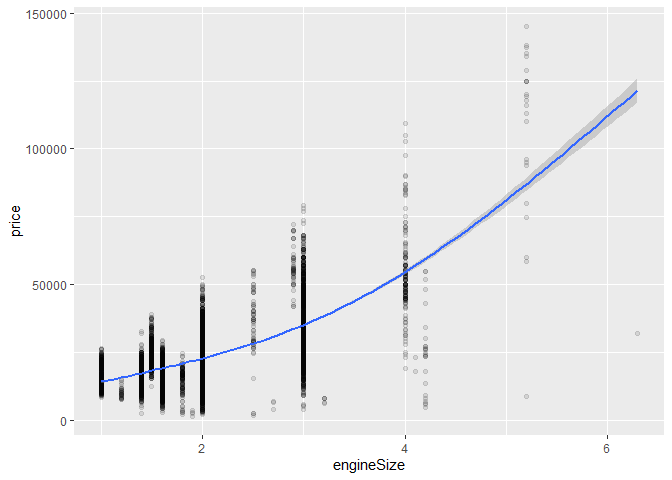<!-- -->

``` r
audi %>% filter(., year >= 2005) %>% ggplot(aes(year, price)) +
  geom_point(alpha = .1) +
  stat_smooth(method = "gam", formula = y ~ s(x, k=3))
```

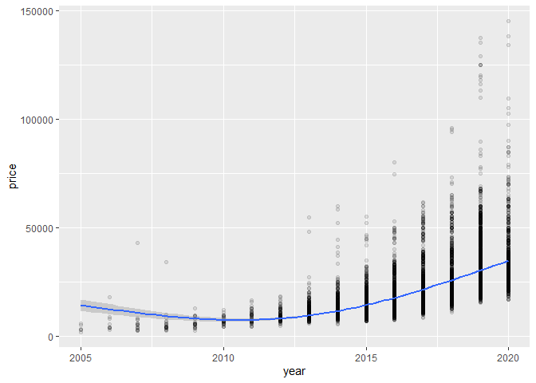<!-- -->

Escalamos los datos antes de ralizar el analisis de regresion

``` r
audi_sca <- audi
audi_sca[,c(2,3,5,7,8,9)] <- scale(audi_sca[,c(2,3,5,7,8,9)])

audi_sca %>%  head()
```

    ##   model        year      price transmission     mileage fuelType        tax
    ## 1    A1 -0.04226724 -0.8842819       Manual -0.39062623   Petrol  0.3578433
    ## 2    A6 -0.50463602 -0.5426970    Automatic  0.48051357   Diesel -1.5735277
    ## 3    A1 -0.50463602 -1.0123762       Manual  0.21420901   Petrol -1.4249607
    ## 4    A4 -0.04226724 -0.5170781    Automatic  0.04422013   Diesel  0.2835598
    ## 5    A3  0.88247030 -0.4743800       Manual -0.97528753   Petrol  0.2835598
    ## 6    A1 -0.50463602 -0.7647272    Automatic  0.31269531   Petrol -1.4249607
    ##           mpg engineSize
    ## 1  0.35636132 -0.9206937
    ## 2  1.03832096  0.1002574
    ## 3  0.35636132 -0.9206937
    ## 4  1.27855674  0.1002574
    ## 5 -0.09311208 -1.6013278
    ## 6  0.62759526 -0.9206937

Primero veremos el caso de una regresion simple, donde solo
consideraremos el kilometraje para predecir el precio de nuesto vhiculo

``` r
reg_simp <- lm(price ~ mileage, data = audi)
summary(reg_simp)
```

    ## 
    ## Call:
    ## lm(formula = price ~ mileage, data = audi)
    ## 
    ## Residuals:
    ##    Min     1Q Median     3Q    Max 
    ## -17692  -5970  -1978   3151 116047 
    ## 
    ## Coefficients:
    ##               Estimate Std. Error t value Pr(>|t|)    
    ## (Intercept)  2.949e+04  1.401e+02  210.46   <2e-16 ***
    ## mileage     -2.661e-01  4.091e-03  -65.05   <2e-16 ***
    ## ---
    ## Signif. codes:  0 '***' 0.001 '**' 0.01 '*' 0.05 '.' 0.1 ' ' 1
    ## 
    ## Residual standard error: 9901 on 10609 degrees of freedom
    ## Multiple R-squared:  0.2851, Adjusted R-squared:  0.2851 
    ## F-statistic:  4232 on 1 and 10609 DF,  p-value: < 2.2e-16

Los resultados de la regresion nos indican que los valores de los
parametros son 0.0002949 para el intercepto y -0.2661 para el
coeficiente asociado a la variable superficie de terreno.

Tambien se puede observar que el coeficiente de determinacion R2 es de
.2851, lo que significa que el 28.5% de la varianza del precio esta
explicada por el modelo lineal.

Veamos que pasa ahora al considerar mas variables en nuestro modelo de
regresion, para eso consideraremos el modelo, el año, su kilometraje, el
tamaño del motor y las millas por galon.

``` r
reg_mult <- lm(price ~ model + year*mileage + engineSize + mpg, data = audi_sca)
summary(reg_mult)
```

    ## 
    ## Call:
    ## lm(formula = price ~ model + year * mileage + engineSize + mpg, 
    ##     data = audi_sca)
    ## 
    ## Residuals:
    ##     Min      1Q  Median      3Q     Max 
    ## -3.1407 -0.1784 -0.0180  0.1507  3.4847 
    ## 
    ## Coefficients:
    ##               Estimate Std. Error t value Pr(>|t|)    
    ## (Intercept)  -0.315831   0.011155 -28.312  < 2e-16 ***
    ## model A2      0.960379   0.339197   2.831 0.004644 ** 
    ## model A3      0.094036   0.012350   7.614 2.88e-14 ***
    ## model A4      0.063767   0.014596   4.369 1.26e-05 ***
    ## model A5      0.172834   0.016416  10.529  < 2e-16 ***
    ## model A6      0.259971   0.017739  14.655  < 2e-16 ***
    ## model A7      0.260300   0.035612   7.309 2.88e-13 ***
    ## model A8      0.497362   0.036781  13.522  < 2e-16 ***
    ## model Q2      0.059073   0.015481   3.816 0.000137 ***
    ## model Q3      0.247573   0.014021  17.657  < 2e-16 ***
    ## model Q5      0.616805   0.017370  35.509  < 2e-16 ***
    ## model Q7      1.210542   0.026969  44.887  < 2e-16 ***
    ## model Q8      2.143872   0.045409  47.212  < 2e-16 ***
    ## model R8      4.722459   0.074086  63.743  < 2e-16 ***
    ## model RS3     0.848538   0.060728  13.973  < 2e-16 ***
    ## model RS4     1.637025   0.064219  25.491  < 2e-16 ***
    ## model RS5     1.617447   0.065624  24.647  < 2e-16 ***
    ## model RS6     2.022186   0.061001  33.150  < 2e-16 ***
    ## model RS7     0.748734   0.337662   2.217 0.026616 *  
    ## model S3      0.461346   0.080288   5.746 9.38e-09 ***
    ## model S4      0.098823   0.114637   0.862 0.388680    
    ## model S5     -0.010231   0.195322  -0.052 0.958229    
    ## model S8      0.244600   0.170637   1.433 0.151759    
    ## model SQ5     0.548999   0.092050   5.964 2.54e-09 ***
    ## model SQ7     1.425967   0.122258  11.664  < 2e-16 ***
    ## model TT      0.276848   0.021792  12.704  < 2e-16 ***
    ## year          0.434107   0.005619  77.258  < 2e-16 ***
    ## mileage      -0.232648   0.005942 -39.155  < 2e-16 ***
    ## engineSize    0.332281   0.006098  54.493  < 2e-16 ***
    ## mpg          -0.057332   0.004682 -12.246  < 2e-16 ***
    ## year:mileage -0.074939   0.002371 -31.609  < 2e-16 ***
    ## ---
    ## Signif. codes:  0 '***' 0.001 '**' 0.01 '*' 0.05 '.' 0.1 ' ' 1
    ## 
    ## Residual standard error: 0.3364 on 10580 degrees of freedom
    ## Multiple R-squared:  0.8871, Adjusted R-squared:  0.8868 
    ## F-statistic:  2772 on 30 and 10580 DF,  p-value: < 2.2e-16

Los resultados de la regresion multiple no muesstra un coeficiente de
determinacion del 88%, y se puede ver que todas las variables son
significativas a excepcion de algunos modelos de autos que no tienen
significancia para nuestro modelo (por lo que podriamos estudiar si
considerar o no esos modelos de audis para nuestro modelo).

Revisamos el valor del facto de inflacion de la varianza, este factor
nos permite entender la colinealidad de los datos.

Un VIF por encima de 4 o una tolerancia por debajo de 0,25 indica que
podría existir multicolinealidad y se requiere más investigación.

``` r
VIF(reg_mult)
```

    ##                  GVIF Df GVIF^(1/(2*Df))
    ## model        4.497546 25        1.030527
    ## year         2.959790  1        1.720404
    ## mileage      3.309501  1        1.819204
    ## engineSize   3.485644  1        1.866988
    ## mpg          2.054680  1        1.433416
    ## year:mileage 1.720326  1        1.311612

``` r
library(olsrr)
```

    ## 
    ## Attaching package: 'olsrr'

    ## The following object is masked from 'package:datasets':
    ## 
    ##     rivers

``` r
fuerza_bruta <- ols_step_all_possible(reg_mult)

plot(fuerza_bruta)
```

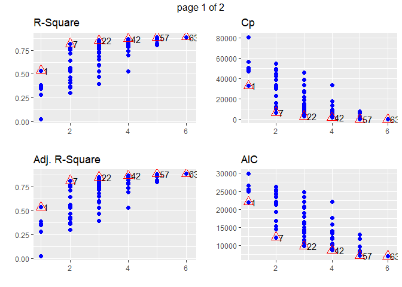<!-- -->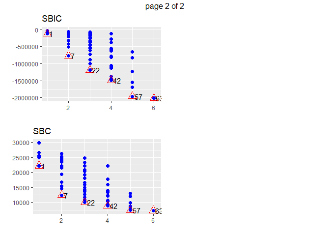<!-- -->

## Regresion Logistica (AirBnb)

Para el segundo modelo que veremos se utilizara un sample de un dataset
con informacion sobre las reservas de alojamiento de airbnb, lo que
buscaremos con este modelo es deteminar si la reserva puede ser
cancelada. Este dataset consta de 32 columnas con diversa informacion
como el hotel, si esta cancelada la reserva, el tiempo de espera, el año
de arrivo, el mes de arrivo, entre otros…

``` r
summary(airbnb)
```

    ##           hotel       is_canceled       lead_time     arrival_date_year
    ##  City Hotel  :8000   Min.   :0.0000   Min.   :  0.0   Min.   :2015     
    ##  Resort Hotel:4000   1st Qu.:0.0000   1st Qu.: 17.0   1st Qu.:2016     
    ##                      Median :0.0000   Median : 68.0   Median :2016     
    ##                      Mean   :0.3718   Mean   :103.5   Mean   :2016     
    ##                      3rd Qu.:1.0000   3rd Qu.:159.0   3rd Qu.:2017     
    ##                      Max.   :1.0000   Max.   :737.0   Max.   :2017     
    ##                                                                        
    ##  arrival_date_month arrival_date_week_number arrival_date_day_of_month
    ##  August :1349       Min.   : 1.00            Min.   : 1.00            
    ##  July   :1266       1st Qu.:16.00            1st Qu.: 8.00            
    ##  May    :1216       Median :27.00            Median :16.00            
    ##  April  :1140       Mean   :27.09            Mean   :15.68            
    ##  June   :1133       3rd Qu.:38.00            3rd Qu.:23.00            
    ##  October:1092       Max.   :53.00            Max.   :31.00            
    ##  (Other):4804                                                         
    ##  stays_in_weekend_nights stays_in_week_nights     adults         children     
    ##  Min.   : 0.0000         Min.   : 0.000       Min.   :0.000   Min.   :0.0000  
    ##  1st Qu.: 0.0000         1st Qu.: 1.000       1st Qu.:2.000   1st Qu.:0.0000  
    ##  Median : 1.0000         Median : 2.000       Median :2.000   Median :0.0000  
    ##  Mean   : 0.9151         Mean   : 2.495       Mean   :1.848   Mean   :0.1076  
    ##  3rd Qu.: 2.0000         3rd Qu.: 3.000       3rd Qu.:2.000   3rd Qu.:0.0000  
    ##  Max.   :13.0000         Max.   :32.000       Max.   :4.000   Max.   :3.0000  
    ##                                                                               
    ##      babies               meal         country           market_segment
    ##  Min.   :0.00000   BB       :9308   PRT    :4846   Aviation     :  24  
    ##  1st Qu.:0.00000   FB       :  73   GBR    :1238   Complementary:  78  
    ##  Median :0.00000   HB       :1432   FRA    : 991   Corporate    : 554  
    ##  Mean   :0.00675   SC       :1078   ESP    : 883   Direct       :1259  
    ##  3rd Qu.:0.00000   Undefined: 109   DEU    : 734   Groups       :1973  
    ##  Max.   :1.00000                    ITA    : 363   Offline TA/TO:2412  
    ##                                     (Other):2945   Online TA    :5700  
    ##  distribution_channel is_repeated_guest previous_cancellations
    ##  Corporate: 694       Min.   :0.000     Min.   : 0.00000      
    ##  Direct   :1475       1st Qu.:0.000     1st Qu.: 0.00000      
    ##  GDS      :  24       Median :0.000     Median : 0.00000      
    ##  TA/TO    :9807       Mean   :0.032     Mean   : 0.08267      
    ##                       3rd Qu.:0.000     3rd Qu.: 0.00000      
    ##                       Max.   :1.000     Max.   :26.00000      
    ##                                                               
    ##  previous_bookings_not_canceled reserved_room_type assigned_room_type
    ##  Min.   : 0.0000                A      :8594       A      :7387      
    ##  1st Qu.: 0.0000                D      :1971       D      :2603      
    ##  Median : 0.0000                E      : 646       E      : 768      
    ##  Mean   : 0.1353                F      : 300       F      : 396      
    ##  3rd Qu.: 0.0000                G      : 214       G      : 266      
    ##  Max.   :67.0000                B      : 116       B      : 221      
    ##                                 (Other): 159       (Other): 359      
    ##  booking_changes       deposit_type       agent         company     
    ##  Min.   : 0.0000   No Deposit:10552   9      :3242   NULL   :11280  
    ##  1st Qu.: 0.0000   Non Refund: 1432   NULL   :1721   40     :   93  
    ##  Median : 0.0000   Refundable:   16   240    :1371   223    :   83  
    ##  Mean   : 0.2089                      1      : 671   153    :   23  
    ##  3rd Qu.: 0.0000                      7      : 364   45     :   22  
    ##  Max.   :13.0000                      14     : 353   67     :   22  
    ##                                       (Other):4278   (Other):  477  
    ##  days_in_waiting_list         customer_type       adr       
    ##  Min.   :  0.000      Contract       : 410   Min.   :  0.0  
    ##  1st Qu.:  0.000      Group          :  59   1st Qu.: 70.0  
    ##  Median :  0.000      Transient      :8971   Median : 95.0  
    ##  Mean   :  2.588      Transient-Party:2560   Mean   :102.0  
    ##  3rd Qu.:  0.000                             3rd Qu.:126.0  
    ##  Max.   :391.000                             Max.   :397.4  
    ##                                                             
    ##  required_car_parking_spaces total_of_special_requests reservation_status
    ##  Min.   :0.00000             Min.   :0.0000            Canceled :4331    
    ##  1st Qu.:0.00000             1st Qu.:0.0000            Check-Out:7539    
    ##  Median :0.00000             Median :0.0000            No-Show  : 130    
    ##  Mean   :0.05992             Mean   :0.5657                              
    ##  3rd Qu.:0.00000             3rd Qu.:1.0000                              
    ##  Max.   :2.00000             Max.   :5.0000                              
    ##                                                                          
    ##  reservation_status_date
    ##  2015-10-21:  131       
    ##  2016-11-25:  103       
    ##  2015-01-01:   80       
    ##  2015-07-06:   72       
    ##  2016-01-18:   60       
    ##  2015-07-02:   55       
    ##  (Other)   :11499

``` r
airbnb %>% head()
```

    ##          hotel is_canceled lead_time arrival_date_year arrival_date_month
    ## 1   City Hotel           0        15              2017            January
    ## 2 Resort Hotel           1        34              2017           February
    ## 3   City Hotel           0       349              2016            October
    ## 4   City Hotel           0        13              2015             August
    ## 5 Resort Hotel           0       128              2016           December
    ## 6   City Hotel           0         2              2017           February
    ##   arrival_date_week_number arrival_date_day_of_month stays_in_weekend_nights
    ## 1                        3                        19                       2
    ## 2                        7                        16                       2
    ## 3                       41                         4                       1
    ## 4                       34                        20                       0
    ## 5                       49                         3                       0
    ## 6                        6                         6                       1
    ##   stays_in_week_nights adults children babies meal country market_segment
    ## 1                    5      2        0      0   BB     BRA      Online TA
    ## 2                    5      2        0      0   BB     GBR         Direct
    ## 3                    5      2        0      0   BB     DEU  Offline TA/TO
    ## 4                    3      2        0      0   BB     PRT      Online TA
    ## 5                    1      2        0      0   HB     PRT         Groups
    ## 6                    4      2        0      0   SC     AUT      Online TA
    ##   distribution_channel is_repeated_guest previous_cancellations
    ## 1                TA/TO                 0                      0
    ## 2               Direct                 0                      0
    ## 3                TA/TO                 0                      0
    ## 4                TA/TO                 0                      0
    ## 5               Direct                 0                      0
    ## 6                TA/TO                 0                      0
    ##   previous_bookings_not_canceled reserved_room_type assigned_room_type
    ## 1                              0                  A                  A
    ## 2                              0                  A                  C
    ## 3                              0                  A                  A
    ## 4                              0                  A                  A
    ## 5                              0                  A                  A
    ## 6                              0                  A                  A
    ##   booking_changes deposit_type agent company days_in_waiting_list
    ## 1               0   No Deposit     7    NULL                    0
    ## 2               1   No Deposit   250    NULL                    0
    ## 3               0   No Deposit    58    NULL                  162
    ## 4               0   No Deposit     9    NULL                    0
    ## 5               2   No Deposit  NULL    NULL                    0
    ## 6               0   No Deposit     7    NULL                    0
    ##     customer_type    adr required_car_parking_spaces total_of_special_requests
    ## 1       Transient  72.65                           0                         1
    ## 2       Transient  39.60                           0                         0
    ## 3 Transient-Party 123.33                           0                         0
    ## 4        Contract  90.00                           0                         2
    ## 5 Transient-Party  64.00                           0                         1
    ## 6       Transient  54.71                           0                         1
    ##   reservation_status reservation_status_date
    ## 1          Check-Out              2017-01-26
    ## 2           Canceled              2017-02-16
    ## 3          Check-Out              2016-10-10
    ## 4          Check-Out              2015-08-23
    ## 5          Check-Out              2016-12-04
    ## 6          Check-Out              2017-02-11

``` r
glimpse(airbnb)
```

    ## Rows: 12,000
    ## Columns: 32
    ## $ hotel                          <fct> City Hotel, Resort Hotel, City Hotel, C~
    ## $ is_canceled                    <int> 0, 1, 0, 0, 0, 0, 1, 0, 1, 0, 1, 0, 0, ~
    ## $ lead_time                      <int> 15, 34, 349, 13, 128, 2, 32, 84, 181, 6~
    ## $ arrival_date_year              <int> 2017, 2017, 2016, 2015, 2016, 2017, 201~
    ## $ arrival_date_month             <fct> January, February, October, August, Dec~
    ## $ arrival_date_week_number       <int> 3, 7, 41, 34, 49, 6, 28, 20, 15, 21, 38~
    ## $ arrival_date_day_of_month      <int> 19, 16, 4, 20, 3, 6, 12, 16, 9, 21, 15,~
    ## $ stays_in_weekend_nights        <int> 2, 2, 1, 0, 0, 1, 0, 0, 2, 2, 0, 0, 2, ~
    ## $ stays_in_week_nights           <int> 5, 5, 5, 3, 1, 4, 2, 4, 2, 3, 2, 1, 4, ~
    ## $ adults                         <int> 2, 2, 2, 2, 2, 2, 2, 2, 2, 2, 2, 3, 1, ~
    ## $ children                       <int> 0, 0, 0, 0, 0, 0, 0, 0, 0, 0, 0, 0, 0, ~
    ## $ babies                         <int> 0, 0, 0, 0, 0, 0, 0, 0, 0, 0, 0, 0, 0, ~
    ## $ meal                           <fct> BB, BB, BB, BB, HB, SC, BB, BB, HB, BB,~
    ## $ country                        <fct> BRA, GBR, DEU, PRT, PRT, AUT, CN, ROU, ~
    ## $ market_segment                 <fct> Online TA, Direct, Offline TA/TO, Onlin~
    ## $ distribution_channel           <fct> TA/TO, Direct, TA/TO, TA/TO, Direct, TA~
    ## $ is_repeated_guest              <int> 0, 0, 0, 0, 0, 0, 0, 0, 0, 0, 0, 0, 0, ~
    ## $ previous_cancellations         <int> 0, 0, 0, 0, 0, 0, 0, 0, 0, 0, 0, 0, 0, ~
    ## $ previous_bookings_not_canceled <int> 0, 0, 0, 0, 0, 0, 0, 0, 0, 0, 0, 0, 0, ~
    ## $ reserved_room_type             <fct> A, A, A, A, A, A, D, A, D, D, A, A, A, ~
    ## $ assigned_room_type             <fct> A, C, A, A, A, A, D, A, D, D, A, D, A, ~
    ## $ booking_changes                <int> 0, 1, 0, 0, 2, 0, 0, 0, 0, 0, 0, 0, 0, ~
    ## $ deposit_type                   <fct> No Deposit, No Deposit, No Deposit, No ~
    ## $ agent                          <fct> 7, 250, 58, 9, NULL, 7, 240, 14, 9, 7, ~
    ## $ company                        <fct> NULL, NULL, NULL, NULL, NULL, NULL, NUL~
    ## $ days_in_waiting_list           <int> 0, 0, 162, 0, 0, 0, 0, 0, 0, 0, 0, 0, 0~
    ## $ customer_type                  <fct> Transient, Transient, Transient-Party, ~
    ## $ adr                            <dbl> 72.65, 39.60, 123.33, 90.00, 64.00, 54.~
    ## $ required_car_parking_spaces    <int> 0, 0, 0, 0, 0, 0, 0, 0, 0, 0, 0, 0, 0, ~
    ## $ total_of_special_requests      <int> 1, 0, 0, 2, 1, 1, 1, 2, 2, 1, 0, 1, 0, ~
    ## $ reservation_status             <fct> Check-Out, Canceled, Check-Out, Check-O~
    ## $ reservation_status_date        <fct> 2017-01-26, 2017-02-16, 2016-10-10, 201~

``` r
ggplot(airbnb,aes(x=factor(hotel))) +
  geom_bar(col ="black",fill="#993333",alpha=0.5) +
  theme(axis.text.x = element_text(face="bold", size=10)) +
  scale_x_discrete("Hotel") +
  scale_y_continuous("Count")
```

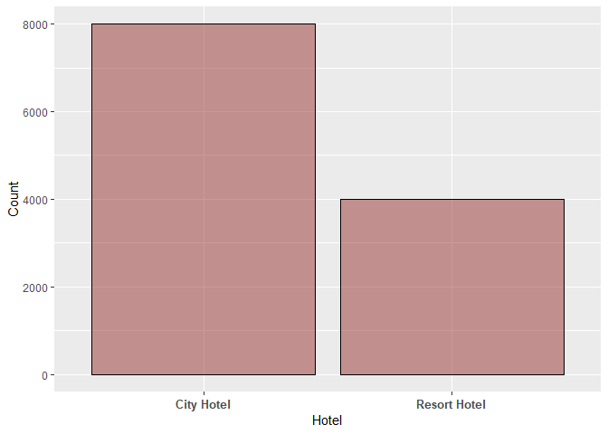<!-- -->

``` r
ggplot(airbnb,aes(factor(arrival_date_month,levels=month.name))) +
  geom_bar(col ="black",fill="#993333",alpha=0.5) +
  theme(axis.text.x = element_text(face="bold", size=8, angle=30)) +
  scale_y_continuous("Count",limits = c(0,1500),breaks=seq(0,15000,by=1500)) +
  scale_x_discrete("Month")
```

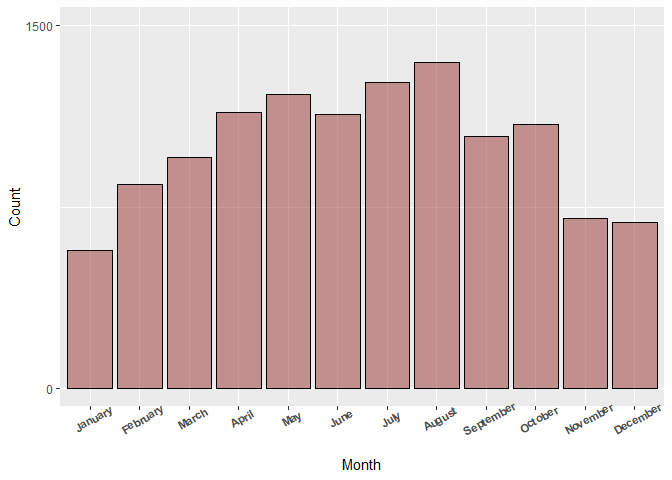<!-- -->

``` r
d <- airbnb %>% 
  group_by(arrival_date_month) %>%
  count() %>%
  arrange(match(arrival_date_month,month.name))
d <- data.frame(ArrivalDateMonth = d$arrival_date_month,N =d$n)
d
```

    ##    ArrivalDateMonth    N
    ## 1           January  571
    ## 2          February  845
    ## 3             March  955
    ## 4             April 1140
    ## 5               May 1216
    ## 6              June 1133
    ## 7              July 1266
    ## 8            August 1349
    ## 9         September 1043
    ## 10          October 1092
    ## 11         November  703
    ## 12         December  687

``` r
ggplot(data = airbnb,aes(factor(is_canceled)))+
  geom_bar( col='black', fill="#993333", alpha = 0.5) +
  facet_wrap(~hotel) +
  scale_x_discrete("Canceled",labels = c("No","Yes")) +
  scale_y_continuous("Count",limits = c(0,5000),breaks=seq(0,47222,by=5000))  +
  theme(axis.text.x = element_text(face="bold", size=10))
```

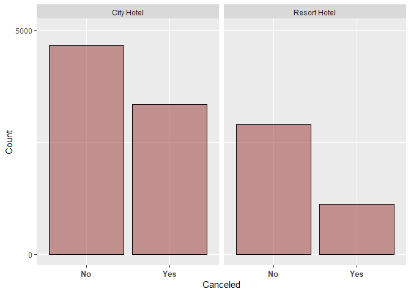<!-- -->

``` r
canceledRate <- airbnb %>%
  group_by(Hotel = hotel) %>%
  summarise(CanceledAverage = mean(is_canceled)) 
canceledRate <- as.data.frame(canceledRate)
canceledRate
```

    ##          Hotel CanceledAverage
    ## 1   City Hotel        0.418375
    ## 2 Resort Hotel        0.278500

``` r
ggplot(data = airbnb, aes(x = factor(is_canceled), y = lead_time  )) + 
  geom_boxplot(col='black', fill="#993333", alpha = 0.5) +
  theme(axis.text.x = element_text(face="bold", size=10)) +
  scale_y_continuous("Lead Time",limits = c(0,800),breaks=seq(0,800,by=100)) +
  scale_x_discrete("Canceled",labels = c("No","Yes"))
```

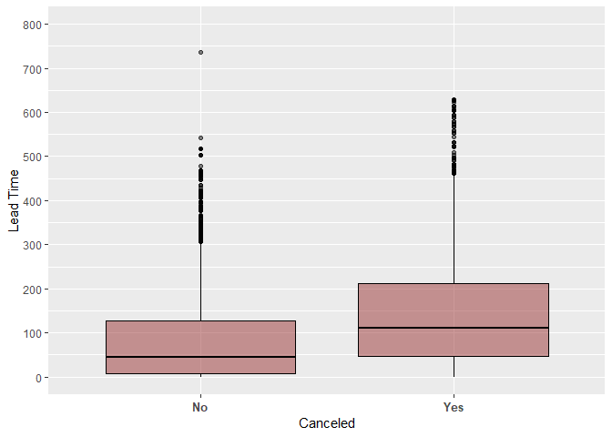<!-- -->

``` r
set.seed(369)
glm.fit <- glm(is_canceled ~ lead_time, data = airbnb , family = "binomial")

#glm.fit <- glm(is_canceled ~ hotel + lead_time + arrival_date_month + children +
#                        market_segment + is_repeated_guest + adults + babies +
#                        previous_cancellations +
#                        deposit_type + booking_changes  +
#                        reserved_room_type + adr + days_in_waiting_list + customer_type +
#                        total_of_special_requests, 
#                        data = airbnb , family = "binomial")
summary(glm.fit)
```

    ## 
    ## Call:
    ## glm(formula = is_canceled ~ lead_time, family = "binomial", data = airbnb)
    ## 
    ## Deviance Residuals: 
    ##     Min       1Q   Median       3Q      Max  
    ## -2.4271  -0.8911  -0.7639   1.2459   1.6701  
    ## 
    ## Coefficients:
    ##               Estimate Std. Error z value Pr(>|z|)    
    ## (Intercept) -1.1096541  0.0285288  -38.90   <2e-16 ***
    ## lead_time    0.0054289  0.0001903   28.52   <2e-16 ***
    ## ---
    ## Signif. codes:  0 '***' 0.001 '**' 0.01 '*' 0.05 '.' 0.1 ' ' 1
    ## 
    ## (Dispersion parameter for binomial family taken to be 1)
    ## 
    ##     Null deviance: 15837  on 11999  degrees of freedom
    ## Residual deviance: 14933  on 11998  degrees of freedom
    ## AIC: 14937
    ## 
    ## Number of Fisher Scoring iterations: 4

``` r
prob <- predict(glm.fit, type = c("response"))

airbnb$prob <- prob

curva_roc <- roc(is_canceled ~ prob, data = airbnb)
```

    ## Setting levels: control = 0, case = 1

    ## Setting direction: controls < cases

``` r
plot(curva_roc)
```

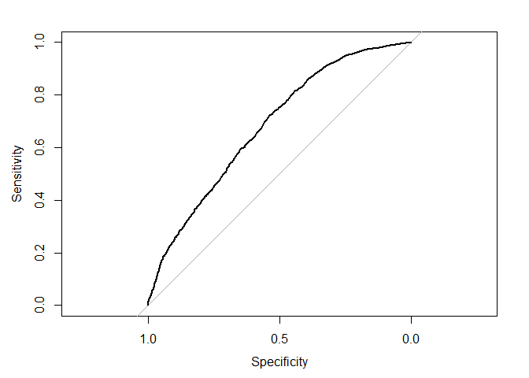<!-- -->

``` r
auc(curva_roc)
```

    ## Area under the curve: 0.6804

``` r
airbnb$prob <- NULL

modelo_log_multi <- glm(is_canceled ~ hotel + lead_time + is_repeated_guest + previous_cancellations + deposit_type + booking_changes + adr + market_segment + customer_type + total_of_special_requests, airbnb, family = "binomial")
```

    ## Warning: glm.fit: fitted probabilities numerically 0 or 1 occurred

``` r
summary(modelo_log_multi)
```

    ## 
    ## Call:
    ## glm(formula = is_canceled ~ hotel + lead_time + is_repeated_guest + 
    ##     previous_cancellations + deposit_type + booking_changes + 
    ##     adr + market_segment + customer_type + total_of_special_requests, 
    ##     family = "binomial", data = airbnb)
    ## 
    ## Deviance Residuals: 
    ##     Min       1Q   Median       3Q      Max  
    ## -6.4873  -0.7525  -0.4720   0.4870   3.2246  
    ## 
    ## Coefficients:
    ##                                Estimate Std. Error z value Pr(>|z|)    
    ## (Intercept)                  -2.0714073  0.5166996  -4.009 6.10e-05 ***
    ## hotelResort Hotel            -0.1134269  0.0511627  -2.217   0.0266 *  
    ## lead_time                     0.0043389  0.0002662  16.301  < 2e-16 ***
    ## is_repeated_guest            -1.5814709  0.2332049  -6.781 1.19e-11 ***
    ## previous_cancellations        2.1444648  0.1556206  13.780  < 2e-16 ***
    ## deposit_typeNon Refund        5.3386756  0.3423771  15.593  < 2e-16 ***
    ## deposit_typeRefundable       -0.0646618  0.6560923  -0.099   0.9215    
    ## booking_changes              -0.5253258  0.0530003  -9.912  < 2e-16 ***
    ## adr                           0.0036090  0.0005186   6.959 3.43e-12 ***
    ## market_segmentComplementary   0.1757810  0.5939222   0.296   0.7673    
    ## market_segmentCorporate      -0.5540350  0.5061673  -1.095   0.2737    
    ## market_segmentDirect         -0.6621641  0.4935348  -1.342   0.1797    
    ## market_segmentGroups         -0.0010618  0.4984817  -0.002   0.9983    
    ## market_segmentOffline TA/TO  -0.7918364  0.4923135  -1.608   0.1077    
    ## market_segmentOnline TA       0.6569878  0.4877840   1.347   0.1780    
    ## customer_typeGroup           -0.3745312  0.5663651  -0.661   0.5084    
    ## customer_typeTransient        0.8818857  0.1709513   5.159 2.49e-07 ***
    ## customer_typeTransient-Party  0.3777386  0.1795412   2.104   0.0354 *  
    ## total_of_special_requests    -0.7765045  0.0360820 -21.521  < 2e-16 ***
    ## ---
    ## Signif. codes:  0 '***' 0.001 '**' 0.01 '*' 0.05 '.' 0.1 ' ' 1
    ## 
    ## (Dispersion parameter for binomial family taken to be 1)
    ## 
    ##     Null deviance: 15837  on 11999  degrees of freedom
    ## Residual deviance: 10880  on 11981  degrees of freedom
    ## AIC: 10918
    ## 
    ## Number of Fisher Scoring iterations: 7

``` r
prob_multi <- predict(modelo_log_multi, type = c("response"))

airbnb$prob_multi <- prob_multi

curva_roc_multi <- roc(is_canceled ~ prob_multi, data = airbnb)
```

    ## Setting levels: control = 0, case = 1

    ## Setting direction: controls < cases

``` r
plot(curva_roc_multi)
```

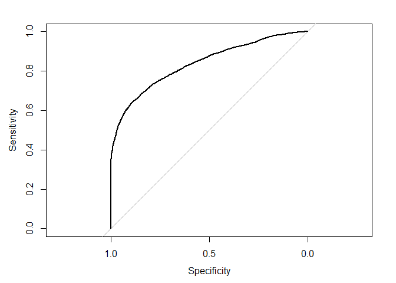<!-- -->

``` r
auc(curva_roc_multi)
```

    ## Area under the curve: 0.836

``` r
set.seed(369)

data_split <- initial_split(airbnb,
                            prop = 0.7,
                            strata = NULL)

train_data <- training(data_split) %>% as.data.frame() 
test_data <- testing(data_split) %>%  as.data.frame()

modelo_log_multi1 <- glm(is_canceled ~ hotel + lead_time + is_repeated_guest + previous_cancellations + deposit_type + booking_changes + adr + customer_type + total_of_special_requests, train_data, family = "binomial")
```

    ## Warning: glm.fit: fitted probabilities numerically 0 or 1 occurred

``` r
summary(modelo_log_multi1)
```

    ## 
    ## Call:
    ## glm(formula = is_canceled ~ hotel + lead_time + is_repeated_guest + 
    ##     previous_cancellations + deposit_type + booking_changes + 
    ##     adr + customer_type + total_of_special_requests, family = "binomial", 
    ##     data = train_data)
    ## 
    ## Deviance Residuals: 
    ##     Min       1Q   Median       3Q      Max  
    ## -5.8515  -0.7930  -0.5234   0.5375   3.5247  
    ## 
    ## Coefficients:
    ##                                Estimate Std. Error z value Pr(>|z|)    
    ## (Intercept)                  -2.2587740  0.2018169 -11.192  < 2e-16 ***
    ## hotelResort Hotel            -0.3065506  0.0592134  -5.177 2.25e-07 ***
    ## lead_time                     0.0046780  0.0002999  15.597  < 2e-16 ***
    ## is_repeated_guest            -1.7759236  0.2734062  -6.496 8.27e-11 ***
    ## previous_cancellations        1.8298748  0.1757452  10.412  < 2e-16 ***
    ## deposit_typeNon Refund        4.5996170  0.3586366  12.825  < 2e-16 ***
    ## deposit_typeRefundable        0.9849551  0.7436144   1.325    0.185    
    ## booking_changes              -0.5435601  0.0627700  -8.660  < 2e-16 ***
    ## adr                           0.0043322  0.0005782   7.493 6.73e-14 ***
    ## customer_typeGroup           -0.0029270  0.6547934  -0.004    0.996    
    ## customer_typeTransient        1.2203664  0.1913518   6.378 1.80e-10 ***
    ## customer_typeTransient-Party  0.2226202  0.1978498   1.125    0.261    
    ## total_of_special_requests    -0.6045707  0.0398846 -15.158  < 2e-16 ***
    ## ---
    ## Signif. codes:  0 '***' 0.001 '**' 0.01 '*' 0.05 '.' 0.1 ' ' 1
    ## 
    ## (Dispersion parameter for binomial family taken to be 1)
    ## 
    ##     Null deviance: 11081.0  on 8399  degrees of freedom
    ## Residual deviance:  7974.6  on 8387  degrees of freedom
    ## AIC: 8000.6
    ## 
    ## Number of Fisher Scoring iterations: 7

``` r
test_data$prob_multi <- predict(modelo_log_multi1, test_data, type = c("response"))
auc(roc(is_canceled ~ prob_multi, data = test_data))
```

    ## Setting levels: control = 0, case = 1

    ## Setting direction: controls < cases

    ## Area under the curve: 0.8009
